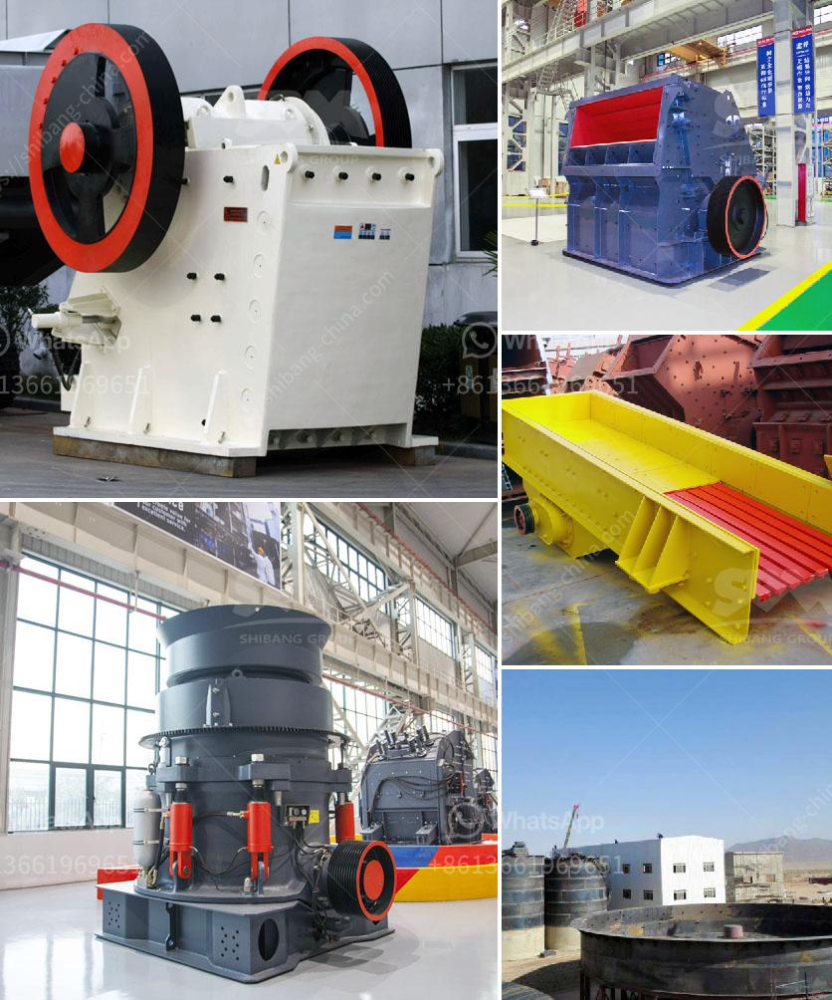

<h3>coal beneficiation process</h3>
Coal beneficiation is a process by which impurities such as sulfur, ash, and rock are removed from coal to upgrade its energy content. The processes involved in the beneficiation of coal are called coal preparation operations. Various methods are employed for coal beneficiation, depending on the characteristics of the raw coal and the targeted end-use.

The beneficiation process begins with crushing and grinding of mined coal to a fine powder. This powder is then mixed with water and chemicals, which help to remove impurities and make the coal more efficient for combustion. The mixture is then subjected to various processes such as screening, washing, and gravity separation to separate the coal particles from the impurities.

One of the most commonly used methods for coal beneficiation is gravity separation. In this process, coal particles are settled in a fluid medium according to their density. The denser coal particles sink to the bottom, while the lighter impurities float to the top. The separated coal is then dewatered and dried before being transported for further processing.

Another method used for coal beneficiation is flotation. In this process, the coal particles are suspended in a liquid and treated with chemicals that selectively attach to the coal particles. These chemicals make the coal particles buoyant, allowing them to be collected and separated from the impurities. The separated coal is then dewatered and dried for use as fuel.

Other techniques such as magnetic separation and electrostatic separation are also used for coal beneficiation. Magnetic separation utilizes magnets to separate the magnetic impurities from the coal particles. Electrostatic separation relies on the differences in electrical conductivity of the coal particles and impurities to separate them.

The beneficiation of coal not only improves the energy content of coal but also reduces its environmental impact. By removing impurities such as sulfur and ash, the combustion of coal becomes cleaner, resulting in reduced emissions of pollutants such as sulfur dioxide and particulate matter. This is important in mitigating the adverse effects of coal combustion on air quality and human health.

Furthermore, coal beneficiation also allows for the recovery of valuable minerals from coal waste. Many coal deposits contain minerals such as pyrite, which can be recovered and used in various industries. By separating these minerals from the coal, their economic value can be maximized, leading to a more sustainable use of coal resources.

In conclusion, coal beneficiation is a crucial process for the efficient utilization of coal resources. It improves the energy content of coal, reduces its environmental impact, and allows for the recovery of valuable minerals. As the demand for energy continues to rise and concerns about environmental pollution grow, the importance of coal beneficiation in the coal industry will only increase.
<h3>Contact us</h3><ul><li><strong>Whatsapp:&nbsp;<a href="https://wa.me/8613661969651">+8613661969651</a></strong></li><li><a href="https://swt.shibang-china.com/?git&amp;zhl&amp;coal beneficiation process"><strong>Online Service(chat now)</strong></a></li></ul><h3>Related</h3><ul><li><a href='vibrating grinding mill ball china.md'>vibrating grinding mill ball china</a></li><li><a href='trommel screen sale australia.md'>trommel screen sale australia</a></li><li><a href='gold plant for sale philippines.md'>gold plant for sale philippines</a></li><li><a href='used gold mining equipment for sale in ghana.md'>used gold mining equipment for sale in ghana</a></li><li><a href='how much does a mobile crusher cost.md'>how much does a mobile crusher cost</a></li></ul>