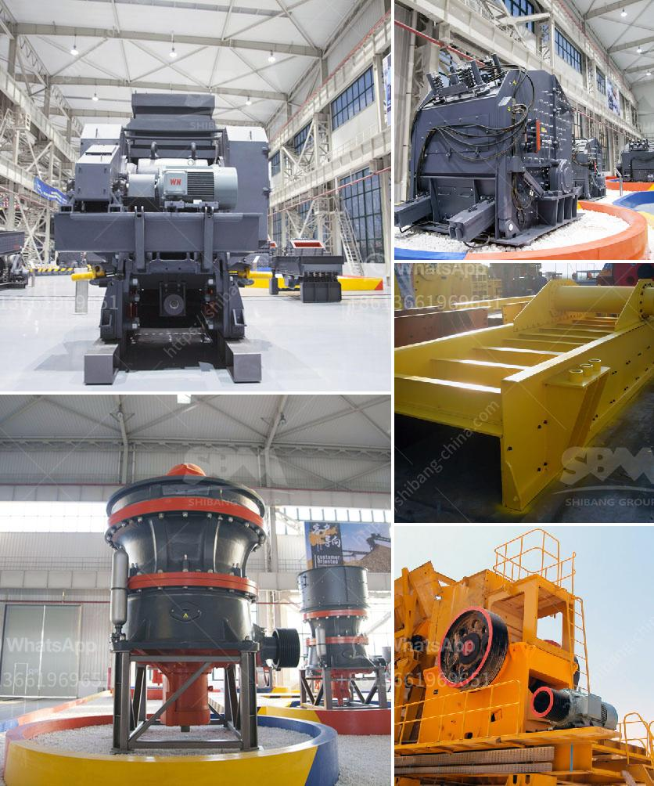

<h3>coal crusher and screen plant for sale</h3>
Coal is a versatile black mineral that has various uses. It can be used in the production of steel, as an energy source in power plants, and in the manufacturing of cement. Coal is also a crucial component in many industries such as chemicals, paper, ceramics, and pharmaceuticals. To utilize coal efficiently, it needs to be crushed into different sizes and then screened to separate the particles according to their size.

A coal crusher is a coal processing plant that breaks coal into different sizes, which can be further used in various industries. Coal crushers also remove impurities from the coal (typically slate) and deposit them into a culm dump. The coal breaker is usually situated at the coal mine entrance, allowing the coal to be crushed and screened to a desirable size.

Coal crushers play a vital role in the coal crushing plant, providing a steady supply of coal to be processed. Crushers, specifically designed for coal processing, allow coal to be crushed into defined size ranges and can be further adjusted for specialized applications. In addition to crusher and screen plant, the entire coal handling system needs to be designed and optimized for efficient and reliable operations.

When considering the purchase of a coal crusher and screen plant for sale, it is essential to understand the overall layout of the crushing plant and its components. The initial process starts with the coal being fed through a hopper into the primary crusher. The primary crusher reduces the size of the coal and transfers it to a secondary crusher or screens where it is further crushed and separated into different sizes.

There are various types of crushers and screens available for coal processing. Jaw crushers and impact crushers are commonly used for primary crushing, while cone crushers and vibrating screens are often utilized for secondary and tertiary crushing stages. The selection of the appropriate equipment depends on the specific requirements of the coal processing plant, as well as the desired final product size.

Used coal crusher and screen plants that are up for sale can provide a cost-effective solution for processing coal. These plants combine the crushing and screening process into one unit, offering a high degree of flexibility while minimizing the need for additional equipment. By purchasing a pre-owned coal crusher and screen plant, businesses can take advantage of significant cost savings and reduce their environmental impact by recycling and reusing equipment.

In conclusion, coal crusher and screen plants for sale provide a cost-effective solution for processing coal and can be a valuable asset for any coal mining operation. It is essential to understand the specific requirements of the coal processing plant and choose equipment that best suits those needs. By investing in used coal crushing and screening plants, businesses can optimize their operations while minimizing costs and environmental impact.
<h3>Contact us</h3><ul><li><strong>Whatsapp:&nbsp;<a href="https://wa.me/8613661969651">+8613661969651</a></strong></li><li><a href="https://swt.shibang-china.com/?git&amp;zhl&amp;coal crusher and screen plant for sale"><strong>Online Service(chat now)</strong></a></li></ul><h3>Related</h3><ul><li><a href='pin for an industrial hammer mill.md'>pin for an industrial hammer mill</a></li><li><a href='grinding machine 2 micron for calcium carbonate.md'>grinding machine 2 micron for calcium carbonate</a></li><li><a href='slag crusher cost.md'>slag crusher cost</a></li><li><a href='second hand crushers and screens in south africa.md'>second hand crushers and screens in south africa</a></li><li><a href='mini cement plant in pakistan.md'>mini cement plant in pakistan</a></li></ul>