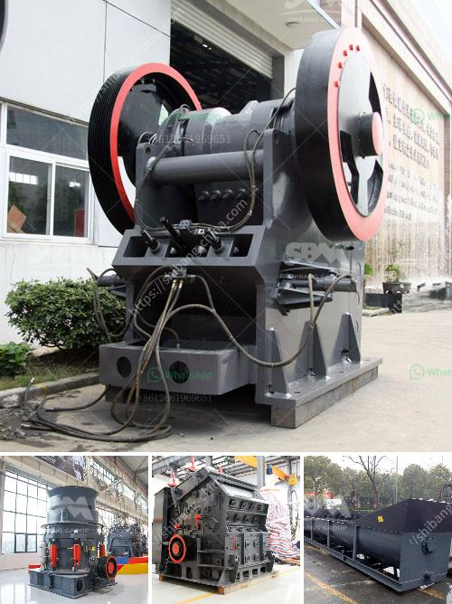

<h3>coal crusher machine china</h3>
China is the largest coal producer and consumer in the world. With abundant coal resources, China has been the target of many countries, coal crusher machine china's capabilities and quality are ranked in the forefront of the world.

The wide application of coal crusher machine china has a long history. In the process of coal crushing, power plant coal crushers are widely used in coal mine operations. At present, China's coal crushing equipment is mainly divided into fixed coal crusher machine and mobile coal crusher machine. In terms of working mode, it can be divided into extrusion type, impact type and shear type.

The coal crusher machine china shear crusher uses the principle of shearing and tearing between two relatively rotating cutters to crush materials. Using the "double motor + double planetary reducer", the power is evenly distributed to ensure the crushing effect. The shear crusher made in China has reasonable design, compact structure, strong crushing capacity, high safety, energy saving and environmental protection.

The coal crusher machine China can be used to crush coal, gangue, coke, coal and other materials in power plants, coal slag, coal gangue and other materials in coal mines, coal crushing and screening plants, etc. It can process coal with moisture content less than 8% and reach the fineness of a micron, which can meet the requirements of power plant coal crushing and screening.

Coal crusher machine China is also increasingly challenging the industry for high-efficiency coal crusher machine. In terms of cost savings, environmental protection, and sustainable development, a high-efficiency coal crusher machine has become a new industry trend. In the future, China's coal crusher machine industry will focus on a new level of research and development, and create high-end coal crusher machine for energy conservation and environmental protection.

China's coal crusher machine industry should provide high-quality products and services for coal mining enterprises, and actively participate in the international coal trading market competition. It is essential to build a good brand reputation, adhere to the principle of customer first, and provide comprehensive and competitive crushing machinery products and services.

China's coal crusher machine industry also faces certain challenges. With the increasing competition in the global market, Chinese coal crusher machine manufacturers need to improve their production technology, research and development capabilities, and innovation capabilities to stand out in the fierce competition. In addition, coal crusher machine China needs to pay attention to environmental protection issues. How to effectively control dust and noise pollution generated during the coal crushing process and reduce the impact on the surrounding environment is a problem that needs to be solved urgently.

In conclusion, coal crusher machine China plays an important role in the coal resource exploitation and utilization industry. It has made outstanding contributions to the development of China's coal industry and the country's economic construction. China's coal crusher machine industry should seize the opportunity, continuously improve product quality, enhance enterprise competitiveness, and actively explore the international market, creating a new chapter in the development of China's coal crusher machine industry.
<h3>Contact us</h3><ul><li><strong>Whatsapp:&nbsp;<a href="https://wa.me/8613661969651">+8613661969651</a></strong></li><li><a href="https://swt.shibang-china.com/?git&amp;zhl&amp;coal crusher machine china"><strong>Online Service(chat now)</strong></a></li></ul><h3>Related</h3><ul><li><a href='industrial aluminum can crusher in saudi arabia.md'>industrial aluminum can crusher in saudi arabia</a></li><li><a href='crushing and screening plant supplier china.md'>crushing and screening plant supplier china</a></li><li><a href='impact crusher zenith.md'>impact crusher zenith</a></li><li><a href='kenya hammer mill is manufactured.md'>kenya hammer mill is manufactured</a></li><li><a href='stone crusher machine pr ice in nepal.md'>stone crusher machine pr ice in nepal</a></li></ul>