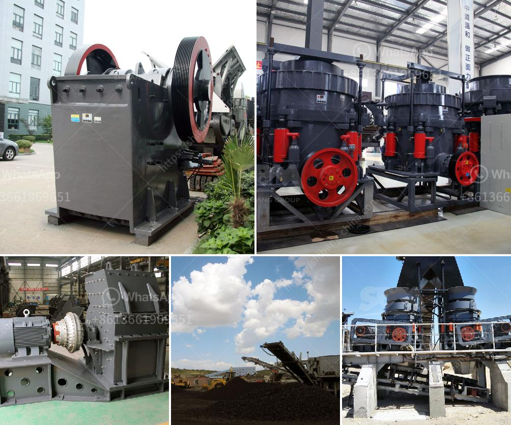

<h3>coal crusher size 100 tph</h3>
Coal Crusher Size 100 TPH: Understanding the Importance of Coal Crusher Size for Efficient Combustion

Many industries like coal mining, cement, steel, and electricity rely on coal for their fuel needs. However, before coal can be used efficiently, it needs to be processed to achieve the proper size. A coal crusher is a key component in this process, ensuring the coal is reduced to an appropriate size for combustion. The coal crusher size is crucial in determining the combustion efficiency of the boiler. It is also an important factor in the overall design and operation of the crusher itself.

Coal crushers are typically used to crush coal into small particles for further processing. Due to the increasing demand for coal and the large size of the coal mine, it is more important to choose a suitable crusher to achieve efficient processing of coal. The following factors need to be considered when selecting the appropriate coal crusher size:

Firstly, the feed size of the coal crusher is important. The smaller the feed size, the easier the coal can be crushed, which means less energy is required during crushing. A smaller feed size also allows the crusher to reach its maximum capacity more efficiently. Therefore, when selecting a coal crusher, it is essential to consider the feed size and its impact on the crusher's performance.

Secondly, the product size requirement is an important consideration. Different industries have different coal size requirements. For example, power plants generally require coal particles of less than 6mm. On the other hand, cement and steel industries may require coal particles of 20mm or larger. It is crucial to understand the specific requirements of the industry the coal crusher will serve to ensure the product meets the desired size.

Lastly, the crusher's capacity is a critical factor. The crusher should be able to handle the required tonnage per hour. The capacity of the crusher should be well-matched with the feed size and desired product size. It is essential to select a coal crusher with a capacity that meets the production requirements of the industry it serves. This will help avoid any bottlenecks in the production process.

Based on these factors, a coal crusher size of 100 TPH is typically chosen for moderate to heavy-duty applications. The 100 TPH coal crusher can adequately process coal of up to 200mm size, reducing it to a product size of 75 to 100mm.

In conclusion, the proper coal crusher size ensures the efficient combustion of coal and the overall performance of the coal-fired power plant. When selecting a coal crusher, the feed size, product size, and crusher capacity are all important factors to consider. A coal crusher size of 100 TPH with a feed size of 200mm and product size of 75-100mm is suitable for moderate to heavy-duty applications. By choosing the appropriate coal crusher, the industry can achieve efficient processing of coal and optimize the combustion process for enhanced productivity and reduced emissions.
<h3>Contact us</h3><ul><li><strong>Whatsapp:&nbsp;<a href="https://wa.me/8613661969651">+8613661969651</a></strong></li><li><a href="https://swt.shibang-china.com/?git&amp;zhl&amp;coal crusher size 100 tph"><strong>Online Service(chat now)</strong></a></li></ul><h3>Related</h3><ul><li><a href='crushing b vsi crusher.md'>crushing b vsi crusher</a></li><li><a href='quarry stone business plan in zimbabwe.md'>quarry stone business plan in zimbabwe</a></li><li><a href='aggregate conveyor systems.md'>aggregate conveyor systems</a></li><li><a href='vibrating screen in the philippines.md'>vibrating screen in the philippines</a></li><li><a href='stone crusher for excavator cost.md'>stone crusher for excavator cost</a></li></ul>