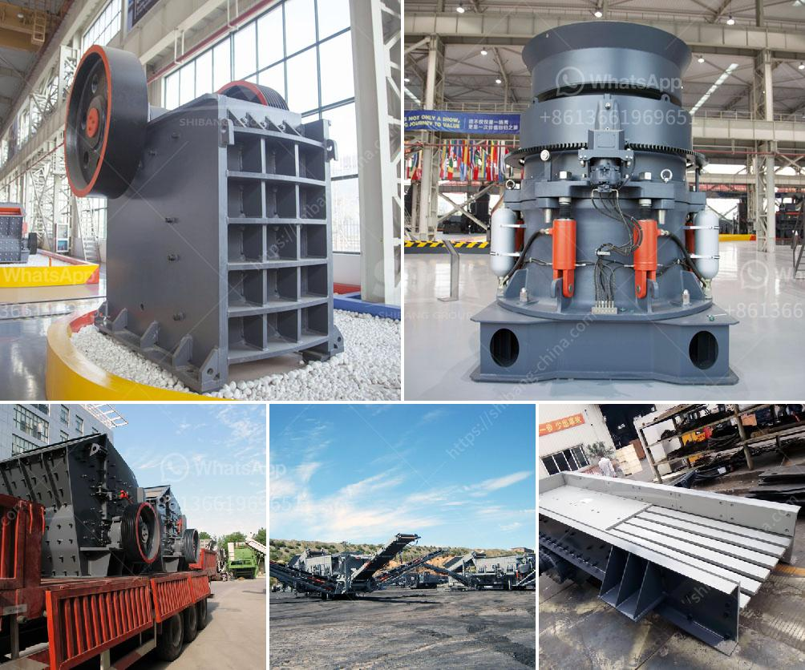

<h3>coal crushing and screening plant for sale</h3>
Coal is a fossil fuel that has been used as a source of energy for centuries. However, with the advancements in technology, the burning of coal has been found to be harmful to the environment. As a result, there has been a shift towards cleaner and more sustainable energy sources. Despite this, coal is still a widely used fuel, especially in countries where it is abundant.

Coal crushing and screening plants are used to process coal into manageable sizes for various industrial uses. The role of coal crushers in the mining and processing of coal is quite essential, as they track down the coal into different categories and sizes. Coal crushers are predominantly used in coal handling plants and thermal power stations. They are most suitable in handling low-grade coal or soft ores.

Coal crushing and screening designs are very efficient for dealing with open-pit coal mines in which a coal seam is extracted from the ground and mixed with impurities, such as rocks and other undesirable materials. This process ensures that the coal is suitable for use as a fuel and also reduces the amount of waste material that needs to be disposed of.

When it comes to coal crushing and screening plants for sale, there are numerous options available. From stationary equipment with built-in crushers and screens to mobile crushing and screening plants, the possibilities are endless. A range of equipment options ensures that all coal processing needs can be met, whether it is for primary crushing, secondary crushing, or even tertiary crushing.

Aside from the equipment options, the capacity of the coal crushing and screening plant for sale is another key factor to consider. Depending on the types and sizes of the coal and the desired end product, the capacity can range from 100 to 300 tons per hour. The higher the capacity, the more productive and efficient the plant will be.

In conclusion, coal crushing and screening plants for sale are crucial in the mining industry. They reduce the size of the coal and make it easier to transport and use as a fuel. With various equipment options, capacities, and designs available, there is something for every coal processing need. It is important, however, to ensure that the chosen plant is reliable, efficient, and meets all the necessary requirements for the specific mining operation.
<h3>Contact us</h3><ul><li><strong>Whatsapp:&nbsp;<a href="https://wa.me/8613661969651">+8613661969651</a></strong></li><li><a href="https://swt.shibang-china.com/?git&amp;zhl&amp;coal crushing and screening plant for sale"><strong>Online Service(chat now)</strong></a></li></ul><h3>Related</h3><ul><li><a href='hammer mills hammer mills.md'>hammer mills hammer mills</a></li><li><a href='stone crusher machine price in kenya.md'>stone crusher machine price in kenya</a></li><li><a href='crushing machine manufacturer.md'>crushing machine manufacturer</a></li><li><a href='mobile crushing and screening to hire south africa.md'>mobile crushing and screening to hire south africa</a></li><li><a href='lavadora de arena en mexico.md'>lavadora de arena en mexico</a></li></ul>