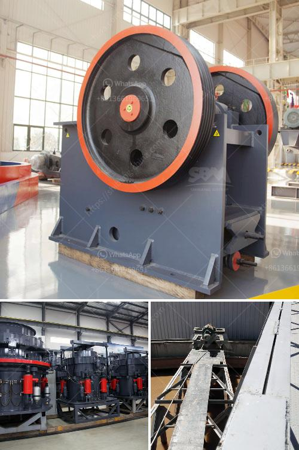

<h3>coal crushing and screening plant setup</h3>
Coal is a versatile and predominantly used source of energy worldwide. It is used for generating electricity, making steel and cement production, and in various industrial processes. As the demand for coal continues to rise, significant efforts are being made to optimize its extraction, transportation, and processing to ensure efficient use and minimize environmental impact.

One crucial step in achieving these objectives is the proper setup of a coal crushing and screening plant. This article outlines the specifics for such a setup and why each component is essential to the overall process.

The first step in coal processing is to reduce the size of large coal chunks into smaller pieces suitable for further handling and processing. Therefore, a robust and efficient crusher is required to optimize the particle size reduction process.

Typically, primary crushers are used to break down large coal chunks into manageable sizes. Jaw, gyratory, or impact crushers are commonly used due to their versatility and ability to handle various types of coals. The choice of crusher depends on the characteristics of the coal and the desired particle size.

Upon achieving the ideal particle size, the next step is to separate the coal into different size fractions through screening. This is crucial to ensure uniformity in the end product and the removal of any impurities or oversized particles.

Various types of screens, such as vibrating, flip-flow, or drum screens, can be used for this process. Screens are designed with different aperture sizes to allow coal particles of the desired size to pass through while larger particles are directed to secondary crushers or stockpiled for further processing.

To set up a coal crushing and screening plant, a central power station building is constructed for crushers, screens, and conveyors. The equipment is housed in a purpose-built structure to protect it from the elements and provide a safe working environment for operators.

The plant setup should also include an efficient dust suppression system to minimize airborne coal dust. Dust suppression technologies such as water sprays, fog cannons, or chemical agents can be employed to prevent dust from becoming a health and safety hazard.

The plant layout should be carefully designed to optimize material flow and minimize the distance traveled by coal during the crushing and screening process. This ensures reduced handling, less wear and tear on equipment, and increased overall operational efficiency.

Furthermore, proper maintenance and regular inspections of the coal crushing and screening plant are crucial for maintaining optimum performance. It is essential to check for worn-out parts, replace any faulty components, and perform routine lubrication to ensure smooth operation and prevent unexpected breakdowns.

Setting up a coal crushing and screening plant requires careful planning and attention to detail. The proper size reduction and separation of coal particles form the backbone of an efficient coal processing system. By investing in high-quality equipment, ensuring an efficient plant layout, and implementing regular maintenance practices, operators can maximize their plant's productivity while adhering to strict environmental regulations. Ultimately, an optimized coal crushing and screening plant will contribute to the sustainable and efficient use of this valuable energy resource for years to come.
<h3>Contact us</h3><ul><li><strong>Whatsapp:&nbsp;<a href="https://wa.me/8613661969651">+8613661969651</a></strong></li><li><a href="https://swt.shibang-china.com/?git&amp;zhl&amp;coal crushing and screening plant setup"><strong>Online Service(chat now)</strong></a></li></ul><h3>Related</h3><ul><li><a href='quartz powder suppliers in dubai.md'>quartz powder suppliers in dubai</a></li><li><a href='ball mill hou feng in china.md'>ball mill hou feng in china</a></li><li><a href='japan jaw crusher machine.md'>japan jaw crusher machine</a></li><li><a href='alluvia gold mining equipments.md'>alluvia gold mining equipments</a></li><li><a href='ultrafine grinder for producing powder.md'>ultrafine grinder for producing powder</a></li></ul>