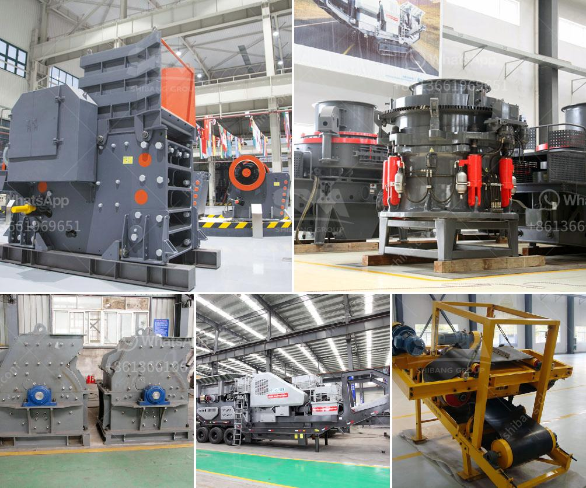

<h3>coal crushing machine in malaysia</h3>
Malaysia is a Southeast Asian country with a rich tradition of mining resources, particularly tin, petroleum, and coal. Coal is one of the important energy sources in Malaysia, accounting for around 26% of the country's primary energy demand in 2019. With the growing demand for coal as an energy source, coal crushing machines are necessary for various industries that require the utilization of coal.

Coal crushing machines are used to crush coal into smaller sizes for further processing or for end-use applications. It is typically used in the mining industry to determine the size of the coal particles and to separate impurities. Coal crushing machines vary in different sizes and capacities, from small handheld units to large heavy-duty machines.

In Malaysia, coal crushing machines are widely applied in various industries such as mining, metallurgy, building materials, highway, railway, water conservancy, and chemical industry. Due to the high quality and efficient service, Malaysia has witnessed a significant growth in terms of coal production and export volume in recent years.

One of the popular coal crushing machines in Malaysia is the jaw crusher. The wide opening jaws designed with a high crushing ratio and large feed opening, it guarantees the outstanding crushing capacity. Besides, jaw crushers have two types of movable jaw plates, one is fixed jaw plate, which is vertically fixed on the front wall of the body; the other is a dynamic jaw plate, forming a crushing cavity with the fixed jaw plate, and it is inclined by a predetermined angle.

Cone crushers are another popular choice for coal crushing machines in Malaysia. This type of crusher features a crushing chamber designed by combining reservoir and vibrating screen technologies, ensuring that the particle size of the coal is uniform and meets the requirements of downstream industries. With its high automation level, cone crushers are easy to operate and require minimal maintenance.

In addition to jaw crushers and cone crushers, coal crushing machines can also be applied in the form of impact crushers. These machines utilize impact force to crush the coal ore and are preferred by industries looking for high reliability and low maintenance costs. Impact crushers are versatile and can be used in various applications such as quarries, mining, and recycling.

While coal crushing machines are essential for Malaysia's coal industry, they also pose challenges in terms of environmental impact and safety regulations. Efforts are being made to ensure that coal crushing machines are equipped with the latest technologies for dust suppression, noise reduction, and energy efficiency. Continuous monitoring and strict regulation are implemented to control emissions and minimize environmental pollution.

In conclusion, coal crushing machines play an essential role in the coal mining industry in Malaysia. They are widely used in various industries to crush coal into smaller sizes for further processing or for final end-use applications. With the increasing demand for coal as an energy source, the development and advancement of efficient and environmentally friendly crushing machines are essential for the sustainable growth of Malaysia's coal industry.
<h3>Contact us</h3><ul><li><strong>Whatsapp:&nbsp;<a href="https://wa.me/8613661969651">+8613661969651</a></strong></li><li><a href="https://swt.shibang-china.com/?git&amp;zhl&amp;coal crushing machine in malaysia"><strong>Online Service(chat now)</strong></a></li></ul><h3>Related</h3><ul><li><a href='aggregate crushing plant layout.md'>aggregate crushing plant layout</a></li><li><a href='quartz making machine germany.md'>quartz making machine germany</a></li><li><a href='gold mining equipments manufacturers.md'>gold mining equipments manufacturers</a></li><li><a href='used mobile jaw crusher dealers in ghana.md'>used mobile jaw crusher dealers in ghana</a></li><li><a href='used crusher plant in dubai for sale.md'>used crusher plant in dubai for sale</a></li></ul>