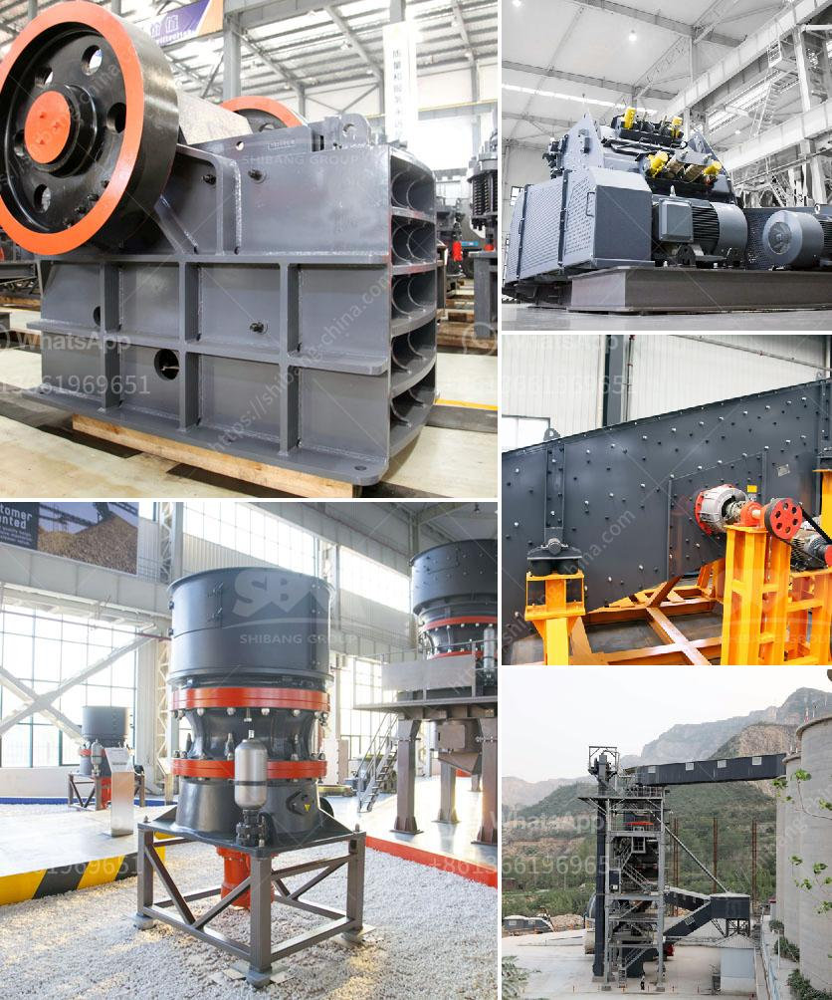

<h3>coal crushing machine</h3>
Coal crushing machine, also known as coal crusher, is the commonly used crushing equipment in coal mining industry. With its unique advantages, coal hammer crusher is favorably used in coal crushing line. Coal hammer crusher is widely used in small and medium sized mines with simple structure and high production efficiency.

Coal crusher specially designed for coal industry is a kind of new equipment recently launched by Fote Machinery. The new successfully developed coal crusher not only meets the requirements of environmental protection but also improves the crushing efficiency and reduces the production cost.

Featuring a unique structure, coal crushing machine has high efficiency and low energy consumption. The crushing materials are coal, ore, limestone, slag, coke, and other materials. The advanced crushing equipment is equipped with a heavy-duty rotor and a high-strength wear-resistant lining plate, greatly improving its reliability during operation. Moreover, the advanced adjustable gap technology allows the discharge size of the materials to be easily adjusted, ensuring the particle size of the final product meets the requirements.

In addition, the coal crushing machine has the advantages of convenient installation and maintenance, simple operation, and long service life. The hammer head of the machine is made of high-grade alloy material, ensuring its high wear resistance and impact resistance. Furthermore, it adopts a hydraulic opening device, which greatly facilitates the replacement of the wearing parts and reduces the downtime caused by maintenance.

Coal crushing machine is widely used in coal mining, power plant, and other industries, which is the preferred equipment for coal crushing. Because of its large capacity, high efficiency and low consumption, it is more and more widely used in coal mining industry.

The coal crusher produced by Fote Machinery successfully adapts to the industry's needs and meets the high production requirements of customers. It plays a key role in coal preparation system, coal production line and coal power plant. With its unique advantages, the coal crusher has brought huge economic benefits to customers.

In conclusion, coal crushing machine is an efficient and reliable equipment. Its unique advantages have been widely used in coal mining industry. The coal crusher greatly improves the performance and output of the coal crushing line. With its unique advantages, it has been welcomed by customers all over the world. Fote Machinery will continue to improve the quality and technology of coal crushing machine to better serve the coal mining industry.
<h3>Contact us</h3><ul><li><strong>Whatsapp:&nbsp;<a href="https://wa.me/8613661969651">+8613661969651</a></strong></li><li><a href="https://swt.shibang-china.com/?git&amp;zhl&amp;coal crushing machine"><strong>Online Service(chat now)</strong></a></li></ul><h3>Related</h3><ul><li><a href='costs of conveyor belts.md'>costs of conveyor belts</a></li><li><a href='capital cost ball mill.md'>capital cost ball mill</a></li><li><a href='2nd hand mobile crusher in dubai.md'>2nd hand mobile crusher in dubai</a></li><li><a href='stone crusher in thailand.md'>stone crusher in thailand</a></li><li><a href='ghana quarry crusher.md'>ghana quarry crusher</a></li></ul>