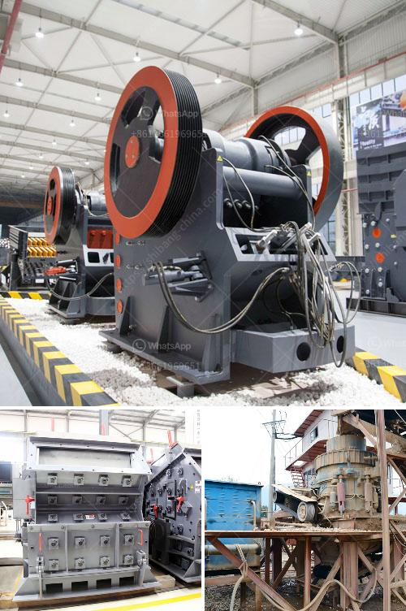

<h3>coal cushing and gdrinding machine</h3>
Coal crushing and grinding machines play a crucial role in the mining and utilization of coal resources in various fields. They undergo extensive research and development to meet the ever-increasing demand for efficient and sustainable coal processing equipment. This article aims to provide an overview of coal crushing and grinding machines, highlighting their significance and advancements.

Coal crushing machines are designed to reduce the size of coal particles and facilitate better combustion. One of the most commonly used machines is the jaw crusher, which is a heavy-duty machine that utilizes compression to effectively crush coal. Jaw crushers are sturdy and durable, making them suitable for coal crushing operations in mines and power plants.

Another popular coal crushing machine is the impact crusher. Similar to a jaw crusher, it utilizes a high-speed rotor with blow bars to crush coal against a steel plate. The impact crusher is renowned for its high reduction ratio and uniform particle size, making it particularly suitable for coal grinding applications where precise control of the particle size is crucial.

In addition to crushers, coal grinding machines are equally vital in the coal processing industry. Grinding machines, such as coal mills, are used to pulverize and dry coal before it is blown into the combustion chamber of a coal-fired boiler. In modern coal-fired power plants, coal is pulverized to a fine powder and then combusted at high temperatures. This process increases the efficiency of coal combustion and reduces harmful emissions.

One of the most common types of coal mills is the ball mill. Ball mills pulverize and mix the coal and additives like limestone, clay, and iron in defined proportions. This mixture is then fed into a rotating drum, which contains steel balls. As the drum rotates, the coal and additives are crushed and ground, resulting in the formation of a fine powder. The powdered coal is then blown into the combustion chamber, where it ignites and produces heat.

Recent advancements in coal crushing and grinding machines have focused on improving efficiency and reducing energy consumption. For instance, the development of high-pressure grinding rolls (HPGR) has revolutionized the coal processing industry. HPGR machines consist of two counter-rotating rolls that apply pressure to the coal, resulting in a highly efficient and energy-saving grinding process.

Furthermore, the integration of automation and control systems has enhanced the overall performance of coal crushing and grinding machines. These systems enable real-time monitoring, precise control of various parameters, and remote operation, ensuring optimal and safe operation of the machines.

In conclusion, coal crushing and grinding machines are essential equipment in the mining and utilization of coal resources. They play a vital role in achieving efficient coal combustion, reducing emissions, and ensuring clean and sustainable energy production. With ongoing research and advancements, these machines are continually evolving to meet the growing demands of the coal industry, contributing to a more efficient and environmentally friendly future.
<h3>Contact us</h3><ul><li><strong>Whatsapp:&nbsp;<a href="https://wa.me/8613661969651">+8613661969651</a></strong></li><li><a href="https://swt.shibang-china.com/?git&amp;zhl&amp;coal cushing and gdrinding machine"><strong>Online Service(chat now)</strong></a></li></ul><h3>Related</h3><ul><li><a href='stone crusher portable machine.md'>stone crusher portable machine</a></li><li><a href='crushing service with peru jaw crusher.md'>crushing service with peru jaw crusher</a></li><li><a href='cone crusher for sale in south africa.md'>cone crusher for sale in south africa</a></li><li><a href='grinding machine 2 micron for calcium carbonate.md'>grinding machine 2 micron for calcium carbonate</a></li><li><a href='concrete crushing machine in india.md'>concrete crushing machine in india</a></li></ul>