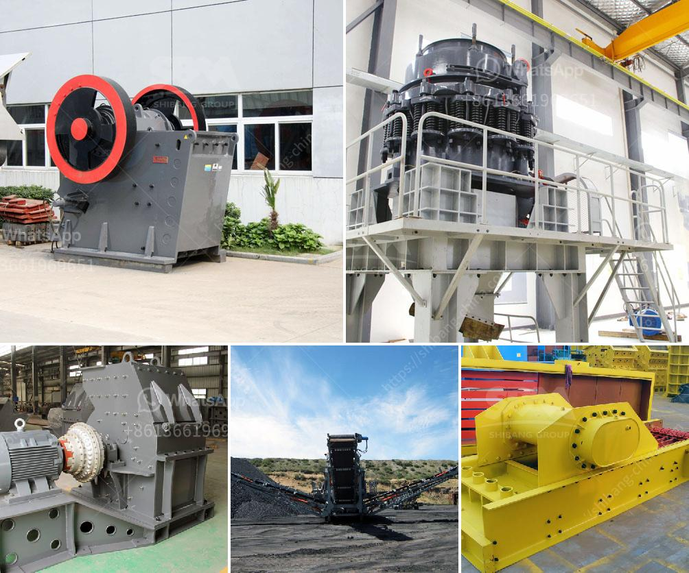

<h3>coal dry wash project cost</h3>
The extraction and usage of coal as an energy source have long been a topic of environmental concern due to its harmful emissions. To address these concerns, several methods of coal processing have been developed, and one such method is coal dry washing. The coal dry wash project aims to reduce the ash content and moisture levels of coal through a mechanical separation process, making it cleaner and more efficient to use.

One crucial aspect of any project is the cost involved, and the coal dry wash project is no exception. The cost of implementing a coal dry wash project can vary depending on several factors. Some of the primary cost considerations include technology selection, plant capacity, equipment, and infrastructure requirements.

Firstly, the technology chosen for coal dry washing significantly impacts the project cost. There are various dry washing technologies available, each with its unique features and associated costs. The selection of the appropriate technology depends on factors such as coal quality, desired output, and local conditions.

Secondly, the plant capacity is another influential factor in determining the project cost. The larger the plant capacity, the higher the cost. The capacity is usually determined based on the expected coal production and market demand. It is important to strike a balance between capacity and cost to ensure the project's economic viability.

Additionally, the cost of equipment required for coal dry washing needs to be considered. This includes crushers, screens, separators, and other machinery essential for the process. The equipment costs depend on the technology chosen and the scale of the project.

Lastly, infrastructure requirements such as land, utilities, and plant layout also contribute to the overall project cost. The cost of acquiring suitable land, establishing power supply connections, and designing an efficient plant layout should be taken into account.

In conclusion, while the cost of implementing a coal dry wash project can vary depending on multiple factors, it is crucial to weigh the potential benefits against the expenses. The reduction in ash content and moisture levels through coal dry washing can lead to cleaner and more efficient coal usage, ultimately benefiting both the environment and the economy.
<h3>Contact us</h3><ul><li><strong>Whatsapp:&nbsp;<a href="https://wa.me/8613661969651">+8613661969651</a></strong></li><li><a href="https://swt.shibang-china.com/?git&amp;zhl&amp;coal dry wash project cost"><strong>Online Service(chat now)</strong></a></li></ul><h3>Related</h3><ul><li><a href='crusher production line.md'>crusher production line</a></li><li><a href='lime powder marking machines.md'>lime powder marking machines</a></li><li><a href='portable vibrating coal screen.md'>portable vibrating coal screen</a></li><li><a href='gypsum powder manufacturing plant price.md'>gypsum powder manufacturing plant price</a></li><li><a href='cement plants suppliers from china.md'>cement plants suppliers from china</a></li></ul>