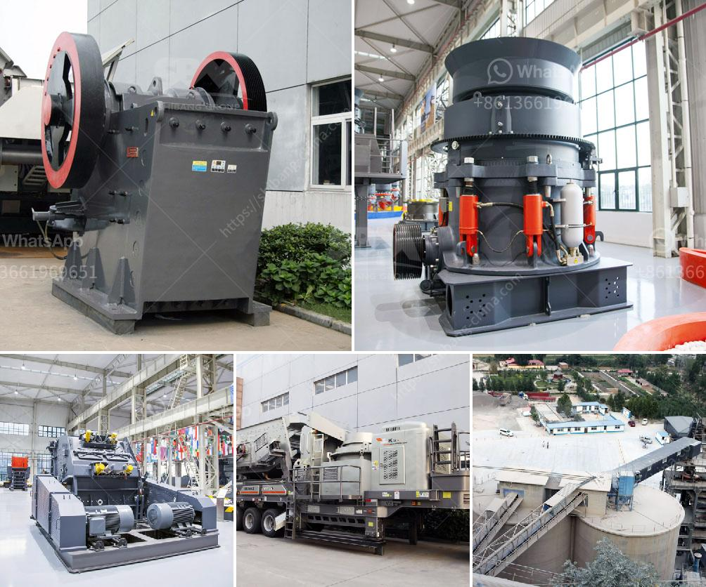

<h3>coal mill grinding media wear rate</h3>
Coal is one of the world’s most abundant sources of energy, making it a vital ingredient for delivering electricity to billions of people every day. As such, the mining and utilization of coal require various processes to ensure its suitability for power generation. One critical aspect in this energy-intensive industry is the coal mill, a machine that grinds coal into a fine powder. To maximize the efficiency of coal combustion, precise coal particle size distribution and desired coal fineness are crucial factors to achieve optimum combustion efficiency.

Within the coal mill, the grinding media, such as steel balls or rods, pulverize the coal to fine particles, providing the necessary motion to allow for its efficient combustion. However, over time, the grinding media inside the coal mill wear out due to continuous usage and abrasion caused by coal particles. This wear leads to a decline in the grinding media's efficiency, reducing the mill's output capacity and overall performance.

One of the critical factors contributing to the grinding media's wear rate is the coal's inherent abrasive nature. The coal generally contains impurities like silica, clay, and pyrite, which act as abrasives during the grinding process. As the coal particles rub against the grinding media, these abrasive components cause wear and tear on the media's surface. Consequently, the grinding media's lifespan decreases, requiring frequent replacements and maintenance activities.

Another factor influencing the wear rate of grinding media within the coal mill is the mill's operating conditions. The grinding media's wear rate is directly proportional to the mill's speed, impacting the kinetic energy transferred to the coal particles. Higher mill speeds result in an increased wear rate as the grinding media experience additional impact forces. Similarly, the coal's moisture content also affects the grinding media's wear rate, with higher moisture levels promoting increased abrasion due to the increased stickiness of the coal particles.

To minimize the overall wear rate of grinding media in coal mills, various strategies can be implemented. First and foremost, selecting a suitable grinding media with high hardness and wear resistance is paramount. Materials like high-chromium alloys and forged steel have proven to be effective in combating high wear rates. Implementing regular media inspection and quality control procedures to identify worn-out media and replace them promptly is also essential. Additionally, optimizing the coal mill's operation parameters, such as speed and feeding rate, can help reduce wear and maintain optimum performance.

In conclusion, the wear rate of grinding media within coal mills greatly impacts overall mill performance and coal combustion efficiency. The abrasive nature of coal particles and the operating conditions of the mill contribute to the wear rate, necessitating frequent replacements and maintenance activities. By selecting appropriate materials, implementing inspection and quality control procedures, and optimizing operational parameters, coal mill operators can mitigate the wear rate and maintain efficient grinding processes. Ultimately, these measures contribute to the sustainability and longevity of coal-powered energy generation.
<h3>Contact us</h3><ul><li><strong>Whatsapp:&nbsp;<a href="https://wa.me/8613661969651">+8613661969651</a></strong></li><li><a href="https://swt.shibang-china.com/?git&amp;zhl&amp;coal mill grinding media wear rate"><strong>Online Service(chat now)</strong></a></li></ul><h3>Related</h3><ul><li><a href='iron ore beneficiation flowsheet.md'>iron ore beneficiation flowsheet</a></li><li><a href='typical flow sheet for granite quarry.md'>typical flow sheet for granite quarry</a></li><li><a href='quartz powder plant in india.md'>quartz powder plant in india</a></li><li><a href='crusher new used for sale in uae.md'>crusher new used for sale in uae</a></li><li><a href='cement lime crusher.md'>cement lime crusher</a></li></ul>