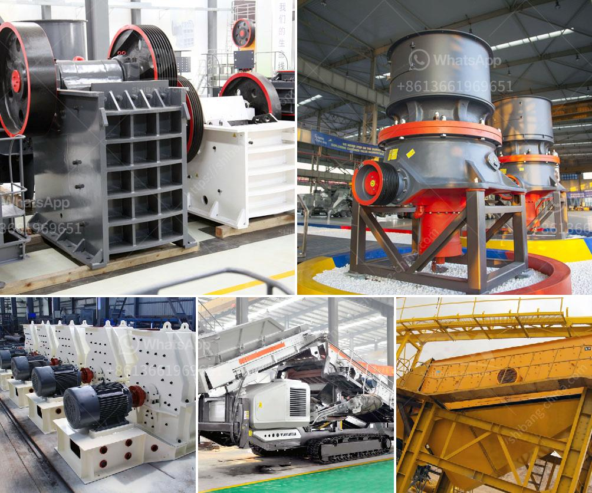

<h3>coal mill in china</h3>
China relies heavily on coal as a source of energy, and the country has built numerous coal-fired power plants to meet its growing energy demands. This has led to an alarming increase in pollution levels and environmental degradation. One crucial component of the coal-dependent energy sector is the coal mill.

The coal mill plays a significant role in the coal-fired power plant. The coal mill grinds the raw coal into fine powder and hot air entering the mill dries and carries the pulverized coal to the burners of the furnace. Hence, the coal mill is an essential component of the entire combustion system within a coal-fired power plant.

In China, the coal mill is classified into three types: a vertical roller mill, a medium-speed pulverizer, and a ball mill. These three kinds of coal mills have their own good points, customers can choose each one suitable for production according to the actual demands.

The energy saving ball mill is a horizontal cylindrical rotating device, which has two cabins. It is energy saving grate ball mill and the outside runs along the gear. The materials enter the first cabin of the mill spirally and evenly through the feeding apparatus and hollow shaft.

In the first cabin, there is stepped liner or corrugated liner, and steel balls with different specifications. The centrifugal force generating from the rotation of the cylinder brings steel balls to a certain level and then fall down, which has a pounding and grinding effect on materials.

After the rough grinding in the first cabin, materials enter the second cabin through the single-layer partition board. The second cabin is lined with flat lining and steel balls to further grind the materials. The powder material is discharged through a discharge grate to complete the grinding operation.

The vertical roller mill is more suitable for grinding coal. With the higher efficiency, it is an effective equipment for coal processing. In the bond working index, it has the following characteristics: high grinding efficiency, small grinding energy consumption, and long service life. If the grinding efficiency is low, the energy saving effect of the whole coal mill will be prominent.

Regarding the medium-speed pulverizer, it adopts the double-layer roller and flat-die micro-mill to improve the coal mill's operating stability. It also achieves the goal of reducing the energy consumption of the coal mill, thereby reducing emissions and protecting the environment.

China recognizes the environmental challenges it faces due to its reliance on coal power, and the government has launched various initiatives to curb pollution and promote cleaner energy alternatives. It is pushing for the closure of inefficient and polluting coal mills and the adoption of cleaner technologies.

Although coal will continue to play a role in China's energy mix in the foreseeable future, the country is also investing heavily in renewable energy sources such as solar and wind power. By diversifying its energy sources and employing cleaner technologies, China aims to reduce its reliance on coal and tackle the environmental issues associated with it.

In conclusion, the coal mill plays a crucial role in the coal-fired power plant. The coal mill's operation is directly related to the overall efficiency of the power plant and the quality of the coal being utilized. The use of modern coal mill models is essential when developing a predictive control strategy for the optimization of such milling systems.
<h3>Contact us</h3><ul><li><strong>Whatsapp:&nbsp;<a href="https://wa.me/8613661969651">+8613661969651</a></strong></li><li><a href="https://swt.shibang-china.com/?git&amp;zhl&amp;coal mill in china"><strong>Online Service(chat now)</strong></a></li></ul><h3>Related</h3><ul><li><a href='aggregate crushing plant layout.md'>aggregate crushing plant layout</a></li><li><a href='dolomite processing plants from germany.md'>dolomite processing plants from germany</a></li><li><a href='second hand jaw pulverizer india.md'>second hand jaw pulverizer india</a></li><li><a href='crush diabase machine.md'>crush diabase machine</a></li><li><a href='laboratory jaw crusher.md'>laboratory jaw crusher</a></li></ul>