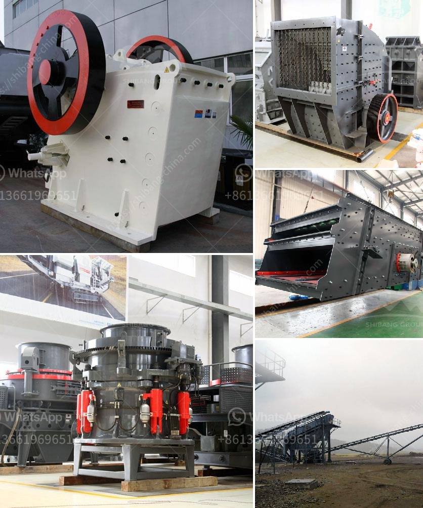

<h3>coal mine conveyor belt for sale</h3>
Conveyor belts are used intensively in coal mines to transport coal from the extraction point to the power plant. The selection of conveyor belts is crucial for the efficiency of the transportation process and the overall productivity of the mine. As such, coal mine owners need to carefully consider several factors before making a purchase. In this article, we will explore the features and benefits of conveyor belts for coal mines, specifically focusing on those available for sale in the market.

One of the significant considerations when selecting a conveyor belt for a coal mine is the durability of the belt. Coal mining operations can be harsh and demanding, with the conveyor belts continuously exposed to abrasion and impact from the coal itself, as well as from the rocks and other materials present in the mining process. Therefore, it is essential to choose a conveyor belt that is resilient and can withstand the rigorous conditions it will face. Look for a belt made from high-quality materials such as rubber compounds with high tensile strength and excellent abrasion resistance.

Another crucial aspect to consider is the belt's ability to handle high levels of tension and impact. Coal mines often experience heavy loads and sharp impacts on the conveyor belt due to the weight and size of the material being transported. Conveyor belts with strong fabric layers and reinforcement will be able to withstand these stresses, minimizing the risk of conveyor belt failures and downtime.

Additionally, the reliability and maintenance requirements of the conveyor belt should be taken into account. A poorly performing belt can lead to costly interruptions in the production process, causing delays and potentially increasing operational expenses. Look for conveyor belts that are easy to install, inspect, and repair, as they will reduce downtime and improve overall efficiency. Some modern conveyor belts even come with built-in monitoring systems that can detect and alert operators to potential issues before they become significant problems.

Furthermore, it is crucial to select a conveyor belt that meets safety standards and regulations. Coal mines are high-risk environments, and any negligence in ensuring the safety of workers and equipment can have severe consequences. Look for conveyor belts that comply with industry safety standards, such as those set by the Occupational Safety and Health Administration (OSHA) in the United States or similar organizations in other countries.

Finally, considering the cost-effectiveness and return on investment is essential when evaluating conveyor belts for sale. While it may be tempting to opt for the cheapest option available, it is crucial to consider the long-term costs including maintenance, repairs, and possible replacements. Investing in a high-quality conveyor belt upfront may prove more cost-effective in the long run, as it will have a longer lifespan and require fewer repairs and replacements.

In conclusion, selecting the right conveyor belt for a coal mine is a crucial decision that should not be taken lightly. Durability, ability to handle tension and impact, reliability, safety, and cost-effectiveness are all significant factors that need to be considered. By carefully evaluating these aspects, coal mine owners can make an informed decision and ensure a smooth and efficient transportation process, leading to increased productivity and profitability.
<h3>Contact us</h3><ul><li><strong>Whatsapp:&nbsp;<a href="https://wa.me/8613661969651">+8613661969651</a></strong></li><li><a href="https://swt.shibang-china.com/?git&amp;zhl&amp;coal mine conveyor belt for sale"><strong>Online Service(chat now)</strong></a></li></ul><h3>Related</h3><ul><li><a href='stone crusher price ton per day.md'>stone crusher price ton per day</a></li><li><a href='crusher jaw crusher 16x8.md'>crusher jaw crusher 16x8</a></li><li><a href='gypsum grinding machine manufacturer in india.md'>gypsum grinding machine manufacturer in india</a></li><li><a href='rock crushing machines for sale.md'>rock crushing machines for sale</a></li><li><a href='prices of conveyor belts for mining.md'>prices of conveyor belts for mining</a></li></ul>