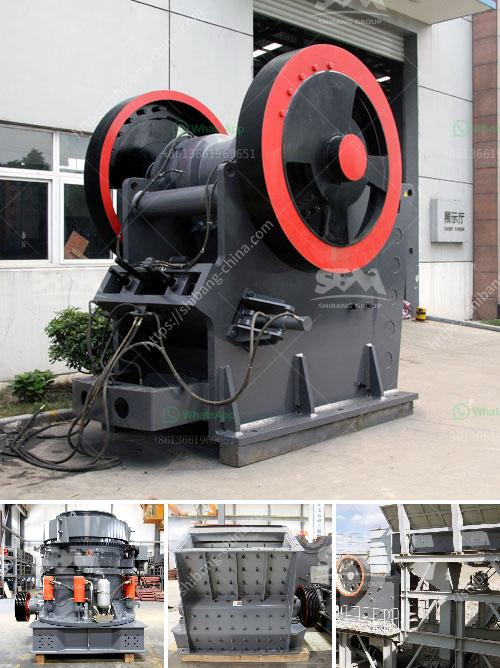

<h3>coal pulverizer manufacturer</h3>
Power generation is a critical aspect of our daily lives, as it ensures the availability of electricity that powers industries, businesses, and even our homes. A significant contributor to power generation worldwide is coal, a fossil fuel known for its abundance and relatively lower cost compared to other energy sources. To harness the full potential of coal as an energy source, coal pulverizer manufacturers play a vital role in the industry.

A coal pulverizer is a mechanical device used to grind coal into fine particles for combustion in various applications. It works by crushing coal into a fine powder and then allowing it to be blown into the boiler furnace to produce steam for electricity generation. This process requires precision and efficiency to ensure optimal results.

Coal pulverizer manufacturers specialize in designing and manufacturing equipment that meets the specific requirements of power plants, enabling them to efficiently process coal and regulate its particle size to meet the desired combustion efficiency. These manufacturers have extensive knowledge and experience in engineering high-quality pulverizers that cater to the unique needs of each power plant.

One of the key factors in the design of a coal pulverizer is its ability to handle different types of coal with varying moisture content and particle sizes. A reputable coal pulverizer manufacturer employs advanced technology and research to develop pulverizers that can process a wide range of coal types effectively, maximizing the fuel's energy potential.

Efficiency is a crucial consideration for coal pulverizer manufacturers. They strive to design equipment that consumes less energy, maximizes coal combustion efficiency, and minimizes environmental impact. By utilizing innovative technologies and materials, these manufacturers continuously improve the effectiveness and efficiency of pulverizers, reducing emissions and ensuring cleaner energy generation.

Additionally, coal pulverizer manufacturers also provide comprehensive services such as equipment installation, maintenance, and replacement parts. They work closely with power plants to ensure that their pulverizers are operating optimally, minimizing downtime, and maximizing power generation.

In conclusion, coal pulverizer manufacturers play a crucial role in the power generation industry. Their expertise in designing and manufacturing efficient pulverizers helps power plants harness the full potential of coal as an energy source. By continuously improving their equipment's performance and adopting environmentally friendly technologies, these manufacturers enable cleaner and more sustainable power generation for the future.
<h3>Contact us</h3><ul><li><strong>Whatsapp:&nbsp;<a href="https://wa.me/8613661969651">+8613661969651</a></strong></li><li><a href="https://swt.shibang-china.com/?git&amp;zhl&amp;coal pulverizer manufacturer"><strong>Online Service(chat now)</strong></a></li></ul><h3>Related</h3><ul><li><a href='india conveyor belt for stone crusher.md'>india conveyor belt for stone crusher</a></li><li><a href='machinery used in cement factory.md'>machinery used in cement factory</a></li><li><a href='roll ball mill manufacturers.md'>roll ball mill manufacturers</a></li><li><a href='stone crusher flow chart.md'>stone crusher flow chart</a></li><li><a href='equipment to start up a quarry crusher.md'>equipment to start up a quarry crusher</a></li></ul>