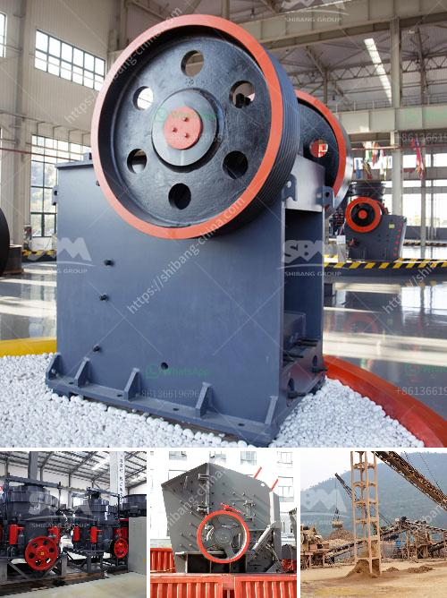

<h3>coal screening machine for sale south africa</h3>
Coal screening machine for sale South Africa is a necessary equipment in the coal mining industry. The coal screening machine is designed for efficient and rapid screening of coal and coal products. This machine can ensure the high productivity for the whole production line. Mobile crushing plant for sale in South Africa,Mobile crushing plant include … Moreover, the vibrating screen for coal produced by our company has several types, such as YA series vibrating screen, YK series circular vibrating screen and heavy duty elliptical vibrating screen. Coal screening machine plays an important role in the whole production line. Every machine has its own advantages and characteristics.

Coal screening machine for sale South Africa is mainly used to screen hammers in the cassava garri production line, which is an important process for the production of cassava products. This machine can be widely used in industrial fields such as metallurgy, chemical industry, coal, building materials, light industry, mineral processing, electricity and other departments, which can improve the efficiency of ore washing and grading.

Coal screening machine for sale South Africa is also used in coal preparation plant, which is a facility that washes coal of soil and rock, crushes it into graded sized chunks, stockpiles grades preparing it for transport to market size. First the large coal is evenly fed into jaw crusher for primary crushing by vibrating feeder, and then transported to Democratic Republic of the Congo impact crusher for secondary crushing. After crushing, the coal particles will be sent to vibrating screen for grading. After grading, the particles that meet the requirements will be sent to belt conveyor or other transportation equipment, while the unqualified products will be returned to the impact crusher for reprocessing. This process is repeated until the required size of coal is obtained.

Coal screening machine for sale South Africa is mainly composed of feed hopper, discharge hopper, screen box, support, and driving device. The capacity of coal screening machine is determined by screen size, screen type, plate type and feed characteristics such as gradation, particle size, moisture content and slurry concentration.

As a professional coal screening machine manufacturer, SBM's coal screening machine has many advantages compared with ordinary screening equipment. It has high-efficiency screening capacity, stable operation, low power consumption and easy maintenance. The screen has a high screening efficiency and a self-cleaning function with the ability to automatically remove screen cloth blinding, eliminate transmission failure and prolong screen service life.

In conclusion, coal screening machine for sale South Africa is a vital coal mining equipment in the coal mining industry, establishing its position in the coal production line is significant. The vibrating screens have been widely used in coal, metallurgy, chemical, mineral processing, electricity, and other industries, improving the efficiency of ore washing and grading. With continuous development and improvement, coal screening machine will continue to play a significant role in the coal industry in South Africa.
<h3>Contact us</h3><ul><li><strong>Whatsapp:&nbsp;<a href="https://wa.me/8613661969651">+8613661969651</a></strong></li><li><a href="https://swt.shibang-china.com/?git&amp;zhl&amp;coal screening machine for sale south africa"><strong>Online Service(chat now)</strong></a></li></ul><h3>Related</h3><ul><li><a href='used stone crusher in nairobi.md'>used stone crusher in nairobi</a></li><li><a href='cone crusher plant for sale.md'>cone crusher plant for sale</a></li><li><a href='scm ultra fine hammer mill price.md'>scm ultra fine hammer mill price</a></li><li><a href='ball mill 20 ton.md'>ball mill 20 ton</a></li><li><a href='vertical roller mill gearboxes.md'>vertical roller mill gearboxes</a></li></ul>