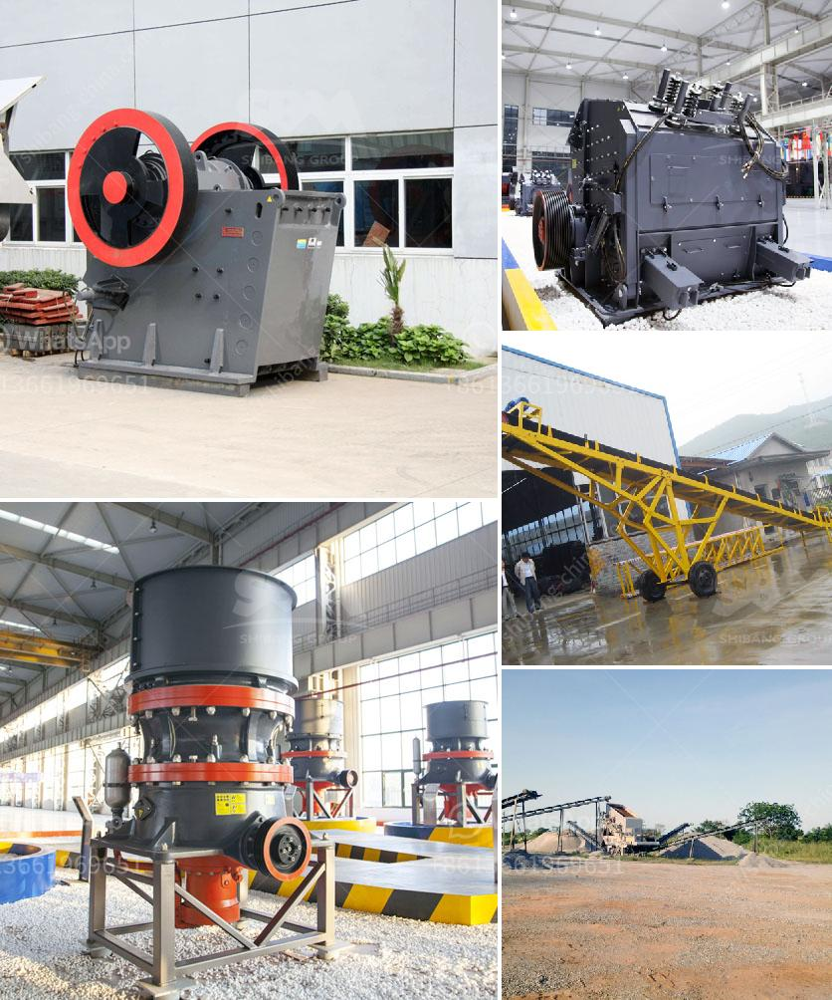

<h3>coal washing plant design</h3>
Coal Washing Plant Design: A Step-by-Step Approach for Improved Efficiency and Environmental Performance

Coal is a vital energy resource worldwide, and its production and consumption are increasing. However, coal often contains impurities such as rocks, dirt, and other materials that can negatively impact its quality and burn efficiency. To ensure cleaner, more efficient coal, coal washing plants are becoming increasingly popular as they remove these impurities before the coal is burned.

The design of coal washing plants is influenced by a variety of factors, including local regulations, the type of coal being processed, and the quality of the final product desired. However, the most common considerations include the following:

1. Size and Type of Coal: The size and type of coal being processed will determine the layout and design of the coal washing plant. Depending on the coal's characteristics, various equipment such as screens, centrifuges, dense medium vessels, and magnetic separators may be used to achieve the desired outcome.

2. Water Availability: Water is a crucial component of the coal washing process. The design should take into consideration the availability of water and the potential for recycling and reusing water to minimize usage and reduce the overall environmental impact.

3. Process Efficiency: The design of the coal washing plant should aim to maximize the efficiency of the washing process. This can be achieved through the use of advanced technologies such as gravity separation, froth flotation, and magnetic separation to remove impurities effectively.

4. Environmental Impact: The design should account for environmental regulations and work towards minimizing the environmental impact of the coal washing plant. This can be achieved by implementing technologies that reduce water usage, utilize energy-efficient equipment, and control emissions.

5. Safety Considerations: Safety is of utmost importance in any coal washing plant design. The layout should ensure safe access and egress for personnel, proper ventilation to prevent the buildup of harmful gases, and effective dust control measures to protect workers' health.

In recent years, there have been significant advancements in coal washing plant design to improve efficiency and environmental performance. For example, modular and compact designs have gained popularity as they can be easily transported and installed, reducing construction time and costs.

Additionally, automation and remote monitoring systems have been implemented to optimize plant operations, reduce human error, and ensure consistent performance. These systems allow for real-time monitoring and adjustments, enhancing overall efficiency and reliability.

Moreover, many coal washing plants are incorporating water recycling systems to minimize water consumption. These systems use advanced filtration and purification techniques to treat and recycle wastewater, reducing the plant's reliance on fresh water sources.

Overall, coal washing plant design is continuously evolving to meet the increasing demand for cleaner, more efficient coal. Through the use of advanced technologies, consideration of environmental impact, and a focus on safety, these plants are improving both the quality of coal and the sustainability of the coal industry. With continued research and innovation, coal washing plants will play a critical role in meeting global energy needs while minimizing their environmental footprint.
<h3>Contact us</h3><ul><li><strong>Whatsapp:&nbsp;<a href="https://wa.me/8613661969651">+8613661969651</a></strong></li><li><a href="https://swt.shibang-china.com/?git&amp;zhl&amp;coal washing plant design"><strong>Online Service(chat now)</strong></a></li></ul><h3>Related</h3><ul><li><a href='limestone processing plant company.md'>limestone processing plant company</a></li><li><a href='mobile gold hammer crusher for sale philippines.md'>mobile gold hammer crusher for sale philippines</a></li><li><a href='costs of conveyor belts.md'>costs of conveyor belts</a></li><li><a href='stone cape crusher for sale china.md'>stone cape crusher for sale china</a></li><li><a href='ball mill in kazakhstan.md'>ball mill in kazakhstan</a></li></ul>