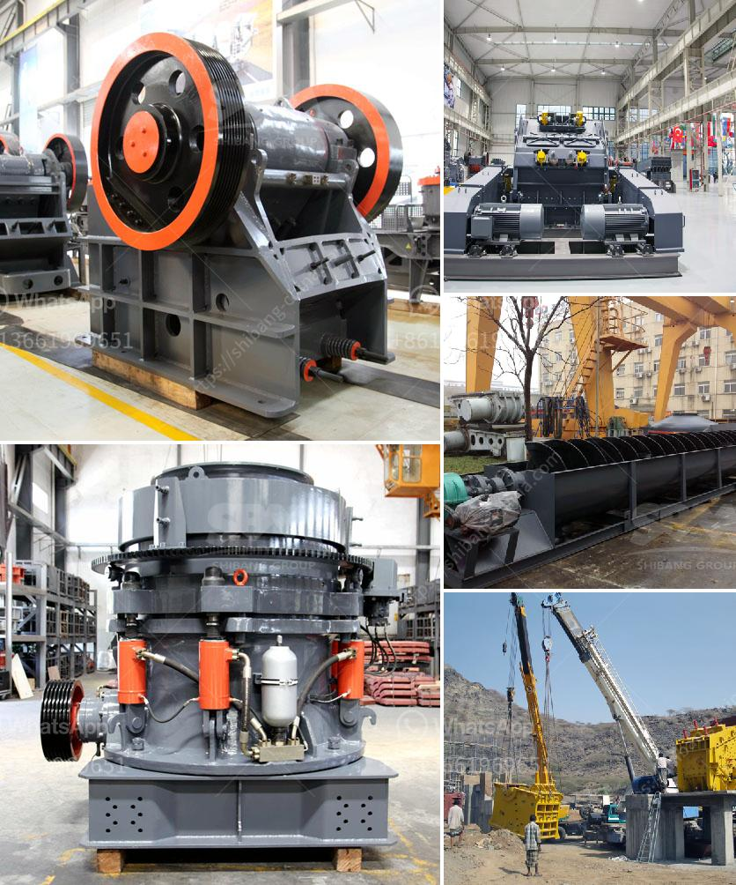

<h3>cobalt mobile crusher</h3>
Introducing the Cobalt Mobile Crusher, a versatile and compact mobile crusher that complements any mining operation.

Whether you're processing material directly on-site, reducing transport costs or utilizing a primary crusher for aggregate production, the Cobalt Mobile Crusher is a reliable, high-quality solution for all your crushing needs.

It offers significant advantages over traditional crushing machines. With its compact design, the Cobalt Mobile Crusher can easily be transported to different sites or recycled within the construction industry, maximizing productivity while minimizing downtime.

Equipped with powerful jaw crushing capabilities, this mobile crusher can handle even the toughest materials. It efficiently crushes a wide range of ores, rocks, and demolition debris, ensuring consistent, high-quality end products. Its adjustable settings allow for precise control of the output size, meeting the demands of various mining operations.

One of the standout features of the Cobalt Mobile Crusher is its ease of use. The user-friendly interface makes it simple to operate, reducing the learning curve and ensuring efficient operation. Additionally, the machine's maintenance requirements are minimal, allowing operators to focus on their core tasks without worrying about time-consuming upkeep.

Safety is paramount in any mining operation, and the Cobalt Mobile Crusher is designed with this in mind. It incorporates various safety features to protect operators and maintain a safe working environment. Advanced remote monitoring and diagnostic capabilities enable real-time monitoring of the machine's health, enhancing safety and performance.

Furthermore, the Cobalt Mobile Crusher is environmentally friendly. It runs on a low-emission engine, minimizing carbon footprint and ensuring compliance with strict environmental regulations. With its efficient fuel consumption, it reduces energy costs and contributes to sustainable mining practices.

The versatility of the Cobalt Mobile Crusher is evident in its wide range of applications. From quarrying to construction, this mobile crusher can handle diverse materials, making it suitable for various industries. It can process different types of minerals, coal, limestone, granite, and more, making it an asset for mining operations of all sizes.

In conclusion, the Cobalt Mobile Crusher is a game-changer in the mining industry. Its compact size, powerful jaw crushing capabilities, and user-friendly interface make it an excellent investment for mines of all sizes. With high-quality end products, minimal maintenance, and advanced safety features, the Cobalt Mobile Crusher delivers exceptional performance and efficiency. Its low-emission engine and versatile applications contribute to sustainable mining practices. If you're looking for a reliable and efficient mobile crusher, the Cobalt Mobile Crusher is the ideal choice.
<h3>Contact us</h3><ul><li><strong>Whatsapp:&nbsp;<a href="https://wa.me/8613661969651">+8613661969651</a></strong></li><li><a href="https://swt.shibang-china.com/?git&amp;zhl&amp;cobalt mobile crusher"><strong>Online Service(chat now)</strong></a></li></ul><h3>Related</h3><ul><li><a href='sand screw professional apr.md'>sand screw professional apr</a></li><li><a href='dolomite lime manufacturers in ghana.md'>dolomite lime manufacturers in ghana</a></li><li><a href='industrial ball mill for sale.md'>industrial ball mill for sale</a></li><li><a href='ball mill in egypt.md'>ball mill in egypt</a></li><li><a href='size ball mills for miner.md'>size ball mills for miner</a></li></ul>