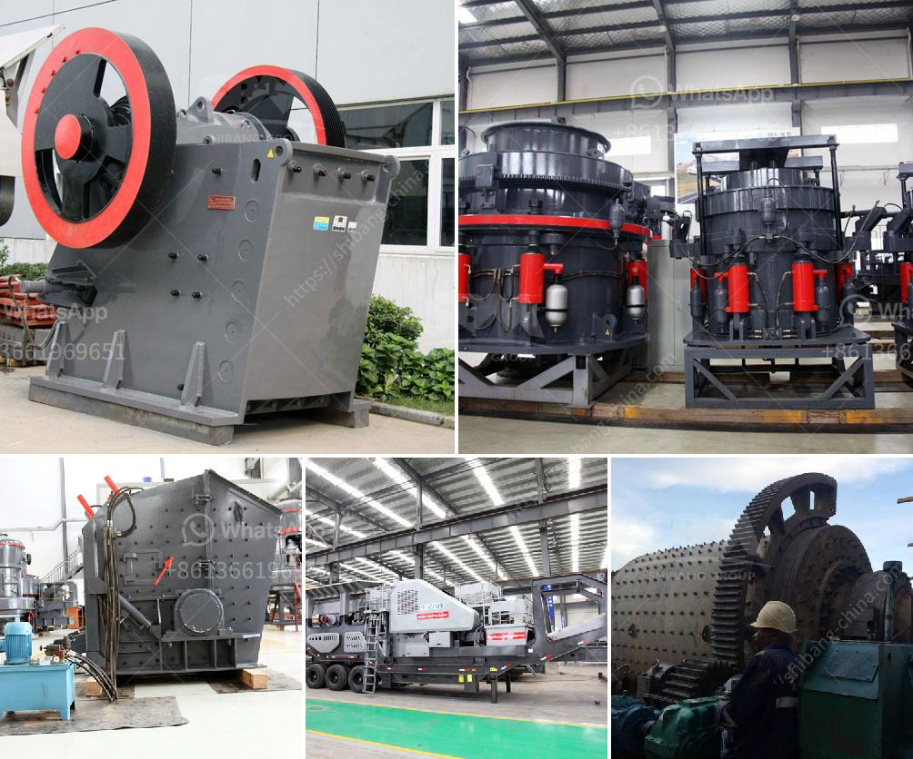

<h3>cobalt ore processing plant supplier</h3>
Cobalt is a valuable metal that is essential for the production of various high-tech devices and technologies, including electric vehicle batteries, aerospace alloys, and smartphone batteries. As the demand for these products continues to rise, so does the need for a reliable cobalt ore processing plant supplier.

One of the top suppliers in the industry is XYZ Corporation, a renowned company known for its commitment to quality and innovation. XYZ Corporation is at the forefront of cobalt ore processing technology, providing turnkey solutions to businesses worldwide. Their state-of-the-art processing plants are designed to efficiently extract cobalt from ores, ensuring a high yield and purity.

One of the key advantages of XYZ Corporation as a supplier is their extensive experience in the field. With years of expertise and a team of highly skilled professionals, they have perfected their processing methods, minimizing production costs and environmental impact. Their advanced technologies enable them to handle various types of cobalt ores, including sulfides and laterites, ensuring a steady supply for their customers.

In addition to efficient processing, XYZ Corporation places a strong emphasis on sustainability. They are committed to eco-friendly practices, implementing measures to reduce energy consumption and waste generation. By utilizing efficient filtration systems and implementing water recycling methods, they minimize their environmental footprint and contribute to a greener future.

Furthermore, XYZ Corporation recognizes the importance of responsible sourcing. Cobalt mining has been linked to various human rights and labor issues in certain regions, raising concerns about ethical practices. As a responsible supplier, XYZ Corporation works closely with their mining partners to ensure adherence to ethical standards, promoting fair labor practices and responsible mining techniques.

Another key aspect that sets XYZ Corporation apart is their customer-centric approach. They understand that each customer has unique requirements and tailor their solutions accordingly. Whether it is a large-scale mining operation or a smaller-scale business, they provide personalized support and technical expertise, ensuring a smooth and efficient operation.

In conclusion, a reliable cobalt ore processing plant supplier is crucial for businesses in industries reliant on cobalt, such as electric vehicles and aerospace. XYZ Corporation emerges as a leading supplier in this field due to their cutting-edge technology, extensive experience, sustainability efforts, responsible sourcing practices, and customer-centric approach. With XYZ Corporation as a partner, businesses can confidently meet the growing demand for cobalt and contribute to a sustainable future.
<h3>Contact us</h3><ul><li><strong>Whatsapp:&nbsp;<a href="https://wa.me/8613661969651">+8613661969651</a></strong></li><li><a href="https://swt.shibang-china.com/?git&amp;zhl&amp;cobalt ore processing plant supplier"><strong>Online Service(chat now)</strong></a></li></ul><h3>Related</h3><ul><li><a href='to produce tons of li ne powder.md'>to produce tons of li ne powder</a></li><li><a href='quartz production line.md'>quartz production line</a></li><li><a href='cone crusher plant for sale.md'>cone crusher plant for sale</a></li><li><a href='50 tph stone crusher plant.md'>50 tph stone crusher plant</a></li><li><a href='clay grinding machine.md'>clay grinding machine</a></li></ul>