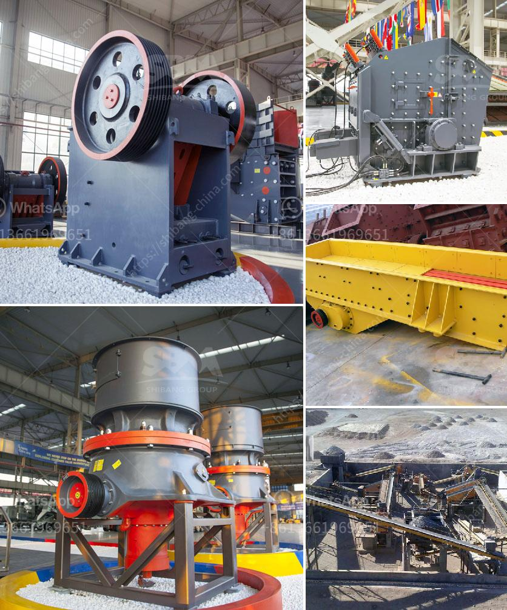

<h3>coconut shell powder machine project report</h3>
Coconut is widely grown in tropical regions and is known for its versatility and various uses. From food to beauty products, the coconut tree offers a plethora of benefits. However, one byproduct of coconut production – coconut shells – often ends up as waste, causing environmental concerns. The disposal of coconut shells not only takes up valuable landfill space but also contributes to air and water pollution. To address this issue, a revolutionary project called the Coconut Shell Powder Machine has been introduced, aiming to transform coconut shells into a valuable resource.

The Coconut Shell Powder Machine Project aims to utilize coconut shells effectively by converting them into high-quality coconut shell powder. This powder can be used in a diverse range of industries, including cosmetics, food processing, and the manufacture of mosquito coils and activated carbon, among others. By transforming coconut shells into a usable product, this project promotes sustainable waste management practices and helps reduce the environmental footprint of coconut production.

The Coconut Shell Powder Machine Project follows a streamlined process to carry out its operations. The raw coconut shells are first collected from coconut farms or coconut processing plants. These shells are then cleaned and dried to remove any dirt or moisture content. Once dried, they are crushed into small pieces using the coconut shell crusher machine, resulting in uniform-sized particles.

The crushed coconut shells are then fed into the Coconut Shell Powder Machine, which further grinds the material into a fine powder. The machine incorporates a series of blades and hammers to pulverize the shells, ensuring a consistent and silken powder texture. During the grinding process, the machine's advanced sieving system separates the powder into different grades, allowing manufacturers to acquire the desired granularity for their specific applications.

The resulting coconut shell powder can be used in various industries due to its excellent absorbent properties, high calorific value, and abrasive nature. In the cosmetics industry, it finds application as a natural exfoliant and body scrub, while food processing companies utilize it as a flavoring and thickening agent. The powder can also be compressed into briquettes and used as a clean and eco-friendly alternative to traditional fossil fuels like coal.

Apart from its direct applications, coconut shell powder is a crucial raw material for the production of value-added products, such as activated carbon and mosquito coils. Activated carbon, derived from coconut shell powder, finds extensive usage in water and air purification, chemical processing, and wastewater treatment. Additionally, mosquito coils made from coconut shell powder release a natural mosquito repellent, offering a sustainable alternative to harmful chemicals commonly found in mosquito control products.

The Coconut Shell Powder Machine Project facilitates social and economic development by generating employment opportunities for local communities. It encourages entrepreneurship and promotes the establishment of coconut shell powder processing plants, which boosts the local economy and creates a sustainable livelihood for farmers and workers involved in coconut processing.

Overall, the Coconut Shell Powder Machine Project brings tremendous benefits, promoting sustainable waste management practices, reducing environmental pollution, and providing value-added solutions for various industries. By harnessing the potential of coconut shells, this innovative project not only tackles the waste management challenge but also offers an exciting avenue for economic growth and resource optimization.
<h3>Contact us</h3><ul><li><strong>Whatsapp:&nbsp;<a href="https://wa.me/8613661969651">+8613661969651</a></strong></li><li><a href="https://swt.shibang-china.com/?git&amp;zhl&amp;coconut shell powder machine project report"><strong>Online Service(chat now)</strong></a></li></ul><h3>Related</h3><ul><li><a href='iron ore mining and beneficiation project.md'>iron ore mining and beneficiation project</a></li><li><a href='equipos para triturado de mineria.md'>equipos para triturado de mineria</a></li><li><a href='crushing and screening plant supplier china.md'>crushing and screening plant supplier china</a></li><li><a href='300tpd mini cement plant task cost in india.md'>300tpd mini cement plant task cost in india</a></li><li><a href='barangay resolution crushing plant.md'>barangay resolution crushing plant</a></li></ul>