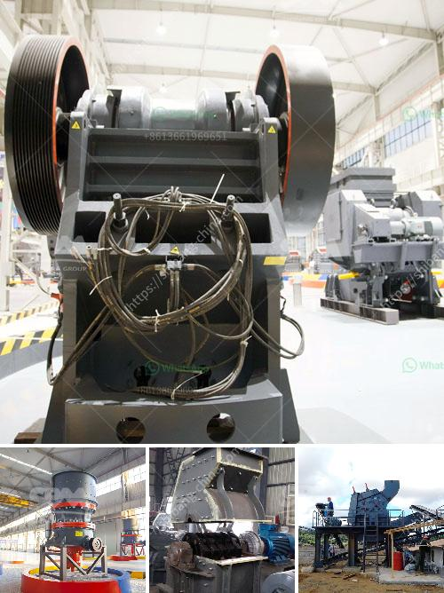

<h3>complete scm stone crushing plant</h3>
A complete SCM stone crushing plant features high capacity, efficient crushing, low operational costs, and great reliability. The quarry equipment, including vibrating feeder, jaw crusher, impact crusher, vibrating screen, and belt conveyor, undergoes rigorous testing and is built to withstand tough conditions. With the integration of automated processes and intelligent control systems, the SCM stone crushing plant maximizes productivity while minimizing operational and maintenance costs.

The vibrating feeder ensures a consistent flow of materials to the jaw crusher, which efficiently crushes large rocks into smaller sizes. The crushed stones are then transferred to the impact crusher for further reduction. The impact crusher, equipped with a high-speed rotor and advanced crushing chamber design, produces a uniform product with excellent shape and size distribution.

The vibrating screen, with multiple layers and adjustable amplitude, separates the crushed materials into different sizes. This enables the plant to produce a wide range of products to meet various requirements. The belt conveyor then transports the finished products to the designated areas.

With its advanced technology and reliable performance, the SCM stone crushing plant is widely used in various industries such as mining, metallurgy, building materials, transportation, and chemical engineering. It is especially suitable for crushing hard and abrasive materials, such as granite, basalt, and limestone.

Furthermore, the complete SCM stone crushing plant is designed with environmental considerations in mind. It adopts advanced dust suppression systems to minimize dust emissions, ensuring a cleaner and healthier working environment. Additionally, it incorporates energy-saving features, such as efficient motors and intelligent control systems, to reduce energy consumption.

In conclusion, a complete SCM stone crushing plant offers a comprehensive solution for quarry operators seeking to increase productivity, reduce operational costs, and improve product quality. With its advanced technology, robust construction, and environmental-friendly design, it is an ideal choice for a wide range of applications in the mining and construction industries.
<h3>Contact us</h3><ul><li><strong>Whatsapp:&nbsp;<a href="https://wa.me/8613661969651">+8613661969651</a></strong></li><li><a href="https://swt.shibang-china.com/?git&amp;zhl&amp;complete scm stone crushing plant"><strong>Online Service(chat now)</strong></a></li></ul><h3>Related</h3><ul><li><a href='ton per hour hammer mill grinding mill china.md'>ton per hour hammer mill grinding mill china</a></li><li><a href='dolomite processing plan in ethiopia.md'>dolomite processing plan in ethiopia</a></li><li><a href='pulverizer grinding machine philippines.md'>pulverizer grinding machine philippines</a></li><li><a href='crusher stone for sale.md'>crusher stone for sale</a></li><li><a href='fly ash processing plant machinery.md'>fly ash processing plant machinery</a></li></ul>