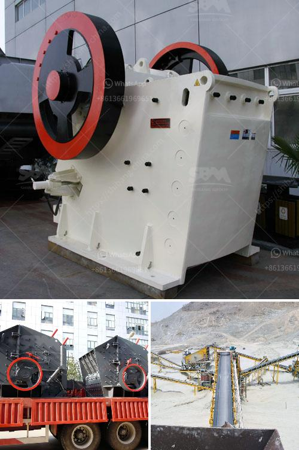

<h3>complete stone crushing</h3>
Stone crushing is an important part in mining industry and require high quality stone crushing machines in order to ensure the smooth production of all types of construction materials. For the stone crusher, there are different types of crushers available for various applications. Each type of crusher is manufactured with precision and utmost care by utilizing superior materials and latest techniques.

Stone crushing is an important process in various industries, such as mining, building materials, railways, highways, metallurgy, chemistry, and gas. The machine works depending on the principle of compression which is readily applied in various types of crushers. They are primarily used in industries that involve the production of heavy mining materials such as raw coal or ore.

1. Crushing: The raw materials are uniformly fed into the jaw crusher by vibrating feeder for primary crushing. The crushed stones are conveyed to the impact crusher for secondary crushing.

2. Screening: After primary crushing, the stones that meet the desired size are conveyed to the vibrating screen for classification. The oversize stones will be returned to the impact crusher for recirculation.

3. Feeding: The stones that do not meet the desired size are sent back to the primary crusher for further crushing. This process ensures that only high-quality stones are used in the production of construction materials.

4. Conveying: The crushed stones are transported to the finished product area through conveyor belts. This process ensures that the production is carried out efficiently and the materials are delivered to the designated areas.

5. Storage: The finished products are stored in designated areas to await transportation or further processing. This step ensures that the materials are organized and easily accessible for transportation or sale.

When it comes to stone crushing machines, there are several types available in the market. Some of the commonly used crushers include jaw crushers, impact crushers, cone crushers, and vertical shaft impact crushers.

Jaw crushers are designed to handle primary crushing of all types of minerals and rocks with a compressive strength of less than 320 MPa. These crushers are often used in the production of construction materials, such as asphalt, concrete, and railway ballast.

Impact crushers, on the other hand, are designed to crush stones into specific sizes. These crushers are often used in the production of aggregates for construction and road building purposes. They can be applied to both hard rock and soft rock materials.

Cone crushers are widely used in the mining industry for crushing various materials, such as ores and rocks with a compressive strength of up to 350 MPa. They are ideal for secondary and tertiary crushing stages.

Vertical shaft impact crushers are used to produce high-quality artificial sand and crushed stone with a cubic shape. They are mainly used as tertiary crushers for materials such as limestone.

In conclusion, stone crushing is an important process in mining, construction, and chemical industries. Various types of stone crushers are used depending on the application. The primary crushing process ensures that only high-quality stones pass through the screening stage, while the storage, transportation, and organization of finished products are essential for efficient production. By investing in high-quality stone crushing machines, companies can ensure the smooth production of construction materials.
<h3>Contact us</h3><ul><li><strong>Whatsapp:&nbsp;<a href="https://wa.me/8613661969651">+8613661969651</a></strong></li><li><a href="https://swt.shibang-china.com/?git&amp;zhl&amp;complete stone crushing"><strong>Online Service(chat now)</strong></a></li></ul><h3>Related</h3><ul><li><a href='clay powder machine.md'>clay powder machine</a></li><li><a href='dolomite powder mill mesh.md'>dolomite powder mill mesh</a></li><li><a href='mobile clusher for hire tanzania.md'>mobile clusher for hire tanzania</a></li><li><a href='cost sand dryer in keralan.md'>cost sand dryer in keralan</a></li><li><a href='gypsum gypsum plant supplier from germany.md'>gypsum gypsum plant supplier from germany</a></li></ul>