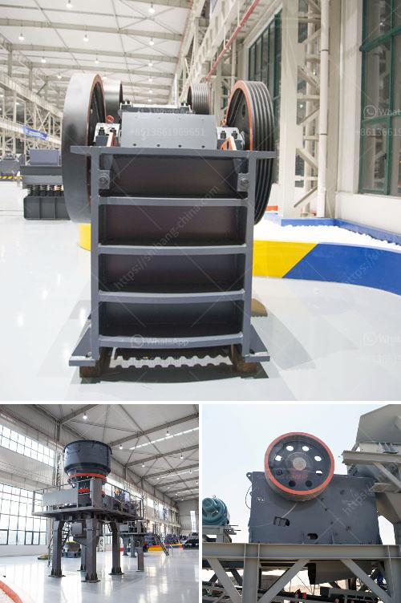

<h3>component of ball mill and its working principle</h3>
The ball mill is a type of grinding mill, used to grind materials into extremely fine powder for use in mineral dressing processes, paints, pyrotechnics, ceramics and selective laser sintering. The grinding process of the ball mill is accomplished by rotating the barrel of the ball mill for a period of time, causing the materials to be crushed by the impact and grinding effect of the grinding media.

1. The cylindrical mill shell: This shell is made of rolled steel plates. The literal meaning of this shell is cylindrical, with a cylindrical shape, and is made of steel, as the main part of the ball mill. The shell thickness is about 50-100 mm, depending on the size of the mill.

2. The heads: These are cylindrical plates made of steel. They cover the ends of the shell for protection of the mill's internal parts.

3. The mill liner: The mill liner is a part of the grinding area in the mill housing. It increases the contact surface of the grinding media and materials, and helps enhance grinding efficiency. It is generally made of high chromium steel or rubber material.

4. Grinding media: The grinding media in the ball mill is a metal or ceramic ball, which can grind materials into smaller particle sizes through impact and friction actions. The grinding media typically consists of spherical balls, steel rods, or ceramic beads.

5. Drive system: The drive system of the ball mill consists of motor, gear transmission, and electronic control system. Motor drives the cylinder through the reducer and gear transmission, and drives the cylinder to rotate.

6. Discharge system: The discharge system of the ball mill mainly consists of a graded outlet that ensures qualified materials are discharged from the mill, while the larger particles are returned to the mill for further grinding.

The main working part of a ball mill is a rotating cylinder mounted on two large bearings and placed horizontally. The cylinder is divided into several compartments with compartments, in which grinders of a certain shape and size are installed. When the cylinder rotates, grinding balls attached to the inner wall of the cylinder fall down and impact the materials in the compartment, crushing and grinding them into powder.

The critical speed of a ball mill is calculated as the rotational speed at which the centrifugal force generated by the grinding balls is equal to the gravitational force acting on the materials being ground. This speed ensures that the balls not only cascade but also obtain sufficient energy for comminution.

In conclusion, the ball mill is an efficient grinding machine that can grind various materials into fine powder. It is widely used in mineral processing, building materials, metallurgy, chemical industry, and other industries. It can be divided into dry type and wet type according to the milling method. The overall structure of the ball mill is simple, compact, and easy to operate.
<h3>Contact us</h3><ul><li><strong>Whatsapp:&nbsp;<a href="https://wa.me/8613661969651">+8613661969651</a></strong></li><li><a href="https://swt.shibang-china.com/?git&amp;zhl&amp;component of ball mill and its working principle"><strong>Online Service(chat now)</strong></a></li></ul><h3>Related</h3><ul><li><a href='price of grinder machine in india.md'>price of grinder machine in india</a></li><li><a href='gold processing equipment price in ghana.md'>gold processing equipment price in ghana</a></li><li><a href='plant project report pdf stone crushing.md'>plant project report pdf stone crushing</a></li><li><a href='costs for a stone crusher plant.md'>costs for a stone crusher plant</a></li><li><a href='calcium carbonate plant manufacturers.md'>calcium carbonate plant manufacturers</a></li></ul>