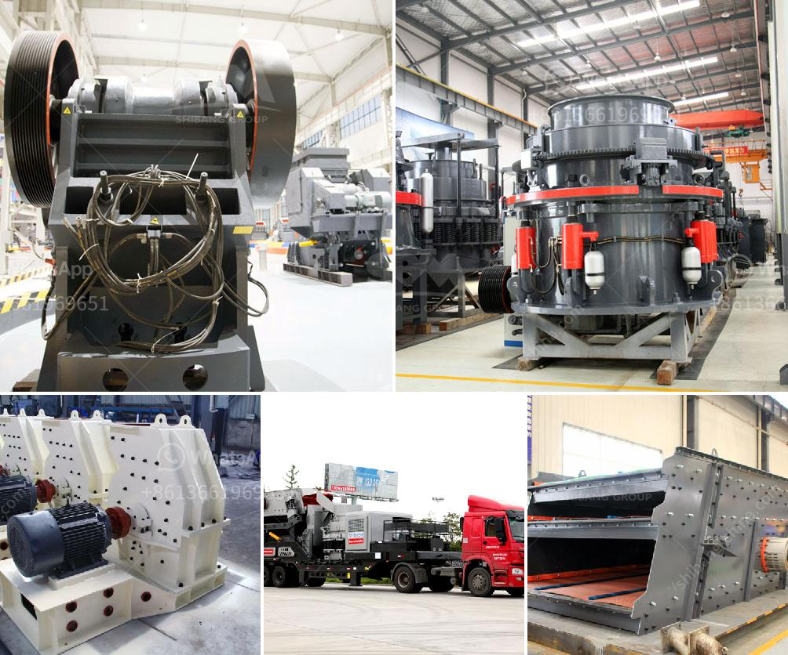

<h3>components of the nigerian mining industry</h3>
The Nigerian mining industry is indeed a critical sector in the country's economic development. As the demand for natural resources continues to increase, the industry's potential in contributing to the nation's GDP cannot be overlooked.

One of the components of the mining industry in Nigeria is exploration and production. This process involves searching for mineral deposits and extracting them for commercial use. Exploration may involve the use of geological surveys, aerial surveys, and satellite imagery to identify potential mineral resources. Once discovered, the mineral resources are then extracted through various techniques such as underground mining, open-pit mining, or placer mining. This component plays a crucial role in identifying valuable mining assets as Nigeria is known to be rich in vast mineral reserves.

Another important component is mine development. This involves preparing the mine site for extraction and ensuring its operational readiness. The activities in this phase may include building necessary infrastructure like roads, railways, power plants, and water systems to support mining operations. Additionally, mine development may also involve constructing mineral processing plants to refine the extracted minerals into a usable form. Proper mine development is essential to maximize the efficiency and productivity of the mining operations.

The third component is mine operations. This includes the day-to-day activities involved in extracting and processing minerals. It requires skilled workers and specialized equipment to safely and efficiently operate the mine. This component encompasses various processes such as drilling, blasting, crushing, grinding, and refining. Adequate safety and environmental measures must be implemented during mining operations to mitigate any potential risks and minimize the ecological footprint.

Lastly, mine reclamation is an essential component of the Nigerian mining industry. After a mine's resources are exhausted or operations cease, the land needs to be rehabilitated to ensure its sustainable use for other purposes. This involves restoring the land's vegetation, mitigating erosion, and rehabilitating any affected water bodies. Proper mine reclamation helps to mitigate the environmental impact and ensures the land's future usability.

In conclusion, the Nigerian mining industry comprises several vital components, including exploration and production, mine development, mine operations, and mine reclamation. Each component plays a significant role in the industry's overall growth, making it a crucial contributor to Nigeria's economy. With proper management and sustainable practices, the mining industry can provide a steady source of revenue and employment opportunities while respecting the environment.
<h3>Contact us</h3><ul><li><strong>Whatsapp:&nbsp;<a href="https://wa.me/8613661969651">+8613661969651</a></strong></li><li><a href="https://swt.shibang-china.com/?git&amp;zhl&amp;components of the nigerian mining industry"><strong>Online Service(chat now)</strong></a></li></ul><h3>Related</h3><ul><li><a href='ball mill for sale in india.md'>ball mill for sale in india</a></li><li><a href='grinding talcum powder company.md'>grinding talcum powder company</a></li><li><a href='bentonite milling plant.md'>bentonite milling plant</a></li><li><a href='stone crusher plant information.md'>stone crusher plant information</a></li><li><a href='primary stone crusher for rent in karnataka.md'>primary stone crusher for rent in karnataka</a></li></ul>