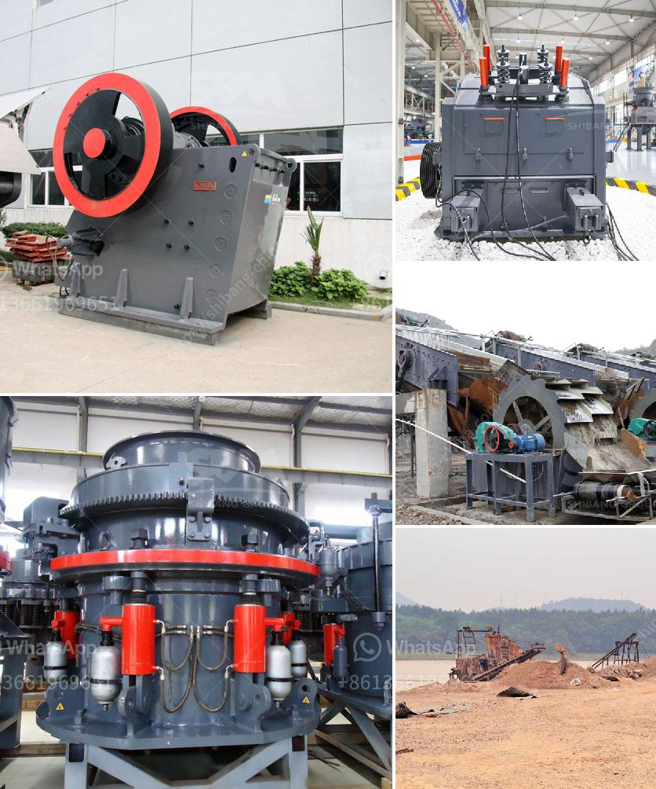

<h3>concrete crusher for sale in uae crusher</h3>
In recent years, UAE has developed rapidly in various industries such as construction, road and infrastructure, and mining, creating a huge demand for various types of crushers. The government of UAE has continuously promoted the development of the economy and infrastructure, attracting many foreign investments and expats. As a result, the need for concrete crushers in UAE has been growing rapidly.

A concrete crusher is a machine that reduces large blocks of concrete into smaller pieces, gravel, or rock dust. Crushers are widely used in construction sites, recycling plants, and quarrying industries, and they play an essential role in reducing the size of concrete blocks and stones for easier disposal or recycling.

One of the main advantages of concrete crushers is their ability to reduce the size of concrete blocks and stones into various sizes, from coarse to fine. This makes it easier to handle and transport materials, saving time and effort in the construction process. Additionally, the crushed concrete can be used as a base material for construction projects such as roads, foundations, and building structures, reducing the need for new materials and thus contributing to sustainable construction practices.

Another benefit of concrete crushers is their ability to separate and remove rebar, metal reinforcements, and other impurities from the crushed concrete. This ensures that the resulting material is clean and suitable for various applications, including aggregate production and recycling.

When it comes to purchasing a concrete crusher, UAE offers a range of options for buyers. There are various suppliers and manufacturers in the country that provide high-quality crushers with different specifications and features. Buyers can choose from a wide range of options to find the crusher that best suits their specific needs and requirements.

In conclusion, the sale of concrete crushers in UAE has become increasingly popular due to the growing demand for construction materials and sustainable practices. Concrete crushers offer significant advantages and benefits, including reducing the size of materials, removing impurities, and contributing to eco-friendly construction practices. With the variety of options available, buyers in UAE can easily find the right concrete crusher for their specific needs and contribute to the development of the country's construction industry.
<h3>Contact us</h3><ul><li><strong>Whatsapp:&nbsp;<a href="https://wa.me/8613661969651">+8613661969651</a></strong></li><li><a href="https://swt.shibang-china.com/?git&amp;zhl&amp;concrete crusher for sale in uae crusher"><strong>Online Service(chat now)</strong></a></li></ul><h3>Related</h3><ul><li><a href='what are the prices of crushing equipment.md'>what are the prices of crushing equipment</a></li><li><a href='crushers plant cost.md'>crushers plant cost</a></li><li><a href='m sand manufacturers in india.md'>m sand manufacturers in india</a></li><li><a href='sand stone quarry mining.md'>sand stone quarry mining</a></li><li><a href='the cost of stone crusher in pakistan.md'>the cost of stone crusher in pakistan</a></li></ul>