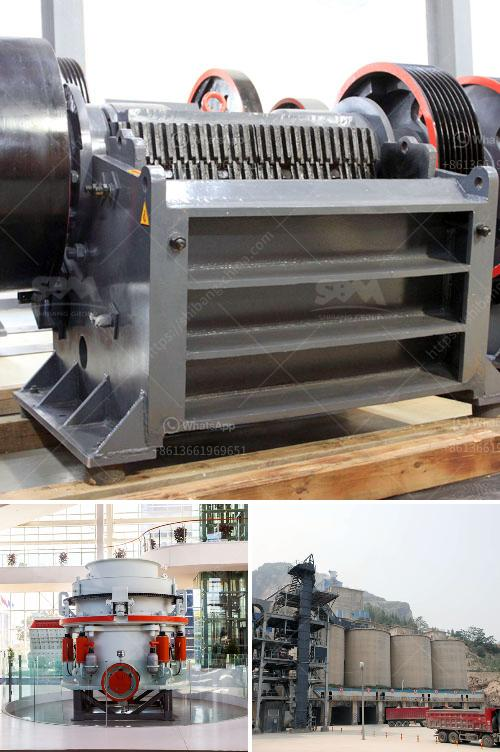

<h3>concrete crusher prices</h3>
When it comes to concrete recycling, the process of breaking up concrete can be time-consuming and costly. With the advent of concrete crushers, however, the process has become much simpler and more affordable. These machines are specifically designed to reduce the size of larger concrete structures into smaller, more manageable pieces, making them easier to transport and dispose of.

One of the key factors that impact concrete crusher prices is the size of the machine. Typically, larger models will have a higher price tag due to their increased capacity and power. Smaller, more compact crushers are generally less expensive, making them a great choice for smaller construction projects or homeowners looking to tackle a DIY concrete removal project.

Another consideration when looking at concrete crusher prices is the type of machine being purchased. There are a few different types of crushers available on the market, each with its own set of features and price points. Jaw crushers, for example, are ideal for primary crushing applications and have a higher initial cost. Impact crushers, on the other hand, are more versatile and affordable, making them a popular choice for secondary or tertiary crushing needs.

In addition to the size and type of crusher, other factors can influence concrete crusher prices. One such factor is the brand and reputation of the manufacturer. Well-known brands with a proven track record of producing high-quality equipment tend to have higher price tags. However, it’s important to remember that quality often correlates with durability and performance, so investing in a reputable brand can save money in the long run.

The availability and location of spare parts can also impact concrete crusher prices. Ensuring that replacement parts are readily available can prevent costly delays in the event of machine breakages or malfunctions. Additionally, the geographical location of the seller or manufacturer can affect prices due to shipping and handling costs.

Lastly, considering whether to purchase a new or used concrete crusher can influence prices. While used machines may offer initial cost savings, it’s important to thoroughly inspect them and ensure they are in good working condition. In some cases, used crushers may require additional maintenance or repairs, which can add to the overall cost. On the other hand, new machines often come with warranties and support from the manufacturer, providing peace of mind and potentially reducing long-term expenses.

When comparing concrete crusher prices, it’s crucial to consider all these factors and determine which features and specifications are necessary for the specific project or application. By doing thorough research and obtaining multiple quotes, potential buyers can ensure they are getting the best value for their money. Additionally, consulting with industry professionals or seeking recommendations from colleagues can provide insight into which crushers are best suited to the desired job.

In conclusion, concrete crusher prices can vary depending on various factors, such as size, type, brand, availability of spare parts, and whether the machine is new or used. By carefully considering these variables, buyers can make an informed decision and find the most cost-effective solution for their concrete breaking needs.
<h3>Contact us</h3><ul><li><strong>Whatsapp:&nbsp;<a href="https://wa.me/8613661969651">+8613661969651</a></strong></li><li><a href="https://swt.shibang-china.com/?git&amp;zhl&amp;concrete crusher prices"><strong>Online Service(chat now)</strong></a></li></ul><h3>Related</h3><ul><li><a href='wet ball milling.md'>wet ball milling</a></li><li><a href='coal crushing and screening plant setup.md'>coal crushing and screening plant setup</a></li><li><a href='specifications of roller mill.md'>specifications of roller mill</a></li><li><a href='100 tph stone crusher.md'>100 tph stone crusher</a></li><li><a href='quarry mining business plan pdf.md'>quarry mining business plan pdf</a></li></ul>