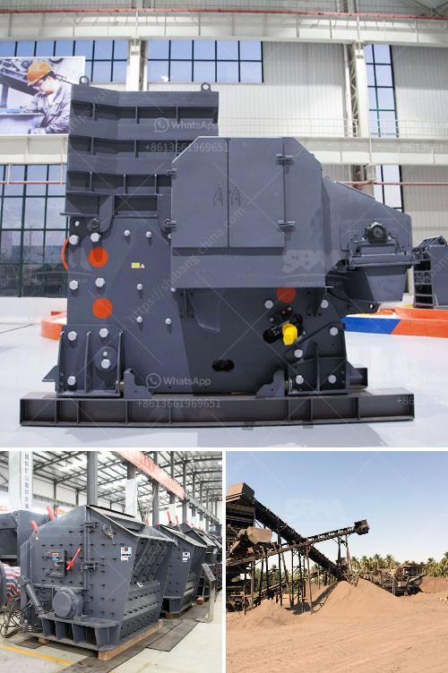

<h3>concrete crushing for sale germany</h3>
Concrete is one of the most commonly used materials in construction projects. However, it also has a limited lifespan as buildings and infrastructure age and ultimately need to be demolished or renovated. This is where concrete crushing comes into play. Concrete crushing is a process that allows for the recycling of used concrete materials, making them suitable for future construction purposes. In Germany, there are several companies and suppliers offering concrete crushing equipment for sale.

Concrete crushing, generally known as the first step in a recycling process, is the means of breaking down a demolished concrete structure into various aggregates, stones, and granules that can be used in new projects. At the same time, it serves as an environmentally friendly solution by reducing the need for new concrete production and minimizing waste disposal.

Many construction companies and contractors in Germany are taking advantage of concrete crushing equipment for sale, as it offers an efficient and cost-effective solution for their projects. By using this equipment, they can both save money and contribute to a sustainable future.

When considering concrete crushing equipment for sale in Germany, there are several factors to take into account. Firstly, you need to determine the type and capacity of the equipment required. For smaller demolition projects, a mobile crusher that can be transported to the site is often the best option. These compact crushers can efficiently process smaller amounts of concrete at a time.

On the other hand, for larger demolition projects or when a constant supply of crushed concrete is required, stationary crushers are the right choice. They can process significant amounts of concrete and often have the ability to crush other materials such as asphalt or bricks.

In addition to capacity, it is important to consider the desired end product. Different crushers offer various sizes and shapes of crushed aggregates, which may be required for specific purposes. Some crushing equipment is designed to produce smaller and more uniform granules, making them suitable for road construction or landscaping projects. Others may offer larger aggregates, ideal for building foundations or structural elements.

Before purchasing any concrete crushing equipment, it is crucial to research reputable suppliers. Germany is well known for its reliable and high-quality machinery manufacturers. Look for suppliers with a proven track record in the industry, positive customer reviews, and a wide range of equipment options.

Furthermore, it is essential to ensure that the equipment meets all safety regulations and guidelines. Picking machines with advanced safety features can help protect the operators and decrease the risk of accidents on the job site.

In conclusion, concrete crushing for sale in Germany offers a sustainable and cost-effective solution for the recycling of used concrete materials. Whether you are a construction company or contractor, investing in the right crushing equipment can save you money while contributing to a greener future. Take the time to research reputable suppliers and consider the type and capacity of the equipment required for your specific projects. By implementing concrete crushing in your operations, you can reduce waste and make a positive impact on the environment.
<h3>Contact us</h3><ul><li><strong>Whatsapp:&nbsp;<a href="https://wa.me/8613661969651">+8613661969651</a></strong></li><li><a href="https://swt.shibang-china.com/?git&amp;zhl&amp;concrete crushing for sale germany"><strong>Online Service(chat now)</strong></a></li></ul><h3>Related</h3><ul><li><a href='roller mill in india.md'>roller mill in india</a></li><li><a href='mobile crusher made in turkey.md'>mobile crusher made in turkey</a></li><li><a href='small gold rock crushers with chain.md'>small gold rock crushers with chain</a></li><li><a href='quarry stone business plan in zimbabwe.md'>quarry stone business plan in zimbabwe</a></li><li><a href='hand operated rock crusher.md'>hand operated rock crusher</a></li></ul>