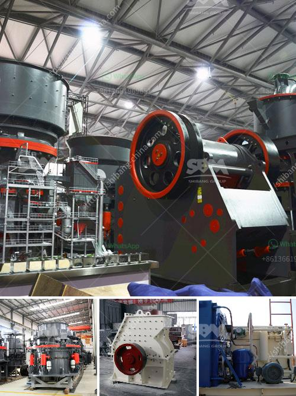

<h3>concrete crushing machine in india</h3>
Concrete is one of the most widely used construction materials in the world. However, the process of producing and disposing of concrete results in a significant amount of waste. Concrete waste is generated from construction sites, demolition sites, and even the concrete leftover from unused or rejected projects. In order to tackle this issue and promote sustainable practices, concrete crushing machines have been developed.

Concrete crushing machines are efficient and user-friendly equipment that can carry out the task of recycling and crushing demolished concrete at a much faster rate. In comparison to traditional methods, concrete crushing machines reduce the time it takes to dismantle and dispose of concrete structures. They are also beneficial in reducing the environmental impact by reusing the crushed concrete as aggregates for new construction projects.

India, being one of the fastest-growing economies and a major contributor to global construction activities, has witnessed a significant rise in the demand for concrete crushing machines. The construction sector in India has been thriving, and therefore, the need to recycle concrete waste has become crucial. Concrete crushing machines have played a vital role in helping construction companies save costs and reduce waste.

These machines are designed to crush and separate the concrete into reusable materials. The concrete waste is fed into the machine, where rotating blades tear it into smaller pieces. These smaller pieces are then sorted by size and further crushed to produce aggregates with varying sizes. The aggregates are then ready to be used as a replacement for natural aggregates in concrete production.

Concrete crushing machines have revolutionized the way construction companies tackle concrete waste. By recycling and reusing concrete waste, the need for natural resources is reduced, leading to a more sustainable construction industry. Moreover, the use of recycled aggregates lowers the carbon footprint associated with concrete production.

In conclusion, concrete crushing machines in India have played a crucial role in tackling the issue of concrete waste. These machines not only reduce the time and effort required for concrete demolition but also promote sustainable practices by recycling and reusing concrete waste. With the increasing demand for sustainable construction practices, concrete crushing machines have become an essential tool for construction companies in India.
<h3>Contact us</h3><ul><li><strong>Whatsapp:&nbsp;<a href="https://wa.me/8613661969651">+8613661969651</a></strong></li><li><a href="https://swt.shibang-china.com/?git&amp;zhl&amp;concrete crushing machine in india"><strong>Online Service(chat now)</strong></a></li></ul><h3>Related</h3><ul><li><a href='ultrafine vertical roller mill.md'>ultrafine vertical roller mill</a></li><li><a href='roller mill in india.md'>roller mill in india</a></li><li><a href='sand washing machine in ethiopia.md'>sand washing machine in ethiopia</a></li><li><a href='200mm crusher sieve opening sizes.md'>200mm crusher sieve opening sizes</a></li><li><a href='quarry machine in nigeria.md'>quarry machine in nigeria</a></li></ul>