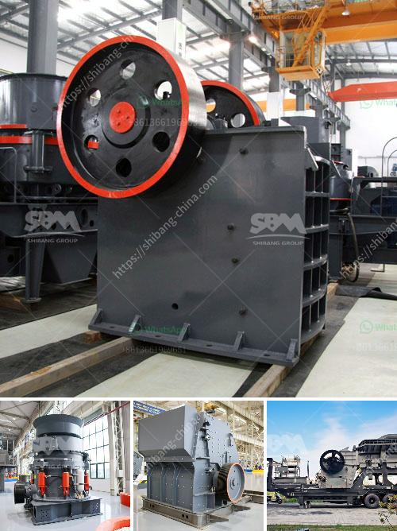

<h3>concrete stones crushing business plan</h3>
Concrete stones crushing business plan, in short, have become one of the most lucrative business ventures in the construction industry. It is a viable business idea, and entrepreneurs willing to venture into this field will be successful.

Concrete stones are essential materials in building infrastructures such as schools, hospitals, roads, and houses. There are different sizes of concrete stones, and the materials can be used for a variety of purposes.

To start a concrete stones crushing business, one requires a clear and well-written business plan. It outlines the objectives of the business and the resources needed to achieve them. Mining and processing of stones up to the proper sizes for construction will be the primary operations. After securing the required permits and licenses, the next step is to identify a suitable quarry site with ample raw materials.

One needs to invest in heavy machinery and equipment to carry out the crushing process effectively. The machinery may include loaders, crushers, and trucks for transporting the crushed stones. Additionally, there is a need for ample space to store both raw materials and finished products.

Marketing should be a key aspect of the business plan. Establishing connections with local builders, contractors, and construction companies is crucial in attracting clients. Additionally, the business can also sell stones to individual homeowners who need concrete for their construction or landscaping projects.

Financial planning is essential when starting a concrete stones crushing business. It includes calculating the initial capital investment, operational costs, and expected revenue. Furthermore, entrepreneurs must secure sufficient funds to cover expenses during the initial stages until the business becomes profitable.

In conclusion, concrete stone crushing is a good business idea that can provide a stable income source. It is an industry that requires relatively minimal upfront investment, with significant returns. However, entrepreneurs must be well-prepared and dedicated to achieving success in this highly competitive field.
<h3>Contact us</h3><ul><li><strong>Whatsapp:&nbsp;<a href="https://wa.me/8613661969651">+8613661969651</a></strong></li><li><a href="https://swt.shibang-china.com/?git&amp;zhl&amp;concrete stones crushing business plan"><strong>Online Service(chat now)</strong></a></li></ul><h3>Related</h3><ul><li><a href='prices of conveyor belts for mining.md'>prices of conveyor belts for mining</a></li><li><a href='100 tph cone crusher price.md'>100 tph cone crusher price</a></li><li><a href='small conveyor belt to move coal for home use.md'>small conveyor belt to move coal for home use</a></li><li><a href='fly ash processing plant machinery.md'>fly ash processing plant machinery</a></li><li><a href='nigeria crusher plant 200 tph.md'>nigeria crusher plant 200 tph</a></li></ul>