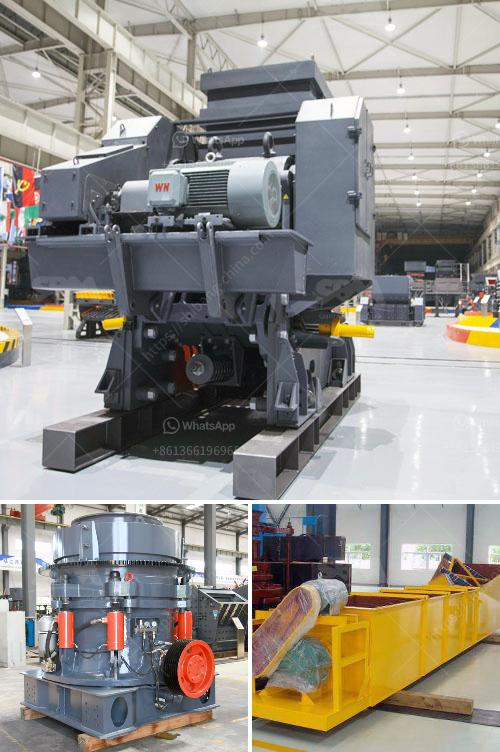

<h3>cone crusher company</h3>
In the realm of mineral processing, cone crushers are widely used for their efficiency in the secondary and tertiary crushing stages. With an exceptional ability to crush various types of materials, cone crushers play a crucial role in many industries, including mining, construction, and aggregates. One such pioneering company in the field is XYZ Cone Crushers, which stands out for its commitment to delivering high-quality machines that consistently meet customer needs.

XYZ Cone Crushers prides itself on staying at the forefront of innovation by continuously investing in research and development. This unwavering dedication has allowed the company to develop cutting-edge cone crushers that excel in performance, reliability, and durability. Integrating advanced technology, the crushers are equipped with features such as hydraulic adjustment, automated control systems, and high-speed rotational capability, ensuring optimal productivity and reduced downtime.

The cone crushers produced by XYZ Company undergo rigorous manufacturing processes to ensure top-notch quality. From the selection of materials to the precision machining of components, every step is meticulously executed to maintain the highest standards. Additionally, a strict quality control program is implemented throughout the production cycle, ensuring that each machine leaving the facility adheres to the company's exacting specifications.

XYZ Cone Crushers believes in surpassing customer expectations, and this dedication extends beyond the sale of their products. The company offers comprehensive after-sales services, including installation, maintenance, and technical support. With a team of highly trained professionals, XYZ Cone Crushers ensures that customers receive prompt assistance and advice, ensuring the seamless operation and longevity of their machines.

XYZ Cone Crushers recognizes the importance of sustainable practices in today's world. Their machines are designed to be energy-efficient, reducing consumption and minimizing the impact on the environment. Moreover, the company aims to optimize the life span of their products through robust construction and regular maintenance, reducing the need for premature replacements.

XYZ Cone Crushers has established itself as a trusted and reputable leader in the cone crusher industry. With its advanced technology, commitment to quality manufacturing, excellent customer support, and sustainable practices, the company is well-equipped to cater to the diverse needs of its customers worldwide. For those seeking efficient and reliable crushing solutions, XYZ Cone Crushers remains a top choice.
<h3>Contact us</h3><ul><li><strong>Whatsapp:&nbsp;<a href="https://wa.me/8613661969651">+8613661969651</a></strong></li><li><a href="https://swt.shibang-china.com/?git&amp;zhl&amp;cone crusher company"><strong>Online Service(chat now)</strong></a></li></ul><h3>Related</h3><ul><li><a href='crushing rock export manufacturers india.md'>crushing rock export manufacturers india</a></li><li><a href='dolomite powder making machine.md'>dolomite powder making machine</a></li><li><a href='ykn vibrating screen price.md'>ykn vibrating screen price</a></li><li><a href='gypsum gypsum plant supplier from germany.md'>gypsum gypsum plant supplier from germany</a></li><li><a href='gyratory cone crusher.md'>gyratory cone crusher</a></li></ul>