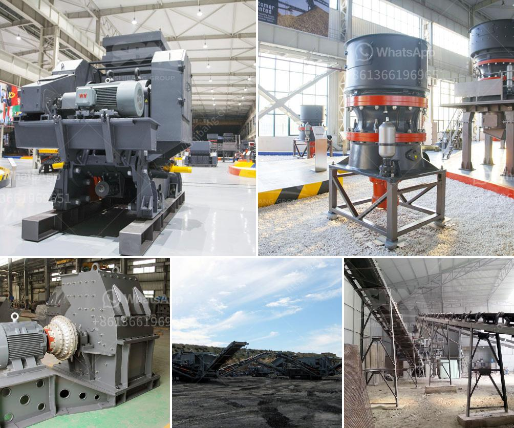

<h3>cone crusher details</h3>
A cone crusher is an essential part of the process of breaking rocks into smaller pieces. This machinery is used to further reduce the size of the material and is typically used in quarries and mining operations to ensure smoother operations and consistent end products.

The cone crusher works by breaking rocks through the squeezing and bending of two surfaces; the mantle and the concave. The concave is fixed to the body of the machine, and the mantle is mounted on the main shaft. The rotating motion creates a continuous compression crushing process, reducing the size of the rocks.

One of the key features of the cone crusher is its excellent capacity. This machinery can process a wide range of materials and has a high throughput. It can handle rocks of various sizes and hardness levels, making it ideal for different applications. Whether it is a small quarry or a large mining site, the cone crusher can deliver the required output efficiently.

The cone crusher also provides versatility in the types of materials it can process. It can handle everything from limestone to basalt, from hard and abrasive rocks to softer materials. This versatility ensures that the cone crusher can be used in a wide range of industries, such as construction, mining, and aggregates.

In addition, the cone crusher is designed to be easy to operate and maintain. It has a user-friendly interface, and the maintenance requirements are minimal. Regular inspections and lubrication are recommended, but overall, it is a robust machine that can withstand heavy use.

When investing in a cone crusher, it is essential to consider factors such as the desired output size, the hardness of the material, and the specific requirements of the application. Different models and configurations are available to accommodate these needs. It is recommended to consult with experts to ensure the right selection of the cone crusher for a particular operation.

Furthermore, safety is paramount when operating a cone crusher. The machine is equipped with safety features such as a hydraulic overload protection system and a release system in case of an uncrushable material. Regular safety training for operators is crucial to prevent accidents and ensure a safe working environment.

Overall, a cone crusher is a reliable and efficient piece of equipment that can improve the productivity and profitability of any operation. With its high capacity, versatility, and ease of maintenance, it is a valuable asset in various industries. From crushing rocks in quarries to producing aggregates for construction, the cone crusher proves its worth time and time again.
<h3>Contact us</h3><ul><li><strong>Whatsapp:&nbsp;<a href="https://wa.me/8613661969651">+8613661969651</a></strong></li><li><a href="https://swt.shibang-china.com/?git&amp;zhl&amp;cone crusher details"><strong>Online Service(chat now)</strong></a></li></ul><h3>Related</h3><ul><li><a href='used for sale raymond roller mills india.md'>used for sale raymond roller mills india</a></li><li><a href='mining process of limestone.md'>mining process of limestone</a></li><li><a href='coal mine conveyor belt for sale.md'>coal mine conveyor belt for sale</a></li><li><a href='portable crushers sweden.md'>portable crushers sweden</a></li><li><a href='ball mill manufacturers in gujarat.md'>ball mill manufacturers in gujarat</a></li></ul>