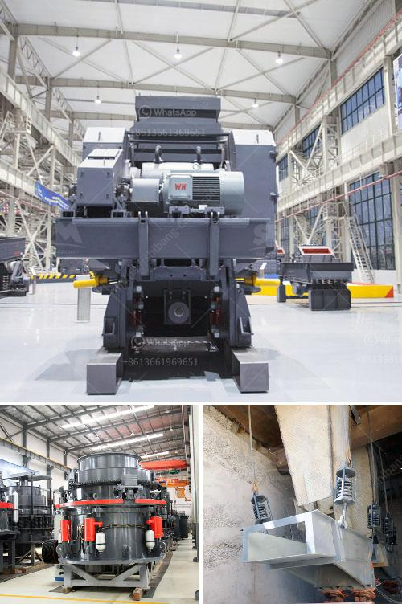

<h3>cone crusher equipment</h3>
The cone crusher is a crushing machine that is commonly used in mining, metallurgy, construction, chemical and other industries. Cone crusher equipment is ideal for medium and fine crushing operations in various ore and non-ore mineral resources. Cone crusher equipment can crush materials with different hardness, such as iron ore, non-ferrous metal ore, granite, limestone, quartzite, sandstone, pebble, etc.

There are many types of cone crushers in the market, they all have different advantages and disadvantages. The cone crusher developed by our company has the following remarkable features.

Firstly, the crushing chamber is designed with highly symmetrical structure. The cone crusher machine has an ideal eccentric distance, which greatly reduces the swing frequency of the moving cone, making the moving cone more even and stable during operation. This greatly improves the efficiency of the cone crusher equipment.

Secondly, the cone crusher equipment is equipped with a hydraulic protection system. When the impurities such as iron or wood enter the crushing chamber, it will automatically discharge and eliminate them, preventing damage to the cone crusher equipment and ensuring the normal operation of the production process.

Thirdly, cone crusher equipment is designed with a reliable lubrication system. It ensures the smooth operation of the machine, reduces the temperature rise during operation, and prolongs the service life of the equipment.

Fourthly, the cone crusher equipment is equipped with an advanced hydraulic system. This system can complete the adjustment of the discharging outlet and the overload protection of the equipment. It is flexible and convenient to operate, greatly reducing the downtime caused by manual maintenance.

Fifthly, the finished product of the cone crusher equipment has a uniform particle size and a high crushing ratio. It can meet the requirements of various industries for different specifications of products. The cone crusher equipment has good product granularity and large processing capacity, which can effectively improve the overall performance of the production line.

In summary, cone crusher equipment is an ideal choice for crushing operations in various industries. Its excellent performance, reliable operation, and low maintenance cost make it widely used in the market. Whether it is used for crushing hard or medium-hard materials, cone crusher equipment can provide efficient and high-quality crushing results. With the continuous development of technology, cone crusher equipment will continue to be optimized and improved to meet the needs of different customers in different industries.
<h3>Contact us</h3><ul><li><strong>Whatsapp:&nbsp;<a href="https://wa.me/8613661969651">+8613661969651</a></strong></li><li><a href="https://swt.shibang-china.com/?git&amp;zhl&amp;cone crusher equipment"><strong>Online Service(chat now)</strong></a></li></ul><h3>Related</h3><ul><li><a href='diamond making machines germany.md'>diamond making machines germany</a></li><li><a href='3 roll mill specifications.md'>3 roll mill specifications</a></li><li><a href='ball mill spares manufacturers in india.md'>ball mill spares manufacturers in india</a></li><li><a href='50 tph stone crusher plant.md'>50 tph stone crusher plant</a></li><li><a href='limestone grinding process.md'>limestone grinding process</a></li></ul>