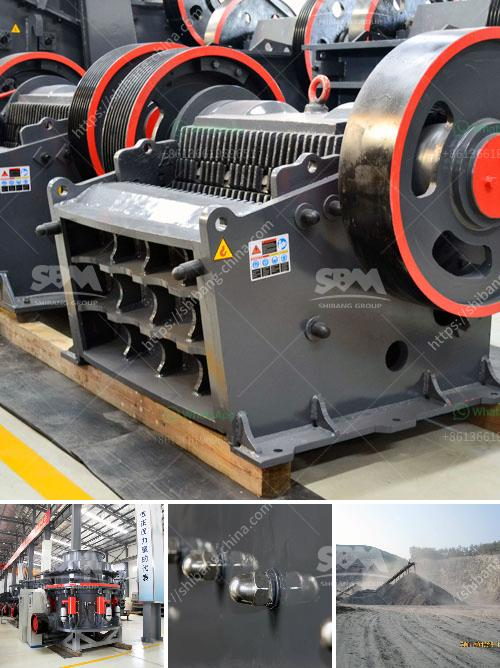

<h3>cone crusher for sale in south africa</h3>
Cone crushers are widely used in South Africa due to the high efficiency and low operating cost. A wide range of applications are available to suit different industry requirements, including quarrying and mining. Purchasing a cone crusher for your South African business will provide numerous benefits when compared to other machines.

One of the main advantages is its ability to process large amounts of hard materials efficiently. This makes cone crushers perfect for crushing hard and abrasive rocks, such as granite, basalt, and quartzite. They can handle various sizes of materials, from coarse to fine, making them highly versatile in different applications.

In addition to their robustness, cone crushers also offer superior performance. They are designed to produce excellent cubicity and particle shape, ensuring a high-quality end product. The combination of a powerful motor and high-quality wear parts contributes to optimal crushing performance, resulting in reduced downtime and maintenance costs.

Another significant advantage of cone crushers is their ability to adjust the discharge setting. This feature allows operators to customize the product size according to their specific needs. By adjusting the clearance between the mantle and concave, the size of the crushed product can be precisely controlled. This flexibility is particularly useful in applications that require different product sizes or when processing various materials.

When considering the purchase of a cone crusher in South Africa, it is essential to choose a reliable and reputable supplier. Look for a company that offers high-quality machines from reputable manufacturers. Additionally, consider the after-sales support provided, such as spare parts availability and technical assistance. A trustworthy supplier will have a comprehensive range of spare parts readily available to minimize downtime and ensure the continuous operation of your equipment.

Although the initial investment might seem high, the long-term benefits of owning a cone crusher in South Africa are numerous. Lower operating costs, improved productivity, and high-quality end products are just a few of the advantages that can positively impact your business.

Furthermore, cone crushers offer excellent versatility, making them suitable for a wide range of applications. Whether you need to crush aggregates for road construction, produce gravel for landscaping projects, or process hard materials for industrial applications, a cone crusher can efficiently meet your requirements.

In conclusion, cone crushers for sale in South Africa are an excellent choice for any business seeking to increase production capacity, minimize downtime, and reduce overall operating costs. The benefits of utilizing a cone crusher include its high efficiency, versatility, and superior performance. However, it is crucial to choose a reliable supplier that offers high-quality machines and comprehensive after-sales support to ensure the long-term success of your investment.
<h3>Contact us</h3><ul><li><strong>Whatsapp:&nbsp;<a href="https://wa.me/8613661969651">+8613661969651</a></strong></li><li><a href="https://swt.shibang-china.com/?git&amp;zhl&amp;cone crusher for sale in south africa"><strong>Online Service(chat now)</strong></a></li></ul><h3>Related</h3><ul><li><a href='stone crushing machineries imphal.md'>stone crushing machineries imphal</a></li><li><a href='india conveyor belt for stone crusher.md'>india conveyor belt for stone crusher</a></li><li><a href='conveyor belt manufacturer in uae.md'>conveyor belt manufacturer in uae</a></li><li><a href='sell jaw crusher for turkey.md'>sell jaw crusher for turkey</a></li><li><a href='how to design surge bin hopper crusher.md'>how to design surge bin hopper crusher</a></li></ul>