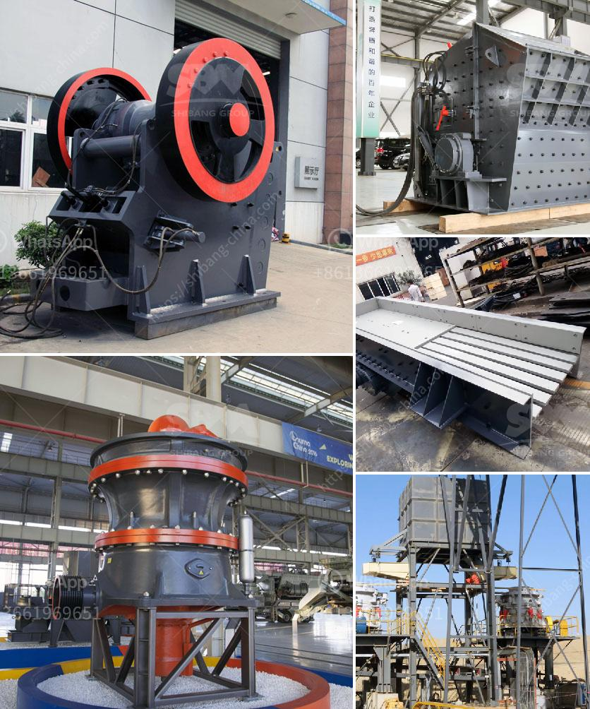

<h3>cone crusher manufacturer</h3>
A cone crusher is used in many industrial sectors for intermediate and fine crushing of materials. Cone crushers are widely used in mining, smelting, building materials, highways, railways, water conservancy, chemical industries, and other sectors. The cone crusher has a large crushing ratio, high efficiency, low energy consumption, uniform product size, and is suitable for medium and fine crushing of various ores and rocks.

When it comes to choosing a cone crusher manufacturer, there are numerous factors to consider. Firstly, it is important to choose a manufacturer with extensive industry experience. An experienced cone crusher manufacturer will have in-depth knowledge and understanding of the market, enabling them to create high-quality and efficient cone crushers.

Secondly, the reputation of the manufacturer is crucial. You should choose a cone crusher manufacturer with a solid reputation for producing reliable and durable equipment. Reading customer reviews and testimonials can give you insights into the manufacturer's reputation.

Furthermore, consider the technical support and after-sales service provided by the manufacturer. A reputable cone crusher manufacturer will offer excellent technical support and responsive after-sales service to address any issues or problems that may arise.

In addition, it is important to choose a cone crusher manufacturer that offers a wide range of models and sizes to meet your specific requirements. Different industries have different needs, so finding a manufacturer with a diverse product line can ensure you find the perfect cone crusher for your application.

Lastly, consider the price and value for money. While price is an important factor, it should not be the sole determinant when choosing a cone crusher manufacturer. Instead, consider the overall value for money, which includes the quality of the equipment, warranty terms, and after-sales service.

In conclusion, choosing the right cone crusher manufacturer is crucial for obtaining a high-quality, efficient, and reliable equipment. Take into account factors such as industry experience, reputation, technical support, product range, and price to make an informed decision. A cone crusher from a reputable manufacturer can greatly enhance your operational efficiency and productivity.
<h3>Contact us</h3><ul><li><strong>Whatsapp:&nbsp;<a href="https://wa.me/8613661969651">+8613661969651</a></strong></li><li><a href="https://swt.shibang-china.com/?git&amp;zhl&amp;cone crusher manufacturer"><strong>Online Service(chat now)</strong></a></li></ul><h3>Related</h3><ul><li><a href='chart of accounts for cement factory.md'>chart of accounts for cement factory</a></li><li><a href='hammer mill for gold.md'>hammer mill for gold</a></li><li><a href='coal crusher size 100 tph.md'>coal crusher size 100 tph</a></li><li><a href='crusher machine price in sri lanka.md'>crusher machine price in sri lanka</a></li><li><a href='working principle of raw mill in cement plant.md'>working principle of raw mill in cement plant</a></li></ul>