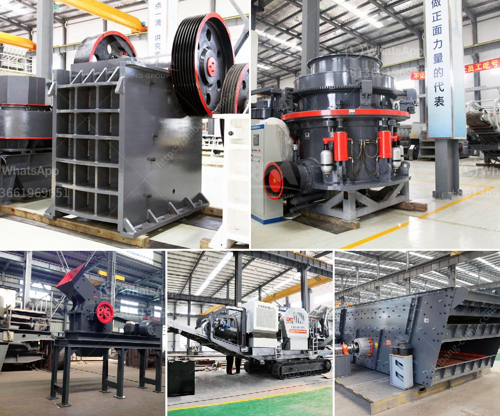

<h3>cone crusher plant for sale</h3>
In recent years, the cone crusher plant for sale has gained popularity among aggregate producers and mining material suppliers due to its ability to crush various ores and rocks with medium hardness and above. Compared to the jaw crusher, impact crusher, or other types of crushers, a cone crusher plant offers efficient secondary crushing capabilities, making it ideal for crushing large quantities of material into a uniform size for further processing.

The cone crusher plant consists of a vibrating feeder, jaw crusher, cone crusher, vibrating screen, and belt conveyor. Each component of the plant plays a vital role in achieving the desired end-product quality. The vibrating feeder ensures a constant and uniform feed to the jaw crusher, which further reduces the material size. The crushed material is then transported to the cone crusher for secondary crushing.

One of the main advantages of a cone crusher plant is its versatility. It can be used for a wide range of applications, including the production of high-quality aggregates for construction purposes, road base materials, and even ore processing. The cone crusher's ability to crush hard materials makes it suitable for recycling applications and the mining industry.

When considering a cone crusher plant for sale, there are several factors to keep in mind. First and foremost, the plant's capacity should match your production needs. Manufacturers provide detailed information about the plant's capacity, which is usually expressed in metric tons per hour (tph). Consider the volume of material you need to process daily and choose a plant that can handle your production requirements efficiently.

Additionally, it is essential to assess the cone crusher's power and efficiency. The power rating determines the crusher's ability to process material effectively, while the efficiency indicates the plant's overall performance. A high-efficiency cone crusher plant will ensure that the material is thoroughly crushed and processed, minimizing the need for additional stages of crushing.

In terms of maintenance, cone crusher plants are generally low-maintenance machines. However, regular inspections and proper maintenance are crucial to ensure their longevity and trouble-free operation. Manufacturers usually provide maintenance guidelines and schedule, which should be followed diligently to maximize the plant's performance.

Before making a purchase, it is advisable to explore different cone crusher plant options available in the market. Consider factors such as the brand's reputation, customer reviews, and after-sales support. A reliable manufacturer will not only provide a high-quality product but also offer excellent customer service and technical assistance when needed.

In conclusion, a cone crusher plant for sale offers a cost-effective solution for secondary crushing needs. Its ability to process a variety of materials and produce uniform-sized aggregates makes it a versatile option for aggregate producers and mining material suppliers. When selecting a plant, always consider the capacity, power, and efficiency to match your production requirements, and choose a reputable manufacturer that offers excellent after-sales support.
<h3>Contact us</h3><ul><li><strong>Whatsapp:&nbsp;<a href="https://wa.me/8613661969651">+8613661969651</a></strong></li><li><a href="https://swt.shibang-china.com/?git&amp;zhl&amp;cone crusher plant for sale"><strong>Online Service(chat now)</strong></a></li></ul><h3>Related</h3><ul><li><a href='concrete crushing for sale germany.md'>concrete crushing for sale germany</a></li><li><a href='price list of used stone crusher in india.md'>price list of used stone crusher in india</a></li><li><a href='small aggregate wash plants.md'>small aggregate wash plants</a></li><li><a href='how to build a hammer mill.md'>how to build a hammer mill</a></li><li><a href='used stone crushing plant for sale in germany.md'>used stone crushing plant for sale in germany</a></li></ul>