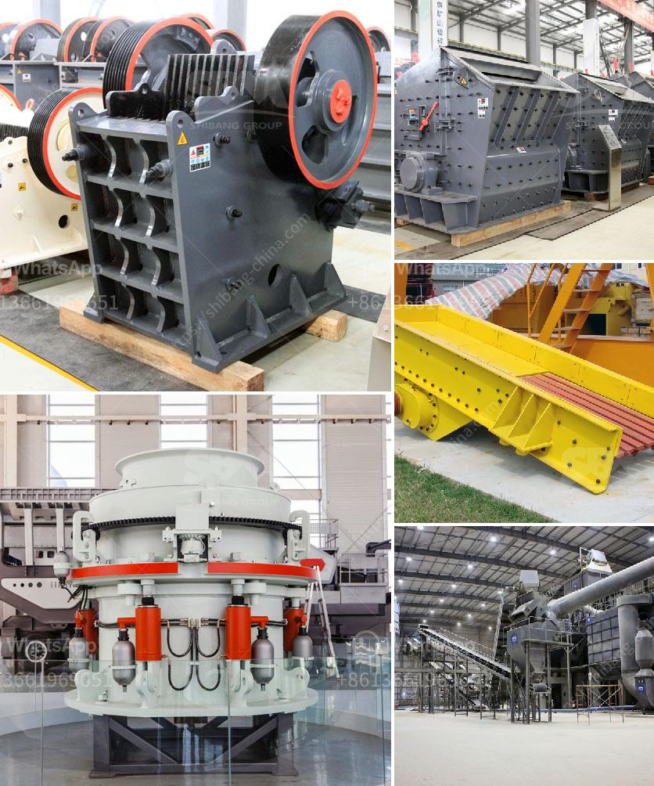

<h3>cone crusher suppliers in south africa</h3>
Cone crusher is primarily used for ore and mineral crushing. It works with one main spindle fixed with the surface under vertical position. Spindle slightly moves from left to right, a set of jaws fix the location of the objects between the two jaws and then crushes them down. A cone crusher is ideal for secondary and fine crushing.

Cone crusher suppliers in South Africa are the leading crusher manufacturers in China, amongst others. Some of them are of national importance with cutting-edge technologies. They are all committed to the production and development of various cone crushers. To fulfill their needs, more and more people choose to cooperate with those manufacturers.

When choosing a cone crusher supplier, there are certain factors you need to consider. First, the quality of their product is one of the key factors. You should choose a supplier that provides high-quality products and guarantees good after-sales service. Second, the price. The price of cone crushers varies widely in the market. Comparing the prices from different suppliers will help you find the most cost-effective one. Finally, the reputation of the supplier is also important. It is advisable to choose a supplier with a good reputation in the industry.

Crushing Equipment Pty Ltd is well known in South Africa as one of the leading suppliers of crushing, screening, and materials handling equipment. They provide cone crushers, impact crushers, jaw crushers, and various other crushing equipment for various industries. Their products are renowned for their reliability and performance.

Pilot Crushtec International (Pty) Ltd is South Africa's leading supplier of mobile and semi-mobile crushing, screening, recycling, sand washing, stockpiling, compacting, and material handling solutions. They offer a range of cone crushers suitable for various applications such as quarrying, mining, recycling, and many others. Their cone crushers are known for their efficiency and durability.

Metso South Africa (Pty) Ltd is a leading supplier of crushing, screening, and materials handling equipment. They offer a wide range of cone crushers suitable for various applications. Their cone crushers are designed for high productivity and low operating costs. They are also known for their excellent reliability and performance.

In conclusion, when looking for cone crusher suppliers in South Africa, it is essential to consider factors such as quality, price, and reputation. The above-mentioned suppliers are some of the leading cone crusher suppliers in South Africa. They offer a wide range of cone crushers suitable for various applications and are known for their reliability and performance. By choosing a reputable supplier, you can ensure that you get high-quality products and excellent after-sales service.
<h3>Contact us</h3><ul><li><strong>Whatsapp:&nbsp;<a href="https://wa.me/8613661969651">+8613661969651</a></strong></li><li><a href="https://swt.shibang-china.com/?git&amp;zhl&amp;cone crusher suppliers in south africa"><strong>Online Service(chat now)</strong></a></li></ul><h3>Related</h3><ul><li><a href='quarry stone business plan in zimbabwe.md'>quarry stone business plan in zimbabwe</a></li><li><a href='grinding mills supplier in gujraanwala.md'>grinding mills supplier in gujraanwala</a></li><li><a href='sells crushing plant in osorno.md'>sells crushing plant in osorno</a></li><li><a href='jaw crushers supplier.md'>jaw crushers supplier</a></li><li><a href='vertical mills for sale alberta.md'>vertical mills for sale alberta</a></li></ul>