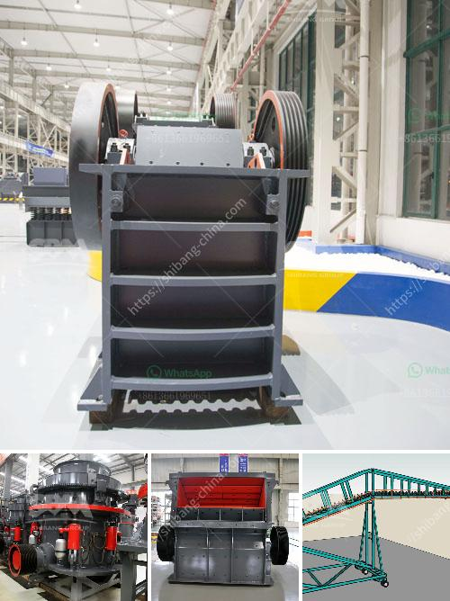

<h3>cone crushers manufacturer</h3>
The mining industry has always been challenging and demanding. With the increasing need for minerals and resources, mining companies are expanding their operations and often rely on cone crushers, to reduce the size of materials in order to achieve the required specifications for various applications. Cone crushers are widely used in the mining industry for processing quarried materials and heavy mining substances. With the additional advantage of transportation to the required location and maneuvering the equipment within the site, the cone crusher's demand is expected to rise.

Cone crushers are mostly utilized for the large scale crushing in the mining industry. It has the advantage of reliable construction, high productivity, easy adjustment and lower operational costs. The spring release system of a cone crusher acts as an overload protection that allows tramp to pass through the crushing chamber without causing any damage to the crusher. The cone crusher consists of a crushing chamber, a concave mantle, drive shaft and a rotating crushing head. The innovative technology behind the cone crusher has been developed by the manufacturer to offer the highest capacity, lowest cost per ton, and top-notch quality.

With a tradition of excellence and dedication to customers, the cone crusher manufacturer is creating a new generation of crushing and screening solutions that are being used by customers around the world. The innovative design of the cone crusher incorporates high performance and productivity with increased uptime and low maintenance costs. Cone crushers are designed to withstand demanding crushing applications in harsh environments, making them suitable for production lines in mines and quarries.

The cone crusher machine offered by the manufacturer is of the highest quality and reliability. The device offers comprehensive safety features and longevity in the toughest working conditions. Cone crushers manufacturing process is the result of efficient and advanced technology employed by the machine developer. There are numerous cone crusher manufacturers of modern crushers each promoting some unique aspect. The Ashcroft Plant impressed the delegates with their crushers demonstrating in the field applications and the amount of work that has gone into each and every unit.

Cone crushers are supremely suitable for the secondary and tertiary crushing stages. Crushing plants in quarrying and mining yards are usually employed in combination with jaw crushers for the pre-crushing of large-sized materials on the scalping screen. The design philosophy is simple and reliable: the right cavity design and kinematics are why the impact crusher delivers maximum performance, reliability, and safe operation. With the steep crushing chamber and large outlet opening, cone crushers deliver top performance, making them capable of crushing all sorts of materials.

To conclude, cone crushers are used widely in the mining industry, fulfilling numerous requirements of clients. The cone crusher machine is at the forefront of the industry, providing the complete crushing and screening solution. Designed to operate with outstanding reliability, it delivers the best results day in and day out. With its simple-to-use control system and user-friendly interface, the cone crusher will continue to deliver uncompromising reliability and durability, improving productivity and efficiency in the mining industry. The cone crushers manufacturer ensures the quality and durability of the device, making it the best choice for the mining industry.
<h3>Contact us</h3><ul><li><strong>Whatsapp:&nbsp;<a href="https://wa.me/8613661969651">+8613661969651</a></strong></li><li><a href="https://swt.shibang-china.com/?git&amp;zhl&amp;cone crushers manufacturer"><strong>Online Service(chat now)</strong></a></li></ul><h3>Related</h3><ul><li><a href='quarry machine in nigeria.md'>quarry machine in nigeria</a></li><li><a href='cement plants suppliers from china.md'>cement plants suppliers from china</a></li><li><a href='ball mills for calcium.md'>ball mills for calcium</a></li><li><a href='difference between horizontal milling machine.md'>difference between horizontal milling machine</a></li><li><a href='used coal power plant for sale.md'>used coal power plant for sale</a></li></ul>