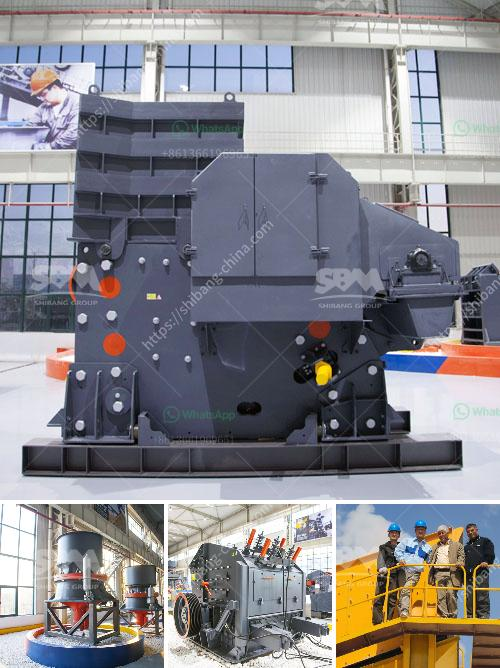

<h3>consol glass recycling price list per ton</h3>
Glass recycling is an important aspect of environmental conservation. Instead of letting glass end up in landfills and taking years to decompose, it can be recycled and reused to create new products. Consol Glass, a leading glass manufacturer and recycling company, is at the forefront of this sustainability initiative. They provide glass recycling services and offer competitive prices for glass waste, helping to incentivize individuals and businesses to participate in this green practice.

Consol Glass operates numerous glass recycling plants across South Africa. They collect various types of glass waste, including bottles, jars, and broken glass, and process them at their facilities. The recycled glass is then used to produce new glass products, reducing the need for virgin materials and conserving valuable resources.

One of the key factors in encouraging glass recycling is having a transparent and attractive pricing structure. Consol Glass has implemented a price list per ton to incentivize individuals, organizations, and recycling businesses to bring in their glass waste for recycling. The pricing is based on the type and color of glass, with different rates for clear, amber, and green glass.

The price per ton for clear glass typically ranges between R1000 and R1500. Clear glass is most commonly used in the production of new bottles and jars, making it highly sought after in the recycling industry. Amber glass, used for products like beer bottles, usually fetches a slightly lower price, ranging from R800 to R1200 per ton. Green glass, commonly used for wine bottles, has a similar price range as amber glass.

It's important to note that the prices mentioned above are approximate and subject to market fluctuations and specific contract arrangements. The final price offering may vary based on factors such as quantity, quality, and location of the glass waste. Consol Glass encourages potential recyclers to reach out to their recycling plants for the most up-to-date information on pricing.

Apart from the per ton pricing, Consol Glass also offers collection services to facilitate the recycling process. They provide containers, bins, and collection vehicles to make it convenient for individuals and businesses to transport their glass waste to the nearest recycling plant. These services ensure that even those without immediate access to recycling facilities can participate in glass recycling in an efficient and cost-effective manner.

Consol Glass's pricing structure aims to support and encourage glass recycling on a large scale. By offering attractive prices for glass waste, they create a win-win scenario where recyclers earn money while contributing to environmental conservation. The demand for recycled glass is steadily increasing, and Consol Glass plays a significant role in fulfilling this demand by offering fair prices and providing a reliable avenue for glass waste recycling.

In conclusion, Consol Glass's price list per ton serves as an effective incentive for individuals and businesses to engage in glass recycling. By offering competitive rates for different types of glass, they encourage widespread participation in this eco-friendly practice. The prices mentioned above are approximate, and it's advisable to contact Consol Glass directly for accurate and up-to-date pricing information. Together, we can work towards a sustainable future by reducing waste and preserving valuable resources through glass recycling.
<h3>Contact us</h3><ul><li><strong>Whatsapp:&nbsp;<a href="https://wa.me/8613661969651">+8613661969651</a></strong></li><li><a href="https://swt.shibang-china.com/?git&amp;zhl&amp;consol glass recycling price list per ton"><strong>Online Service(chat now)</strong></a></li></ul><h3>Related</h3><ul><li><a href='limestone processing plant price.md'>limestone processing plant price</a></li><li><a href='asphalt crushing machine capacity 15 ton hour.md'>asphalt crushing machine capacity 15 ton hour</a></li><li><a href='bentonite milling plant.md'>bentonite milling plant</a></li><li><a href='primary stone crusher for rent in karnataka.md'>primary stone crusher for rent in karnataka</a></li><li><a href='stone crushing feasibility study.md'>stone crushing feasibility study</a></li></ul>