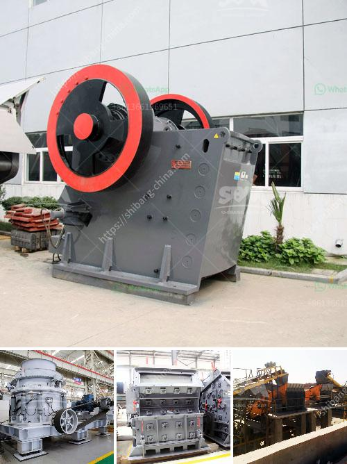

<h3>construction conveyor for sale</h3>
A construction conveyor is an essential tool in the construction industry that helps to transport materials from one location to another. These conveyors come in various sizes and types, and they are widely used in both small and large construction projects. If you are in need of a construction conveyor, you may want to consider purchasing one that is for sale.

There are several reasons why buying a construction conveyor for sale can be a wise investment. First and foremost, it can save you money. Buying a conveyor that is on sale can often be more cost-effective than purchasing a brand new one. Construction conveyors are typically expensive pieces of equipment, so finding one that is for sale can help you reduce your overall project costs. Additionally, buying a used conveyor can also be a great option if you are looking for a temporary solution or if you are working on a smaller project.

Another advantage of purchasing a construction conveyor for sale is that it allows you to get the equipment you need quickly. Instead of waiting for a new conveyor to be manufactured and delivered, you can find one that is already available for sale and have it delivered to your construction site within a short period. This can save you time, which is crucial in the construction industry where delays can be costly.

When looking for a construction conveyor for sale, it is important to consider the specific needs of your project. Conveyors come in various sizes and types, including belt conveyors, chain conveyors, and screw conveyors. Each type has its own advantages and is suitable for different materials and applications. Determine the type and size of conveyor that will best serve your project's requirements before making a purchase.

Additionally, it is important to assess the condition of the conveyor before buying it. While purchasing a used conveyor can be cost-effective, it is crucial to ensure that the equipment is in good working condition. Inspect the conveyor thoroughly and ask for maintenance records if possible. If there are any issues or concerns, it is advisable to consult a professional to assess the equipment before making a decision.

In conclusion, a construction conveyor for sale can be a beneficial investment for construction projects. It can save you money and time while providing a reliable means of transporting materials on your site. However, it is essential to carefully consider the specific needs of your project and assess the condition of the conveyor before making a purchase. By doing thorough research and making an informed decision, you can find a construction conveyor that meets your requirements and contributes to the smooth operation of your construction project.
<h3>Contact us</h3><ul><li><strong>Whatsapp:&nbsp;<a href="https://wa.me/8613661969651">+8613661969651</a></strong></li><li><a href="https://swt.shibang-china.com/?git&amp;zhl&amp;construction conveyor for sale"><strong>Online Service(chat now)</strong></a></li></ul><h3>Related</h3><ul><li><a href='ultra fine grinding mill.md'>ultra fine grinding mill</a></li><li><a href='sand washing machine in ethiopia.md'>sand washing machine in ethiopia</a></li><li><a href='sand making machine indonesia.md'>sand making machine indonesia</a></li><li><a href='sales of crusher machines.md'>sales of crusher machines</a></li><li><a href='mobile crusher medium manufacturers japan.md'>mobile crusher medium manufacturers japan</a></li></ul>