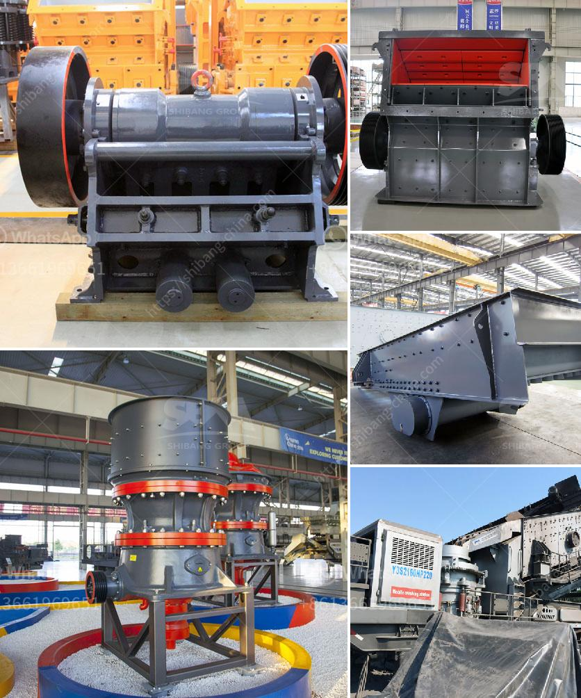

<h3>construction crusher price</h3>
When it comes to construction projects, there are important aspects that need to be considered to ensure successful and efficient execution. One of these key considerations is the price of construction equipment, specifically crushers. Crushers play a vital role in the construction industry as they efficiently break down large rocks, stones, concrete, or other materials into smaller pieces, making them easier to handle and transport. However, with numerous options available in the market, determining the right crusher and its price can be a daunting task. In this article, we will discuss the factors to consider when buying a construction crusher and how it influences its price.

The type of crusher you choose for your construction project depends on the nature of the project and the materials you will be working with. There are various types of crushers available, including jaw crushers, cone crushers, impact crushers, and hammer crushers. Each type has its own advantages and is suitable for different applications.

The capacity of the crusher is another important factor to consider. It refers to the maximum amount of material the crusher can process in a given time. A higher capacity crusher will typically have a higher price tag. Therefore, it is crucial to determine your project's requirements and choose a crusher that meets your production needs without overpaying for unnecessary capacity.

The brand reputation and quality of a construction crusher are crucial factors that determine its price. Renowned and well-established brands tend to have higher prices due to their reputation for producing reliable and high-quality equipment. Investing in a trusted brand may initially seem more expensive, but it can provide better long-term value through better performance, durability, and less frequent breakdowns.

Crusher price is not the only cost associated with owning a crusher; regular maintenance and upkeep also contribute to the overall expenses. Consider the availability and cost of spare parts for the chosen crusher. Additionally, enquire about the maintenance requirements of the crusher and factor in the associated costs to ensure it fits within your budget.

Some construction crushers come with optional features and customization options to enhance their functionality and adaptability to specific projects. The more features and customization options a crusher offers, the higher its price will be. Evaluate these additional features and determine if they are essential for your project or if you can work with a simpler, more affordable model.

The demand for construction crushers can vary depending on the region and the specific requirements of the construction industry in that area. Different factors, such as the availability of raw materials and government regulations, can influence the local market and, consequently, the price of crushers. Conduct market research to understand the price trends in your area and make an informed decision.

In conclusion, when buying a construction crusher, it is important to consider the crusher type and capacity, brand reputation and quality, maintenance and upkeep costs, optional features, and the local market demand. Finding the right balance between price and functionality is crucial to ensure efficient and cost-effective crushing operations. Investing in a high-quality crusher may have a higher upfront cost but can result in long-term savings through improved productivity and reduced maintenance expenses.
<h3>Contact us</h3><ul><li><strong>Whatsapp:&nbsp;<a href="https://wa.me/8613661969651">+8613661969651</a></strong></li><li><a href="https://swt.shibang-china.com/?git&amp;zhl&amp;construction crusher price"><strong>Online Service(chat now)</strong></a></li></ul><h3>Related</h3><ul><li><a href='dolomite powder making machine.md'>dolomite powder making machine</a></li><li><a href='stone crusher machine sale germany.md'>stone crusher machine sale germany</a></li><li><a href='list of equipment used gold diamond mining.md'>list of equipment used gold diamond mining</a></li><li><a href='aggregate crushing machines.md'>aggregate crushing machines</a></li><li><a href='stone crushing machine for sale in uganda.md'>stone crushing machine for sale in uganda</a></li></ul>