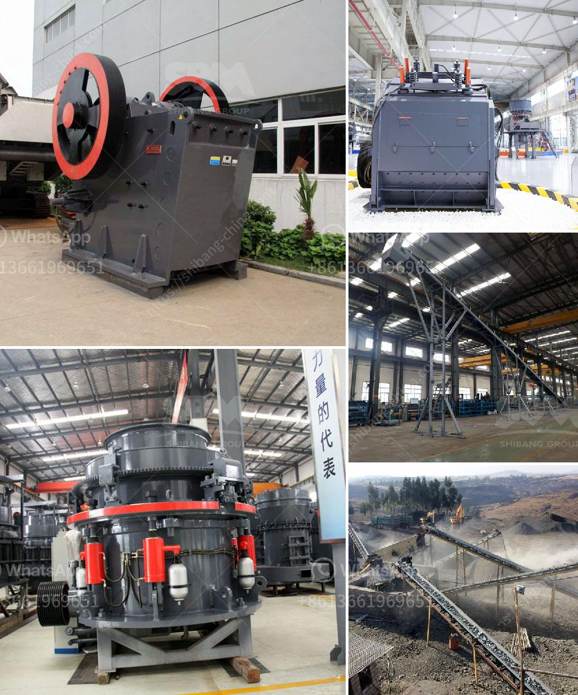

<h3>construction waste recycling production line</h3>
Construction waste is a major environmental concern, with landfills overflowing and natural resources being depleted. However, there is hope in the form of construction waste recycling. With the help of advanced technology, a construction waste recycling production line has emerged as a solution to tackle this global issue.

A construction waste recycling production line is designed to turn construction debris into reusable materials. It offers a great opportunity for recycling and disposing of construction waste efficiently. The production line makes use of a special crusher that crushes construction waste, causing it to become smaller and more manageable. Once crushed, the waste materials can be reused for a variety of purposes, such as making concrete and asphalt.

One of the main advantages of a construction waste recycling production line is that it reduces the need for new raw materials. By incorporating recycled materials, the production line helps to conserve natural resources and reduce the environmental impact of construction activities. Additionally, recycling construction waste reduces the amount of waste sent to landfills, leading to better waste management practices.

Another benefit of a construction waste recycling production line is its potential for creating job opportunities. As the demand for recycling increases, more workers will be needed to operate and maintain the production line. This can have a positive impact on the local economy by providing employment opportunities and fostering sustainable development.

In conclusion, a construction waste recycling production line is an innovative solution that tackles the challenges of construction waste management. By turning waste materials into reusable resources, the production line contributes to environmental sustainability and resource conservation. Furthermore, it provides economic benefits by creating job opportunities in the recycling industry. With the implementation of more of these production lines, we can make significant strides towards a greener future.
<h3>Contact us</h3><ul><li><strong>Whatsapp:&nbsp;<a href="https://wa.me/8613661969651">+8613661969651</a></strong></li><li><a href="https://swt.shibang-china.com/?git&amp;zhl&amp;construction waste recycling production line"><strong>Online Service(chat now)</strong></a></li></ul><h3>Related</h3><ul><li><a href='grinding media charge calculation in cement ball mills.md'>grinding media charge calculation in cement ball mills</a></li><li><a href='2 micron limestone grinding unit in india.md'>2 micron limestone grinding unit in india</a></li><li><a href='granite stone crushing plants.md'>granite stone crushing plants</a></li><li><a href='25 tph vsi crushers.md'>25 tph vsi crushers</a></li><li><a href='rollers for conveyor belts manizales.md'>rollers for conveyor belts manizales</a></li></ul>