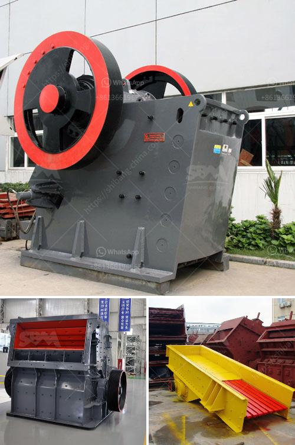

<h3>conveyor belt capacity</h3>
Conveyor belts are an integral component of industries worldwide, facilitating the efficient transportation of materials and products. Understanding conveyor belt capacity is crucial in planning and optimizing conveyor systems for maximum productivity.

Conveyor belt capacity refers to the maximum amount of material that a conveyor belt can handle within a given time period. It is typically measured in terms of tons per hour (TPH) or cubic meters per hour (m3/h). The capacity of a conveyor belt depends on several factors, including belt width, belt speed, material characteristics, and the specific layout of the system.

One of the primary factors influencing conveyor belt capacity is belt width. The wider the belt, the higher the capacity as it allows for a larger surface area for material to be transported. However, wider belts require additional support and more energy to operate efficiently. Therefore, it is essential to strike a balance between belt width and overall system requirements.

Another critical factor is belt speed, which refers to the rate at which the belt moves. Faster belt speeds can increase conveyor belt capacity, allowing for higher throughputs. However, it is important to consider the material being conveyed and its impact on the belt. Certain materials may require slower belt speeds to prevent spillage or damage.

Material characteristics play a significant role in determining conveyor belt capacity. The density, size, and shape of the material can affect the belt's ability to carry it effectively. For instance, lighter materials may require a steeper incline or faster belt speeds to prevent them from sliding back. Additionally, material moisture levels and flowability can impact conveyor performance.

The specific layout of the conveyor system also influences capacity. Factors such as incline angle, conveyor length, and the presence of curves or conveyors transfers can affect overall capacity. Inclined conveyors generally have lower capacities than horizontal ones due to the increased energy required to lift the material. Additionally, curves and transfers can introduce friction and result in reduced capacity if not properly designed.

To determine the appropriate conveyor belt capacity for a specific application, it is crucial to consider these factors collectively. Conveyor belt manufacturers and system engineers utilize various methodologies and software tools to calculate and optimize capacity. These calculations typically involve analyzing material characteristics, belt width, belt speed, and system layout data.

Optimizing conveyor belt capacity can provide significant benefits to industries. Higher capacity allows for increased throughput, reducing production time and costs. It can also enable more efficient material handling, better inventory management, and improved overall productivity.

However, it is essential to note that exceeding conveyor belt capacity can lead to system failure, material spillage, and increased wear and tear. It is critical to ensure that the conveyor system is appropriately designed and sized for the intended application. Regular maintenance and monitoring are also necessary to ensure optimal performance and prevent unexpected breakdowns.

In conclusion, understanding conveyor belt capacity is critical for designing, optimizing, and maintaining conveyor systems. Considering factors such as belt width, belt speed, material characteristics, and system layout enables industries to maximize productivity and operational efficiency. By carefully evaluating and planning conveyor belt capacity, industries can achieve seamless material transportation, contributing to their overall success.
<h3>Contact us</h3><ul><li><strong>Whatsapp:&nbsp;<a href="https://wa.me/8613661969651">+8613661969651</a></strong></li><li><a href="https://swt.shibang-china.com/?git&amp;zhl&amp;conveyor belt capacity"><strong>Online Service(chat now)</strong></a></li></ul><h3>Related</h3><ul><li><a href='stone crusher machine sale germany.md'>stone crusher machine sale germany</a></li><li><a href='price of hammer mill in china.md'>price of hammer mill in china</a></li><li><a href='ball mill inside.md'>ball mill inside</a></li><li><a href='the world largest mobile crusher.md'>the world largest mobile crusher</a></li><li><a href='types of grinding mills.md'>types of grinding mills</a></li></ul>