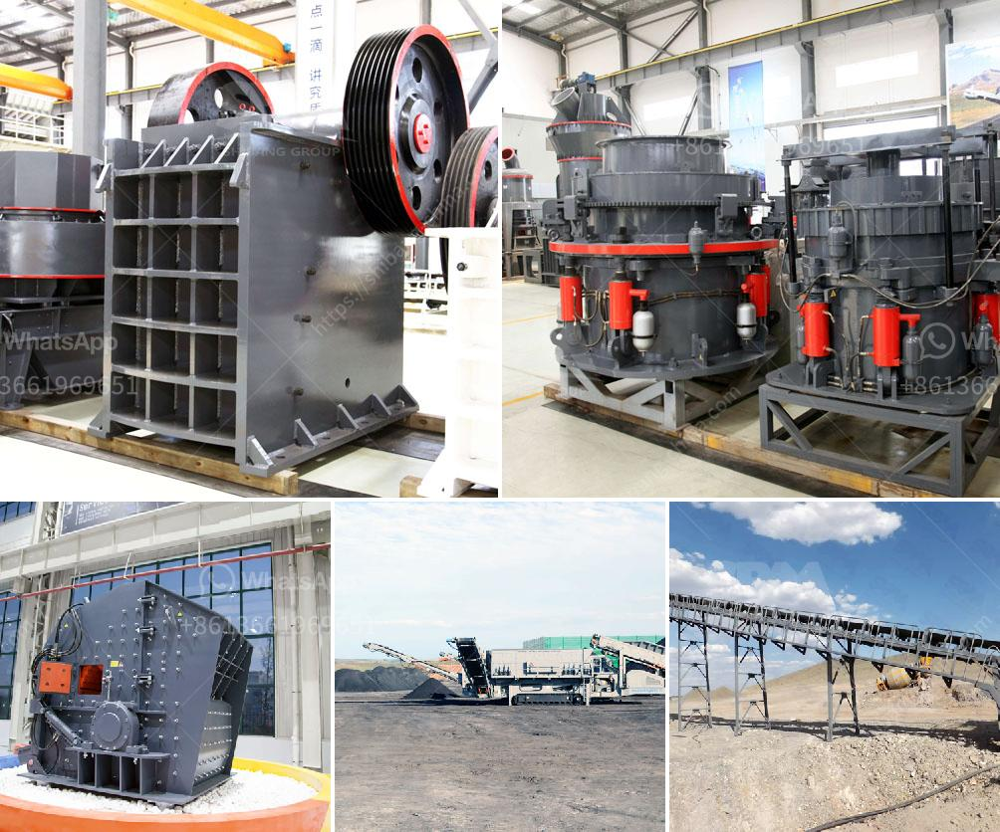

<h3>conveyor belt for crusher china</h3>
China is a land of opportunity for those looking to invest in various industries. One such industry that is rapidly gaining traction is the mining industry. With the increasing demand for various materials such as ores, coal, and minerals, the need for efficient and safe mining equipment is also on the rise. Amongst the many tools and machines used in the mining sector, the conveyor belt for crusher China plays a crucial role in conveying crushed materials from one location to another.

What sets the conveyor belt apart is its ability to transport large quantities of materials over long distances continuously. This eliminates the need for manual labor and ensures an efficient and streamlined mining operation. The conveyor belt system significantly reduces downtime and increases productivity as it is capable of handling heavy loads with ease.

In China, there are several manufacturers specializing in conveyor belts for crushers. To ensure quality and reliability, we recommend using conveyor belts produced by those who have undergone strict quality control measures. It is also essential to consider the specific requirements of your mining operation and select a conveyor belt that meets those needs. Conveyor belts with high tensile strength and exceptional durability are ideal for demanding mining environments.

One of the distinct advantages of using conveyor belts for crushers is enhanced safety. Manual transportation of materials in a mining site can be dangerous, leading to accidents and injuries. However, the conveyor belt eliminates these risks by automating the process. Additionally, modern conveyor belts are equipped with safety features such as emergency stop buttons and protective covers to prevent any mishaps.

Furthermore, using a conveyor belt for crusher China reduces the need for multiple machines, thereby reducing operational costs and minimizing the carbon footprint. It ensures energy efficiency and helps in conserving valuable resources.

In conclusion, the conveyor belt for crusher China plays a significant role in the mining industry. It provides efficient and safe transportation of materials, reduces downtime, increases productivity, and ensures operator safety. By investing in high-quality conveyor belts, mining companies can streamline their operations while contributing to a sustainable future.
<h3>Contact us</h3><ul><li><strong>Whatsapp:&nbsp;<a href="https://wa.me/8613661969651">+8613661969651</a></strong></li><li><a href="https://swt.shibang-china.com/?git&amp;zhl&amp;conveyor belt for crusher china"><strong>Online Service(chat now)</strong></a></li></ul><h3>Related</h3><ul><li><a href='china crusher exporters mails hotmail com.md'>china crusher exporters mails hotmail com</a></li><li><a href='clay grinding machine for sale china.md'>clay grinding machine for sale china</a></li><li><a href='xzm series ultra fine mill zenith.md'>xzm series ultra fine mill zenith</a></li><li><a href='philippines crushing machine manufacturer in pakistan.md'>philippines crushing machine manufacturer in pakistan</a></li><li><a href='how to design surge bin hopper crusher.md'>how to design surge bin hopper crusher</a></li></ul>