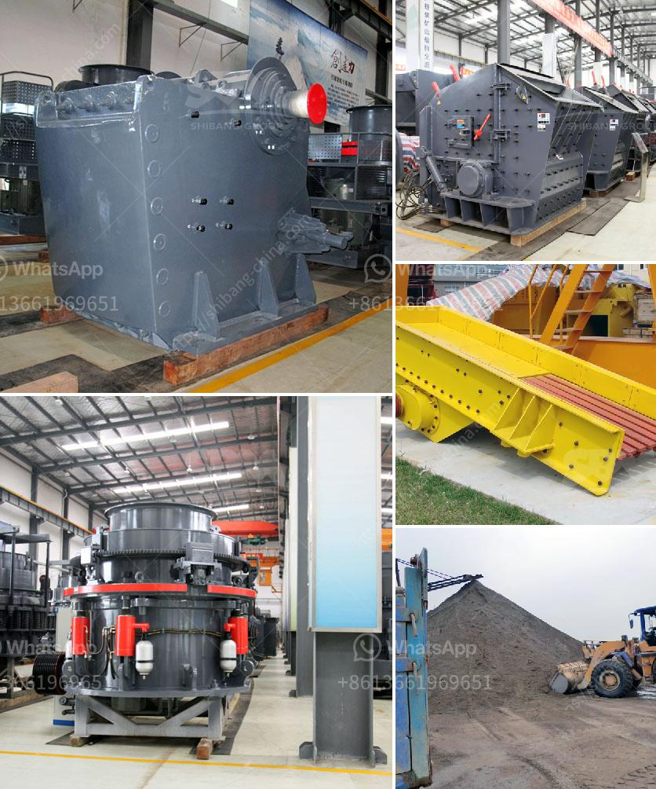

<h3>conveyor belt hire ireland</h3>
In the fast-paced world of construction, time is money. Every minute wasted adds to the overall project cost and can cause delays that can have a significant impact on the project timeline. One area where construction companies often face logistical challenges is the movement of materials and equipment across the job site. This is where conveyor belt hire services in Ireland come to the rescue.

Conveyor belt hire in Ireland offers a convenient solution for construction projects of all sizes. Whether it's transporting building materials, soil, rubble, or any other heavy item, conveyor belts can efficiently move them from one location to another. Here are some key reasons why conveyor belt hire has become increasingly popular in the construction industry in Ireland:

1. Increased Efficiency: Manual labor for material handling can be time-consuming, physically demanding, and prone to human errors. Conveyor belts, on the other hand, provide a more efficient and automated solution that saves time and minimizes the risk of injuries or mistakes. It allows for continuous movement of materials, eliminating the need for workers to constantly load and unload items.

2. Cost-effective: Hiring conveyor belts for short-term projects can be a cost-effective alternative to purchasing equipment outright. Construction companies can save money by availing themselves of rental services, avoiding the upfront costs associated with equipment purchase, maintenance, and storage. Additionally, rental agreements often include regular maintenance and servicing, further reducing the burden on the construction company.

3. Versatility: Conveyor belt hire services in Ireland offer a range of conveyor options tailored to different construction needs. Whether it's a long-distance or short-distance belt, inclined or decline systems, or even specialized belts for specific materials, there is a solution available for every project requirement. The ability to customize the conveyor belt ensures that it can handle the unique challenges faced on each construction site.

4. Flexibility: Construction projects often have changing demands. Conveyor belt hire services can adapt to these changing requirements, providing additional or larger conveyor belts when needed and adjusting the rental terms accordingly. This flexibility allows construction companies to efficiently manage their resources and avoid unnecessary expenses.

5. Environmentally Friendly: Conveyor belt hire promotes sustainability within the construction industry. By utilizing automated systems, it reduces the reliance on conventional transportation methods, such as trucks or forklifts, which contribute to air pollution and increase carbon emissions. Furthermore, the increased efficiency of conveyor belts reduces fuel consumption and overall energy usage, making it an environmentally friendly choice.

Conveyor belt hire in Ireland has revolutionized the construction industry, providing a convenient, cost-effective, and sustainable solution for material handling. By outsourcing this crucial aspect of construction projects, companies can focus on their core activities and improve overall productivity. With the ability to quickly scale and customize the equipment, construction companies have come to rely on conveyor belt hire services for their material transportation needs.

In summary, conveyor belt hire in Ireland is an essential service for construction projects seeking to streamline operations, reduce costs, and improve efficiency. Its flexibility, cost-effectiveness, and environmentally friendly nature make it a popular choice in the construction industry. As construction projects continue to grow in complexity, conveyor belt hire services will undoubtedly play a vital role in meeting the ever-increasing demands of the industry.
<h3>Contact us</h3><ul><li><strong>Whatsapp:&nbsp;<a href="https://wa.me/8613661969651">+8613661969651</a></strong></li><li><a href="https://swt.shibang-china.com/?git&amp;zhl&amp;conveyor belt hire ireland"><strong>Online Service(chat now)</strong></a></li></ul><h3>Related</h3><ul><li><a href='design for stone crusher plant.md'>design for stone crusher plant</a></li><li><a href='hp 400 cone crusher.md'>hp 400 cone crusher</a></li><li><a href='calcium carbonate production line in germany.md'>calcium carbonate production line in germany</a></li><li><a href='disintegrator grinder pulverizer.md'>disintegrator grinder pulverizer</a></li><li><a href='construction conveyor for sale.md'>construction conveyor for sale</a></li></ul>