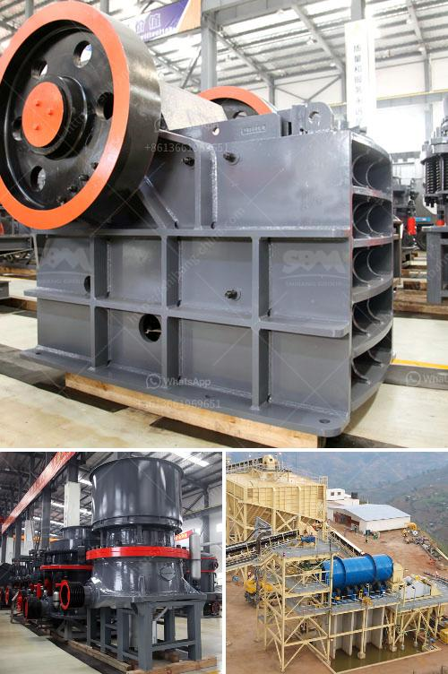

<h3>conveyor belt manufacturer in uae</h3>
The United Arab Emirates (UAE) has emerged as a global leader in various sectors, including manufacturing, infrastructure, and logistics. One of the key contributors to these advancements is the conveyor belt industry, which has witnessed exponential growth in the UAE. With numerous conveyor belt manufacturers operating in the country, they have become an integral part of the UAE's industrial landscape, enabling efficient and seamless transportation of goods across various industries.

The conveyor belt industry plays a vital role in improving productivity, reducing manual labor, and enhancing overall operational efficiency. As a result, businesses in the UAE are increasingly relying on conveyor belts to streamline their processes and meet the growing demands of a rapidly expanding economy. These belts are employed in diverse sectors like mining, construction, manufacturing, food processing, and logistics, among others.

When it comes to conveyor belt manufacturing, several companies in the UAE stand out. They have not only gained recognition on a local scale but also earned global acclaim for their commitment to high-quality products and customer satisfaction. By investing in cutting-edge technology, adopting stringent quality control measures, and employing skilled professionals, these manufacturers ensure that their conveyor belts meet international standards and cater to the specific needs of their clients.

One such prominent conveyor belt manufacturer in the UAE is known for its comprehensive range of conveyor belts, customized solutions, and exceptional customer service. Their offerings include rubber belts, PVC belts, timing belts, modular belts, and more, catering to various applications. Whether it's transporting bulk materials, delicate goods, or heavy loads, these manufacturers provide reliable and durable conveyor belts that enhance productivity and reduce downtime.

Additionally, UAE-based conveyor belt manufacturers place a strong emphasis on research and development (R&D) to stay ahead of the curve. They continuously innovate and explore new materials, engineering techniques, and designs to improve the performance and longevity of their products. This commitment to innovation has allowed them to develop conveyor belts that are resistant to extreme temperatures, corrosive substances, and strong impacts. Such advancements make these belts suitable for even the most challenging environments, ensuring uninterrupted operations and optimal safety.

Moreover, conveyor belt manufacturers in the UAE prioritize sustainable practices, aiming to reduce carbon footprints and increase energy efficiency. They promote the use of eco-friendly materials and technologies, such as low-power consumption motors and recyclable components, in their manufacturing processes. By embracing sustainability, these manufacturers not only contribute to environmental preservation but also provide their clients with cost-effective solutions in the long run.

In conclusion, the conveyor belt industry in the UAE has witnessed remarkable growth in recent years. With their commitment to quality, innovation, and sustainability, conveyor belt manufacturers in the UAE are catering to the evolving needs of various industries and positioning the country as a hub for efficient and reliable transportation solutions. As the UAE continues to strive for excellence in its industrial sectors, conveyor belt manufacturers will play an increasingly significant role in driving the nation's economy forward.
<h3>Contact us</h3><ul><li><strong>Whatsapp:&nbsp;<a href="https://wa.me/8613661969651">+8613661969651</a></strong></li><li><a href="https://swt.shibang-china.com/?git&amp;zhl&amp;conveyor belt manufacturer in uae"><strong>Online Service(chat now)</strong></a></li></ul><h3>Related</h3><ul><li><a href='crusher for quartz.md'>crusher for quartz</a></li><li><a href='vibrating screens manufacturers.md'>vibrating screens manufacturers</a></li><li><a href='mobile crusher morocco.md'>mobile crusher morocco</a></li><li><a href='beneficiation of iron ore suppliers.md'>beneficiation of iron ore suppliers</a></li><li><a href='used mini grinding plant india sale.md'>used mini grinding plant india sale</a></li></ul>