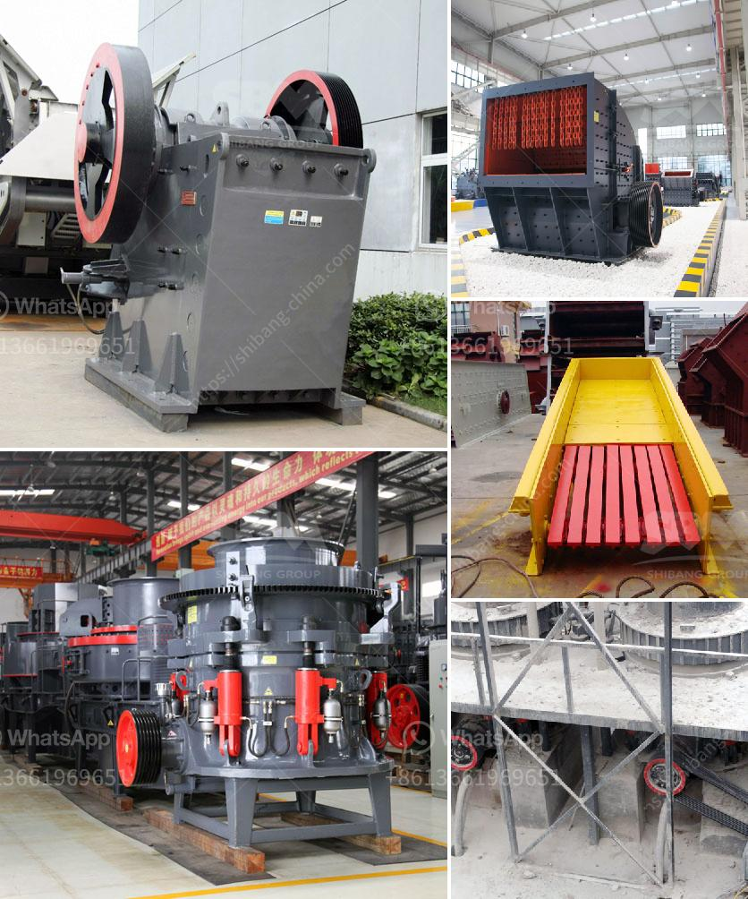

<h3>conveyor belt price per meter</h3>
Conveyor belts are essential tools in many industries, facilitating the transport of heavy and bulky materials from one point to another. They are widely used in mining, metallurgy, agriculture, construction, and many other sectors. When considering the purchase or replacement of a conveyor belt, one of the key factors to consider is the price per meter.

Conveyor belt prices can vary significantly depending on the brand, size, material composition, and level of customization. It is essential to have a clear understanding of these factors to make an informed decision and ensure the best value for your investment. In this article, we will provide a comprehensive guide on conveyor belt price per meter.

One of the primary factors influencing conveyor belt prices is the brand and quality. There are numerous manufacturers in the market, ranging from well-established global brands to smaller, niche players. While global brands tend to command higher prices due to their reputation and extensive research and development, smaller manufacturers may offer more competitive prices but with a potential compromise in quality.

Another critical factor influencing conveyor belt prices is the size and length required. Conveyor belts are available in various widths and lengths to cater to different applications. Standard sizes are usually more readily available and may come at a lower price per meter compared to custom sizes that require special manufacturing processes.

Conveyor belts are made from various materials, each suitable for different applications. The most common materials include rubber, PVC, polyurethane, and nylon. Each material has its specific advantages and price range. Rubber belts, for instance, are known for their durability and resilience but may have a higher price per meter compared to PVC belts, which are more cost-effective but less durable. Consider your application requirements and budget carefully when selecting the material composition of your conveyor belt.

The level of customization required also affects the price per meter of a conveyor belt. Customizations such as special coatings, cleats, or sidewalls can enhance the functionality of the belt but may come at an additional cost. Conversely, opting for standard belts that do not require any customization can help reduce the price per meter.

Certain applications may require additional features on conveyor belts, such as heat resistance, oil resistance, or anti-static properties. These features often increase the price per meter. It is crucial to assess your specific application needs and determine if such additional features are necessary or if a standard belt would suffice.

To ensure you get the best price per meter for your conveyor belt, it is advisable to contact multiple manufacturers or suppliers and obtain quotes. Comparing prices from different sources can help identify any price variations and negotiate the best deal. However, it is essential to remember that price should not be the sole determining factor. Consider the reputation, quality, and after-sales service offered by the manufacturer to make an informed decision.

In conclusion, when considering the purchase or replacement of a conveyor belt, understanding the price per meter is crucial. Factors such as brand and quality, size and length, material composition, level of customization, and additional features all contribute to the final price. By carefully considering these factors and comparing quotes from different sources, you can make a well-informed decision and secure the best value for your investment.
<h3>Contact us</h3><ul><li><strong>Whatsapp:&nbsp;<a href="https://wa.me/8613661969651">+8613661969651</a></strong></li><li><a href="https://swt.shibang-china.com/?git&amp;zhl&amp;conveyor belt price per meter"><strong>Online Service(chat now)</strong></a></li></ul><h3>Related</h3><ul><li><a href='quartz crushing suppliers.md'>quartz crushing suppliers</a></li><li><a href='ultra grinder service center mumbai.md'>ultra grinder service center mumbai</a></li><li><a href='conveyor belt hire ireland.md'>conveyor belt hire ireland</a></li><li><a href='coal crusher machine china.md'>coal crusher machine china</a></li><li><a href='coal crusher and screen plant for sale.md'>coal crusher and screen plant for sale</a></li></ul>