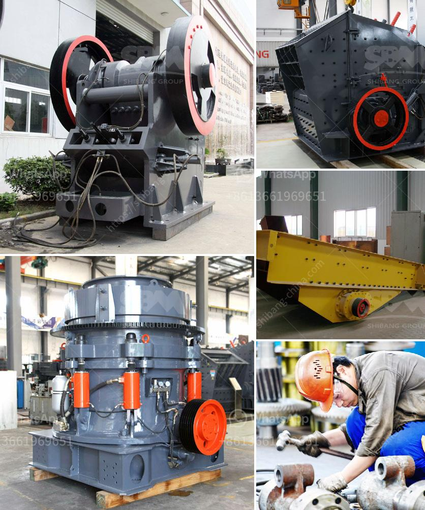

<h3>conveyor belt supplies south africa</h3>
Conveyor belts are used in various industries such as manufacturing, food processing, mining, and logistics. They play a vital role in transporting goods and materials from one place to another efficiently and quickly. Without conveyor belts, many industries would face challenges in handling heavy materials, reducing productivity, and increasing labor costs. South Africa is one of the leading countries in the manufacturing and supplying of conveyor belts, offering a wide range of products and solutions to meet the growing demands of various industries.

Conveyor belt supplies in South Africa are provided by a few specialized companies that focus on the manufacturing, distribution, and maintenance of conveyor belts. These conveyor belt suppliers are highly experienced and possess a deep understanding of the market dynamics, trends, and requirements of the South African industries. The aim is to provide innovative conveyor belt solutions that enhance productivity, reduce downtime, and ensure the safety of workers and goods being transported.

One of the key factors driving the conveyor belt supplies in South Africa is the robust growth of mining activities in the country. The mining sector contributes significantly to the economy of South Africa and is one of the leading sources of exports. Conveyor belts are extensively used in the mining industry to transport materials such as coal, iron ore, and copper ore over long distances, efficiently and reliably. The conveyor belt suppliers in South Africa ensure high-quality conveyor belts for mining companies that operate in harsh environments, ensuring maximum productivity and uptime.

Apart from mining applications, conveyor belts are also extensively used in manufacturing industries such as automotive, electronics, and food processing. In these industries, conveyor belts are utilized for transportation, assembly lines, packaging, and quality control processes. Conveyor belt supplies in South Africa cater to these manufacturing industries by offering customized solutions that are tailored to meet specific requirements. These conveyor belt suppliers utilize advanced technologies, such as automation and robotics, to optimize manufacturing processes, improve operational efficiency, and reduce costs.

One of the significant developments in conveyor belt supplies in South Africa is the introduction of lightweight, eco-friendly conveyor belts. These belts are designed using sustainable materials and advanced technology, ensuring reduced energy consumption and prolonged belt lifespan. Lightweight conveyor belts are an ideal choice for industries that focus on sustainability and environmental responsibility while maintaining high productivity levels.

In conclusion, conveyor belt supplies in South Africa play a crucial role in various industries, enabling efficient transportation of goods and materials. The conveyor belt suppliers in the country offer a comprehensive range of conveyor belts and solutions that cater to the diverse needs of different industries. By focusing on innovation, sustainability, and customized solutions, these conveyor belt suppliers ensure the growth and success of the South African industries they serve. As the demand for conveyor belts continues to grow, these suppliers remain committed to providing high-quality products and reliable services to meet the evolving needs of their customers.
<h3>Contact us</h3><ul><li><strong>Whatsapp:&nbsp;<a href="https://wa.me/8613661969651">+8613661969651</a></strong></li><li><a href="https://swt.shibang-china.com/?git&amp;zhl&amp;conveyor belt supplies south africa"><strong>Online Service(chat now)</strong></a></li></ul><h3>Related</h3><ul><li><a href='shafts of a ball mill.md'>shafts of a ball mill</a></li><li><a href='ball mill for sale uk.md'>ball mill for sale uk</a></li><li><a href='standard ratio for cement sand building blocks.md'>standard ratio for cement sand building blocks</a></li><li><a href='sale of stone hammer hammer.md'>sale of stone hammer hammer</a></li><li><a href='hammer mill for gold.md'>hammer mill for gold</a></li></ul>