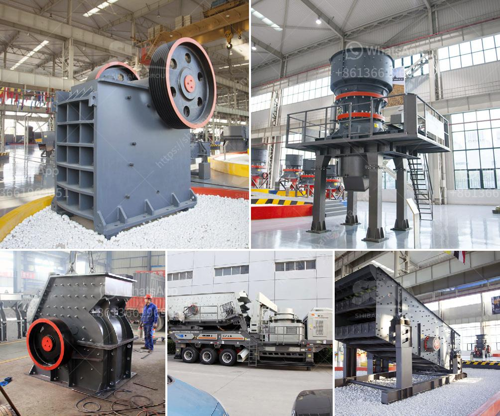

<h3>conveyor belt user in tanzania</h3>
Title: The Increasing Utilization of Conveyor Belts in Tanzania: Streamlining Operations and Boosting Efficiency

Conveyor belts have become an essential component of various industries worldwide, and Tanzania is no exception. As the country experiences a surge in industrial development and infrastructure projects, the utilization of conveyor belts has rapidly increased. This article delves into the rising adoption of conveyor belts in Tanzania, highlighting the benefits they offer and their role in enhancing operations across several sectors.

Conveyor belts enable businesses in Tanzania to improve operational efficiency and productivity significantly. They provide a seamless and reliable mode of transporting materials, reducing the need for manual handling and accelerating the movement of goods. Whether it is in the mining, manufacturing, agriculture, or construction sectors, conveyor belts automate the process, minimizing time-consuming tasks and preventing material damage.

In the mining industry, for instance, conveyor belts efficiently transport minerals from the extraction site to the required processing locations or storage facilities. This automation helps minimize human error, enhances worker safety, and increases overall productivity. Similarly, conveyor belts play a crucial role in the agriculture sector, where they facilitate the movement of grains, fruits, and other agricultural produce from harvesting to packaging, streamlining the entire process.

Implementing conveyor belts in Tanzania's businesses also leads to significant cost savings and enhanced safety measures. Manual transportation of heavy materials not only increases production costs but also creates a higher risk of workplace injuries. Conveyor belts mitigate these risks by eliminating the need for manual labor and providing a safer environment.

Moreover, conveyor belts can operate continuously without breaks, resulting in increased production uptime and reduced labor costs. With the ability to handle large volumes of materials in a shorter time, businesses can meet market demands more efficiently and remain competitive.

Conveyor belts have played a vital role in supporting Tanzania's ongoing infrastructure projects. They are widely used in construction sites, enabling the efficient transportation of sand, gravel, cement, and other construction materials. By optimizing material movement, conveyor belts help accelerate project completion schedules, reducing downtime and increasing overall productivity.

Aside from their operational benefits, conveyor belts also contribute to environmental sustainability. The automated nature of the system results in reduced energy consumption compared to manually operated machinery or vehicles. Additionally, conveyor belts help minimize waste generation by preventing material spillage, improving the overall cleanliness of the working area.

Conveyor belts have become an integral part of Tanzania's industrial landscape, revolutionizing numerous sectors and contributing to the country's overall development. These efficient and cost-effective systems enhance productivity, improve workplace safety, and support infrastructure projects. As Tanzania continues to progress and expand its industrial activities, the utilization of conveyor belts will undoubtedly continue to grow, heralding a new era of efficiency and progress for the nation.
<h3>Contact us</h3><ul><li><strong>Whatsapp:&nbsp;<a href="https://wa.me/8613661969651">+8613661969651</a></strong></li><li><a href="https://swt.shibang-china.com/?git&amp;zhl&amp;conveyor belt user in tanzania"><strong>Online Service(chat now)</strong></a></li></ul><h3>Related</h3><ul><li><a href='stone crushing machine for sale in uganda.md'>stone crushing machine for sale in uganda</a></li><li><a href='concrete stones crushing business plan.md'>concrete stones crushing business plan</a></li><li><a href='conveyor belts in opracion.md'>conveyor belts in opracion</a></li><li><a href='grinding mill spare parts manufacturers china.md'>grinding mill spare parts manufacturers china</a></li><li><a href='slag grinding mill india.md'>slag grinding mill india</a></li></ul>