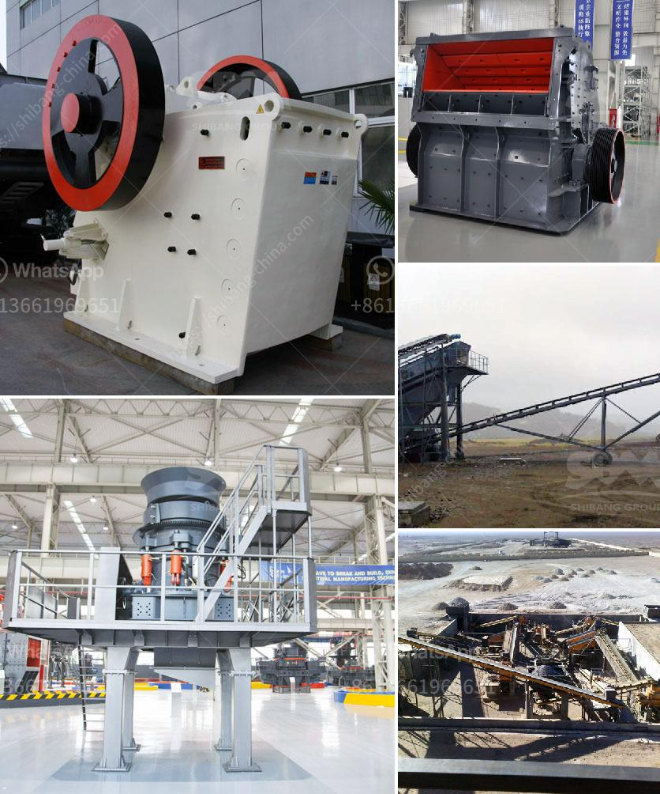

<h3>conveyor belts contacts</h3>
Conveyor belts have become an integral part of various industries. These systems consist of mechanical devices that move materials, products, and packaged goods from one location to another. Widely used in manufacturing, mining, and logistics, conveyor belts have revolutionized the way materials are handled and transported. With their countless benefits, they have become an indispensable tool in the modern world.

One of the primary advantages of conveyor belts is their efficiency. As compared to other means of transportation, such as manual labor or forklifts, conveyor belts are capable of handling large quantities of materials in a considerably shorter time. They can transport heavy and bulky items with ease, significantly reducing labor costs while increasing productivity. Moreover, these belts are designed to operate continuously, minimizing downtime, and maximizing production output.

Another significant benefit is the versatility conveyor belts bring to material handling processes. They are available in various sizes and types, adaptable to suit specific needs across industries. For instance, flat belt conveyors can handle lightweight and small products, while roller conveyors are ideal for accumulating items or moving them at an incline. Whether it is food processing, mining, or automotive assembly lines, there is a conveyor belt to meet every requirement.

Conveyor belts also ensure a high level of safety during material handling. When compared to using manual labor, there is reduced risk of injury as workers do not have to lift or carry heavy items. Additionally, automated systems can be equipped with safety features, such as emergency stop buttons and automatic shutdowns, ensuring the protection of workers and preventing accidents or injury.

The applications of conveyor belts are vast and varied. In the mining industry, they are used to transport materials like coal, ore, and minerals, improving efficiency and reducing reliance on human labor. In manufacturing, conveyor belts seamlessly connect various stages of production, from assembly lines to packaging and shipping, creating a continuous flow of materials. Conveyor belts are also used extensively in logistics and distribution centers, allowing for quick and efficient movement of goods.

Furthermore, conveyor belts are eco-friendly, contributing positively towards sustainable practices. They facilitate recycling processes and reduce waste by efficiently moving materials from one processing stage to another, minimizing the need for unnecessary movement or handling. Additionally, modern belts are designed to be energy-efficient, using motors and systems that consume minimal power, further reducing the carbon footprint of industries.

In conclusion, conveyor belts have transformed material handling processes across industries, revolutionizing productivity, efficiency, and safety standards. Their versatility allows for customization to meet specific needs, while their applications range from mining to manufacturing and logistics. Furthermore, their contribution to sustainable practices makes them an essential and responsible choice for modern businesses. As technology continues to advance, conveyor belts will undoubtedly evolve and play an even more significant role in shaping the future of material handling.
<h3>Contact us</h3><ul><li><strong>Whatsapp:&nbsp;<a href="https://wa.me/8613661969651">+8613661969651</a></strong></li><li><a href="https://swt.shibang-china.com/?git&amp;zhl&amp;conveyor belts contacts"><strong>Online Service(chat now)</strong></a></li></ul><h3>Related</h3><ul><li><a href='crush granite machine.md'>crush granite machine</a></li><li><a href='fluorite ore processing equipment manufacturer.md'>fluorite ore processing equipment manufacturer</a></li><li><a href='mini crusher for gravel sale in philippines.md'>mini crusher for gravel sale in philippines</a></li><li><a href='stone crushers for sale in uk.md'>stone crushers for sale in uk</a></li><li><a href='limestone mill suppliers in china.md'>limestone mill suppliers in china</a></li></ul>