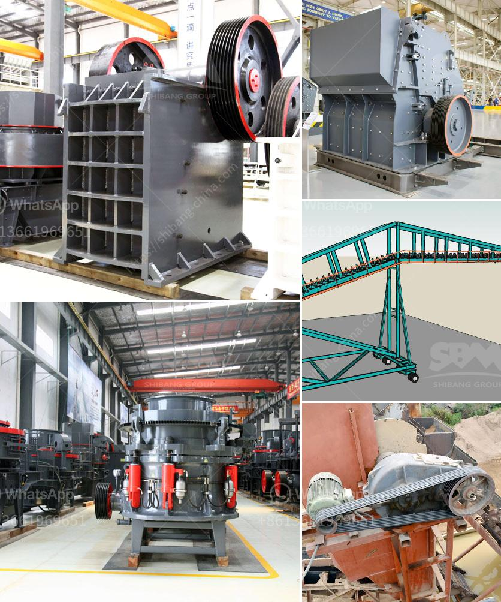

<h3>conveyor belts for sale in china</h3>
Conveyor belts are an integral part of any industry that involves the transportation of materials or products. They are essential in manufacturing, packaging, and distribution facilities, as they help in streamlining the production process and ensuring a smooth and efficient material handling system. In China, conveyor belts have become increasingly popular due to their reliability, durability, and cost-effectiveness. With a wide range of options available, businesses in China can easily find conveyor belts for sale that meet their specific requirements.

One of the notable advantages of conveyor belts is their ability to transport materials with minimal human intervention. These systems are capable of moving heavy or bulky items from one location to another quickly and effortlessly. As a result, they enhance the productivity of manufacturing plants by reducing manual labor and increasing overall efficiency. In China, conveyor belts have proved to be a reliable solution for several industries, including automotive, food processing, mining, and logistics.

When searching for conveyor belts for sale in China, businesses have a variety of options to choose from. There are numerous manufacturers and suppliers in the country that specialize in providing high-quality conveyor belts tailored to specific needs. The conveyor belts offered for sale in China are made from various materials, such as rubber, PVC, nylon, and metal, depending on the application and industry requirements. This wide range of choices ensures that businesses can find a conveyor belt that suits their needs in terms of strength, durability, and resistance to wear and tear.

China is known for its manufacturing capabilities, and this extends to the production of conveyor belts. The country possesses advanced manufacturing facilities, machinery, and skilled technicians, making it an ideal destination for purchasing conveyor belts. Businesses can expect not only superior quality but also competitive prices when looking for conveyor belts for sale in China. The country's vast manufacturing infrastructure enables manufacturers to produce conveyor belts at large volumes, resulting in economies of scale that are passed on to customers.

Moreover, Chinese manufacturers are known for their commitment to research and development. They continuously strive to improve the design and functionality of conveyor belts, incorporating innovative features to enhance their performance. This dedication to technological advancements ensures that businesses in China have access to state-of-the-art conveyor belts that meet the highest industry standards. Additionally, many manufacturers offer customization options, allowing businesses to tailor the conveyor belts according to their specific needs.

In conclusion, conveyor belts have become an essential component of the material handling systems in various industries in China. With their ability to transport materials efficiently and effectively, conveyor belts improve productivity and streamline operations. Businesses searching for conveyor belts for sale in China have a wide range of options to choose from, ensuring that they can find a conveyor belt that meets their specific needs in terms of material, strength, and durability. Chinese manufacturers offer superior quality and competitive prices, driven by their advanced manufacturing capabilities and commitment to technological advancement. Overall, conveyor belts are the backbone of efficient material handling in China, contributing to the country's industrial growth and economic development.
<h3>Contact us</h3><ul><li><strong>Whatsapp:&nbsp;<a href="https://wa.me/8613661969651">+8613661969651</a></strong></li><li><a href="https://swt.shibang-china.com/?git&amp;zhl&amp;conveyor belts for sale in china"><strong>Online Service(chat now)</strong></a></li></ul><h3>Related</h3><ul><li><a href='mobile stone crusher south africa.md'>mobile stone crusher south africa</a></li><li><a href='cone crusher manufacturer.md'>cone crusher manufacturer</a></li><li><a href='asphalt crushing machine capacity 15 ton hour.md'>asphalt crushing machine capacity 15 ton hour</a></li><li><a href='copper ore processing plant in philippines.md'>copper ore processing plant in philippines</a></li><li><a href='costs for a stone crusher plant.md'>costs for a stone crusher plant</a></li></ul>