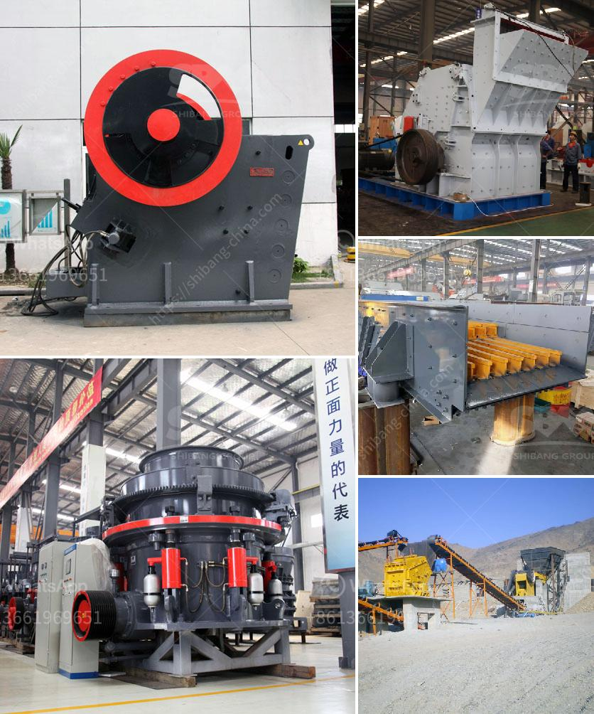

<h3>conveyor belts in opracion</h3>
Conveyor belts have revolutionized the manufacturing, transportation, and logistics industries, playing a crucial role in streamlining operational processes and ensuring efficient material handling. From small-scale operations to large industrial plants, conveyor belts have become an integral part of operations worldwide.

The concept of conveyor belts dates back to the late 18th century when they were first used in mines to transport coal and other materials. Since then, their design and capabilities have evolved significantly. Today, conveyor belts are versatile and can handle various products, from lightweight items like parcels to heavy loads like bulk materials and machinery.

One of the key advantages of conveyor belts is their ability to move materials continuously, minimizing the need for manual handling and reducing the risk of workplace injuries. With automated systems, these belts can transport items over long distances, around corners, and even vertically. They can be customized to cater to specific operational requirements, including speed, load capacity, and material type.

The manufacturing industry largely relies on conveyor belts for efficient production processes. In assembly lines, conveyor belts ensure a smooth flow of products, allowing workers to focus on specific tasks without interruptions. By eliminating manual handling and optimizing production time, conveyor belts enhance productivity, reduce errors, and ultimately increase profitability.

Conveyor belts have also found significant usage in the transportation and logistics sectors. Airports, for example, employ conveyor belts to facilitate the movement of luggage from check-in counters to airplanes and vice versa. This automation not only expedites baggage handling but also reduces the chances of mishandling or lost items.

In warehouses and distribution centers, conveyor belts enable the seamless sorting, packaging, and loading of items for delivery. By integrating sensors and automated systems, these belts can detect abnormal items and redirect them to the appropriate location, optimizing order fulfillment and minimizing errors.

Furthermore, conveyor belts play a critical role in the mining industry, where they are used to transport extracted materials from the mining site to processing plants or storage facilities. They endure extreme conditions, including heavy loads, harsh environments, and long distances, making them crucial for efficient mining operations.

While conveyor belts offer numerous advantages, appropriate maintenance and regular inspections are essential to ensure optimal performance and prevent breakdowns. Lubrication, cleaning, and belt tensioning are crucial maintenance tasks that reduce wear and tear and extend the lifespan of the belts. Additionally, it is crucial to promptly repair any damaged components to avoid disruptions in operations.

In conclusion, conveyor belts have revolutionized various industries by enhancing operational efficiency, improving safety, and streamlining material handling. From manufacturing plants to airports and mines, their versatility and customization capabilities make them an indispensable tool for businesses striving to optimize their operations. With continuous technological advancements, the role of conveyor belts in operational processes will only grow, enabling greater efficiency and productivity in the future.
<h3>Contact us</h3><ul><li><strong>Whatsapp:&nbsp;<a href="https://wa.me/8613661969651">+8613661969651</a></strong></li><li><a href="https://swt.shibang-china.com/?git&amp;zhl&amp;conveyor belts in opracion"><strong>Online Service(chat now)</strong></a></li></ul><h3>Related</h3><ul><li><a href='calcium carbonate processing.md'>calcium carbonate processing</a></li><li><a href='gold washing plant tons per hour.md'>gold washing plant tons per hour</a></li><li><a href='crusher suppliers usa.md'>crusher suppliers usa</a></li><li><a href='mobile quarry crushing plant price in jamaica.md'>mobile quarry crushing plant price in jamaica</a></li><li><a href='quarry business in south africa.md'>quarry business in south africa</a></li></ul>